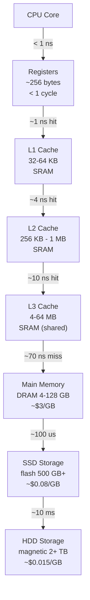

## In simple terms

Memory is a computer's short-term workspace. When a program runs, its code and the data it's working on live in memory — fast, byte-addressable, and immediately accessible to the CPU. Turn off the power and it all vanishes. That's the deal: memory is fast and temporary; [storage](/t/storage) is slow and permanent.

## The Visual Map



## More detail

When people say "memory" they usually mean **RAM** (Random Access Memory). It is *random access* because the CPU can read or write any byte address in roughly the same amount of time, unlike a tape or a spinning disk that must physically seek to the right location.

**RAM is volatile:** turn the power off and it forgets everything. This is why long-term data lives in [storage](/t/storage) (SSD/HDD).

**The memory hierarchy:** computers have layers of memory that trade capacity for speed, because fast memory (SRAM) is expensive and slow memory (DRAM, SSD) is cheap:

| Level | Tech | Size | Latency | Cost/GB |
|---|---|---|---|---|
| Registers | SRAM | bytes | &lt;1 ns | — |
| L1 cache | SRAM | 32–64 KB | ~1 ns | ~$3,000 |
| L2 cache | SRAM | 256 KB–1 MB | ~4 ns | ~$1,500 |
| L3 cache | SRAM | 4–64 MB | ~10 ns | ~$800 |
| Main memory | DRAM | 4–256 GB | ~70 ns | ~$3 |
| SSD | Flash | 256 GB–8 TB | ~100 µs | ~$0.08 |
| HDD | Magnetic | 1–30 TB | ~10 ms | ~$0.015 |

**DRAM (Dynamic RAM):** main memory uses DRAM — capacitors plus transistors. Capacitors leak charge and must be refreshed every 64 ms. Very dense and cheap, but ~70 ns latency.

**DDR (Double Data Rate):** the standard for desktop/laptop RAM. DDR5 (2022+) transfers on both clock edges, delivering 38–76 GB/s of bandwidth per channel. A modern CPU with 2–4 DDR5 channels can sustain 100–300 GB/s.

**Cache hierarchy (SRAM):** the L1/L2/L3 caches on the CPU die are Static RAM — latches instead of capacitors, no refresh, ~1 ns access. They're much smaller because SRAM takes ~50× more area than DRAM per bit.

Most performance problems in modern software are memory problems: the CPU executes at ~1 instruction/ns, but a DRAM miss takes 70 ns — 70 wasted cycles. Cache-friendly code (sequential access, small working sets, good locality) can be 10–100× faster than cache-unfriendly code.

## Under the Hood

A cache locality experiment showing how access pattern affects performance — the same computation, very different times:

```python
import time

SIZE = 1024
matrix = [[i * SIZE + j for j in range(SIZE)] for i in range(SIZE)]

def row_major(m, n):
    total = 0
    for i in range(n):
        for j in range(n):
            total += m[i][j]   # row-major: sequential in memory
    return total

def col_major(m, n):
    total = 0
    for j in range(n):
        for i in range(n):
            total += m[i][j]   # column-major: cache-unfriendly strides
    return total

N = SIZE
t0 = time.perf_counter_ns()
r1 = row_major(matrix, N)
t1 = time.perf_counter_ns()
r2 = col_major(matrix, N)
t2 = time.perf_counter_ns()

row_ms = (t1 - t0) / 1e6
col_ms = (t2 - t1) / 1e6
print(f"Matrix {N}x{N} sum:")
print(f"  Row-major (cache-friendly)  : {row_ms:6.1f} ms")
print(f"  Col-major (cache-unfriendly): {col_ms:6.1f} ms")
print(f"  Ratio: {col_ms/row_ms:.1f}x  (same result, different access order)")
```

## Engineering Trade-offs

**More RAM vs. faster RAM:** for applications that fit entirely in RAM, adding more RAM does nothing. For applications that need more RAM than available, performance collapses because the OS starts swapping to disk — 10 ms SSD swaps instead of 70 ns DRAM access. "Out of memory" → 1,000× slowdown.

**Bandwidth vs. latency:** DRAM bandwidth (GB/s) and latency (ns) are different axes. High-bandwidth workloads (ML training, video encoding) need multiple DDR channels; low-latency workloads (databases, cache) need low-latency DRAM. HBM (High Bandwidth Memory) achieves 3+ TB/s at the cost of being physically stacked on the chip die (used in GPUs and TPUs).

**ECC RAM:** Error-Correcting Code RAM detects and corrects single-bit DRAM errors (cosmic rays, noise). Required for servers, databases, and scientific computing. Consumer desktops typically skip ECC to reduce cost; a silent bit flip in a database can corrupt data.

**Shared memory on GPUs:** GPU "global memory" is HBM (on-die DRAM), while "shared memory" is on-chip SRAM — programmers explicitly manage it like a user-controlled L1 cache. This explicitness is one reason CUDA programming is harder than CPU programming.

## Real-world examples

- A laptop with "16 GB RAM" has 16 GB of DDR5 DRAM — the workspace for your browser, apps, and OS.
- A browser tab using "200 MB" is occupying 200 MB of DRAM.
- "The application ran out of memory" means the process tried to allocate more than the OS would provide — either too little physical RAM, or the process hit a per-process address space limit.
- Redis / Memcached: in-memory databases that deliberately keep all data in DRAM for sub-millisecond reads — accepting volatility in exchange for speed.

## Common misconceptions

- **"Memory and storage are the same thing."** Memory (RAM) is fast and volatile; storage (SSD/HDD) is slower and persistent. Confusing them leads to "my computer is slow" when the answer is "you need more RAM so it stops swapping to disk."
- **"More RAM always makes a computer faster."** Only up to the point where you stop running out. If your workload fits in RAM, adding more RAM mostly does nothing.

## Try it yourself

Measure the memory bandwidth available on your machine:

```bash
python3 - <<'EOF'
import time, array

SIZE   = 10_000_000   # 10M integers ~ 40 MB
data   = array.array('i', range(SIZE))

t0 = time.perf_counter_ns()
total = sum(data)
t1 = time.perf_counter_ns()

bytes_read = SIZE * 4   # 4 bytes per int
ms         = (t1 - t0) / 1e6
gb_s       = (bytes_read / 1e9) / (ms / 1000)

print(f"Array size    : {SIZE:,} integers ({bytes_read/1e6:.0f} MB)")
print(f"Elapsed       : {ms:.1f} ms")
print(f"Memory bandwidth: {gb_s:.2f} GB/s  (Python overhead; real DRAM: 30-100 GB/s)")
print(f"Sum check     : {total}")
EOF
```

## Learn next

- [DRAM vs SRAM](/t/dram-vs-sram) — the two physical memory technologies: DRAM is cheap and dense (main memory), SRAM is fast and expensive (CPU cache); the contrast explains the entire cache hierarchy
- [Storage](/t/storage) — the non-volatile counterpart to memory; understanding the latency gap between RAM and SSD/HDD explains why databases cache aggressively and why SSDs matter
- [Virtual memory](/t/virtual-memory) — the OS abstraction that gives every process a private address space larger than physical RAM, managed through paging to SSD/HDD
- [Flash memory](/t/flash-memory) — the technology behind SSDs; NAND flash is non-volatile but much slower than DRAM, illustrating the latency-durability trade-off
