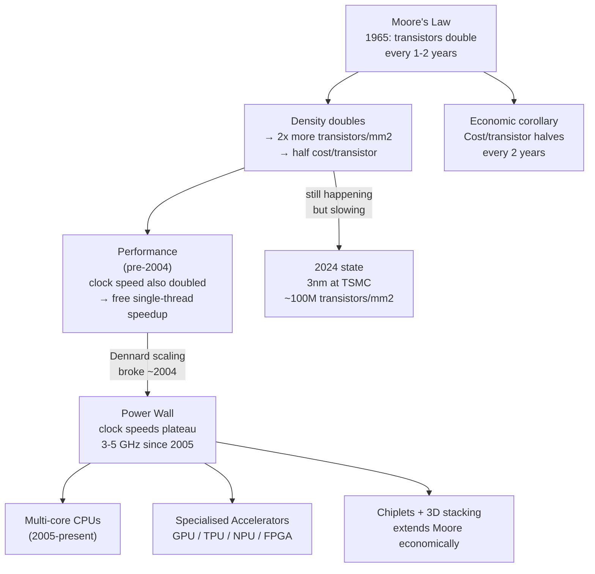

## In simple terms

In 1965, Gordon Moore (later Intel co-founder) observed that the number of transistors engineers could fit on a chip was doubling every year (later revised to every two years). This meant computing power would double every two years at the same price. For 50 years, this held. A 1971 Intel 4004 had 2,300 transistors; a 2024 Apple M4 has 28 billion. Computers got better faster than anything in human history. The pace is now slowing.

## The Visual Map



## More detail

**The original observation:** Moore published "Cramming more components onto integrated circuits" in 1965, noting that component counts had doubled each year since integrated circuits were invented (1959) and predicting this would continue for at least another decade.

**Why it held:** shrinking transistors allows more transistors per mm² (density), and smaller transistors switch faster (performance) and use less power per switch. The semiconductor industry organised itself around Moore's Law as a roadmap — ITRS (International Technology Roadmap for Semiconductors) coordinated global research to hit two-year cadence targets, creating a self-fulfilling prophecy.

**Economic corollary:** as density doubled, cost per transistor halved. Computing power per dollar doubled every two years. This compounding made electronics progressively cheaper: mainframes → minicomputers → PCs → smartphones → cloud → IoT. A $500 phone in 2026 has more compute than a $1M supercomputer from 1990.

**The slowing — three limits:**
1. **Physics:** quantum tunnelling through gate oxide when features reach ~1 nm makes further shrinking increasingly difficult. Gate lengths at 3 nm nodes are approaching the point where classical transistor models break down.
2. **Economics:** a 5 nm TSMC wafer costs ~$20,000; EUV lithography machines cost $150–350M each. The R&D investment per node transition is billions of dollars. Only 3 companies (TSMC, Samsung, Intel Foundry) can afford leading-edge nodes.
3. **Power:** even if density keeps growing, you can't run all transistors simultaneously without exceeding thermal design power (dark silicon). 50%+ of a leading-edge chip may be powered off at any time.

**Moore's Law ≠ Dennard scaling:** Dennard scaling (power per transistor decreases proportionally as they shrink) broke around 2005 when leakage current became significant. This is why clock speeds plateaued at 3–5 GHz. CPU performance improvement since then comes from IPC improvements, multi-core, specialised accelerators, and architecture innovations — not raw MHz increases.

**What continues:** transistor density is still increasing at TSMC 3 nm and 2 nm, though more slowly and expensively. Chiplet design (combining multiple dies in one package — AMD EPYC, Intel Meteor Lake) extends economic scaling without a single monolithic die. 3D stacking (TSMC SoIC, HBM memory) adds vertical density.

## Under the Hood

Modelling the transistor count doubling from historical data — the empirical basis of Moore's Law:

```python
chips = [
    # (year, name, transistors)
    (1971, "Intel 4004",          2_300),
    (1978, "Intel 8086",         29_000),
    (1982, "Intel 286",         134_000),
    (1989, "Intel 486",       1_200_000),
    (1993, "Pentium",         3_100_000),
    (2000, "Pentium 4",      42_000_000),
    (2006, "Core 2 Duo",    291_000_000),
    (2012, "Ivy Bridge",   1_400_000_000),
    (2019, "Zen 2 (EPYC)", 9_890_000_000),
    (2024, "Apple M4",    28_000_000_000),
]

print(f"{'Year':<6} {'Chip':<22} {'Transistors':>15}  {'2yr doubling'}  {'Actual'}")
print("-" * 70)
prev_year, prev_tr = chips[0][:2][0], chips[0][2]
for year, name, tr in chips:
    years = year - prev_year if year > prev_year else 1
    expected = prev_tr * (2 ** (years / 2))
    ratio = tr / prev_tr if year > prev_year else 1
    doublings = f"{ratio:.1f}x in {years}y"
    print(f"{year:<6} {name:<22} {tr:>15,}  {doublings}")
    prev_year, prev_tr = year, tr
```

## Engineering Trade-offs

**What Moore's Law gave us (pre-2004):**
- Free performance: each process node provided faster clocks, lower power, and lower cost simultaneously — software developers needed only to wait for the next CPU generation.
- Single-core dominance: sequential code ran faster on every new chip with no software changes.

**What the slowdown changed:**
- Performance no longer comes automatically. It requires explicit parallelism (multi-core, SIMD), specialisation (GPU, NPU), or algorithmic improvement.
- Software must be written to exploit parallelism — Amdahl's Law caps benefit for sequential code regardless of core count.
- Power efficiency (performance per watt) replaced raw GHz as the key hardware metric — critical for mobile, IoT, and data-centre TCO.

**Chiplet strategy:** instead of building one huge monolithic die (expensive, lower yield as die area grows), AMD/Intel break chips into smaller **chiplets** connected by high-speed die-to-die links (AMD XGMI, Intel EMIB). A chiplet can use different process nodes for different functions — logic at 3 nm, I/O at 6 nm (cheaper and more reliable). This extends Moore's Law economics without requiring a perfect monolithic 3 nm die.

## Real-world examples

- Intel 4004 (1971): 2,300 transistors at 10 µm process. Apple M4 (2024): 28 billion transistors at 3 nm — 12 million times more dense in 53 years.
- TSMC 3 nm (N3) has ~117 million logic transistors per mm². TSMC 2 nm (N2, 2025) targets ~180–200 million per mm² using GAAFET.
- NVIDIA H100: 80 billion transistors on 4 nm — the GPU equivalent of Moore's Law applied to ML compute.

## Common misconceptions

- **"Moore's Law is a physical law."** It is an empirical observation and economic self-fulfilling prophecy, not a law of physics. It held because the semiconductor industry organised itself to make it hold.
- **"Moore's Law means computers double in speed every two years."** It describes transistor density. Performance gains (IPC, clock speed, single-thread) are separate and involve many additional factors — including software and architecture.

## Try it yourself

Project transistor counts forward assuming 30% per year density growth (slowed from 40% historical):

```bash
python3 - <<'EOF'
BASE_YEAR = 2024
BASE_TR   = 28_000_000_000   # Apple M4 transistors
RATE      = 0.30             # ~30% annual density growth (slowing Moore)

print(f"Transistor count projections (starting from {BASE_YEAR} Apple M4):")
print(f"{'Year':<6} {'Transistors':>18}  {'vs 2024'}")
print("-" * 38)
tr = BASE_TR
for yr in range(BASE_YEAR, BASE_YEAR + 15):
    mult = tr / BASE_TR
    print(f"{yr:<6} {tr:>18,.0f}  {mult:>5.1f}x")
    tr *= (1 + RATE)
EOF
```

## Learn next

- [Dennard scaling](/t/dennard-scaling) — the complementary law that explained why transistor density gains also translated into clock speed gains; it broke down ~2004, explaining why GHz stopped growing
- [ASIC](/t/asic) — domain-specific chips that exploit Moore's Law density gains for one specific task: when general scaling isn't enough, purpose-built silicon is the answer
- [FPGA](/t/fpga) — reconfigurable hardware that sits between ASIC and CPU; understanding why FPGAs exist requires understanding the economics of chip customisation that Moore's Law shapes
