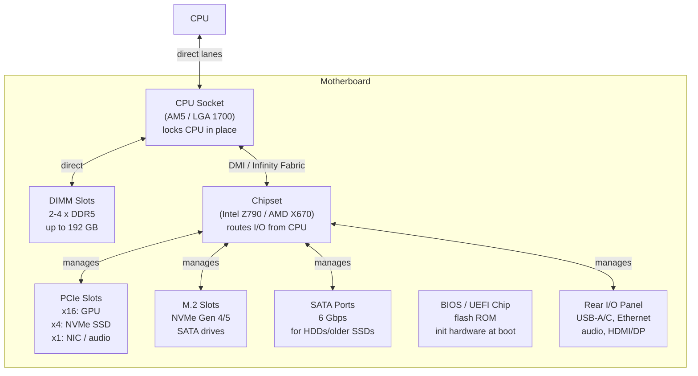

## In simple terms

The **motherboard** is the big circuit board everything else in a computer plugs into. The [CPU](/t/cpu), memory sticks, storage drives, graphics card, and ports on the back — all connect to and communicate through the motherboard. If the individual components are organs, the motherboard is the skeleton and nervous system that holds them together and lets them talk.

## The Visual Map



## More detail

A motherboard's job is **interconnection and power distribution**:

- **CPU socket:** where the processor mounts; the socket type (AMD AM5, Intel LGA 1851) determines which CPUs fit. Changing socket generations often requires a new board.
- **DIMM slots:** where RAM modules go. CPU memory controllers connect directly to RAM without going through the chipset, for lower latency. Modern boards support 2–4 DDR5 channels.
- **PCIe slots:** for graphics cards (x16 lanes at PCIe Gen 5 = ~63 GB/s), NVMe SSDs (x4 lanes), and other add-in cards. PCIe is the dominant high-speed expansion bus.
- **Chipset:** a controller hub that routes traffic between the CPU's PCIe lanes and slower peripherals (SATA, USB, Thunderbolt, audio). The CPU doesn't directly manage every port; the chipset handles that behind a DMI (Intel) or Infinity Fabric (AMD) link.
- **BIOS/UEFI:** a flash chip holding firmware that runs before the OS. It initialises hardware, runs POST (Power-On Self Test), and hands control to the bootloader. UEFI replaced BIOS in the 2010s with a graphical interface, GPT disk support, and Secure Boot.
- **VRM (Voltage Regulator Module):** converts PSU voltage (12 V) to the low voltages CPUs need (~1 V). High-end boards have elaborate VRMs with many phases for stable power delivery to overclocked or high-core-count CPUs.
- **Form factors:** ATX (305×244 mm), microATX (244×244 mm), Mini-ITX (170×170 mm) — standardised sizes that determine case compatibility.

The chipset and socket together define what a given board can support — which CPUs, how much memory, how many drives and cards, and which features (PCIe Gen, USB 4 / Thunderbolt, Wi-Fi 7).

## Under the Hood

Simulating chipset I/O bandwidth — showing how high-speed PCIe lanes are shared and how bandwidth limits apply:

```python
# PCIe lane bandwidth by generation (both directions combined)
PCIE_GB_S = {
    "PCIe 3.0 x16": 16.0,
    "PCIe 4.0 x16": 32.0,
    "PCIe 5.0 x16": 64.0,
    "PCIe 4.0 x4 (NVMe)": 8.0,
    "PCIe 5.0 x4 (NVMe)": 16.0,
    "SATA III (6 Gbps)": 0.6,
    "USB 3.2 Gen 2": 1.25,
    "Thunderbolt 4": 5.0,
}

print("PCIe / I/O bandwidth summary:")
print(f"  {'Connection':<28} {'GB/s':>8}  {'vs SATA'}")
print("  " + "-" * 52)
sata_bw = PCIE_GB_S["SATA III (6 Gbps)"]
for name, bw in PCIE_GB_S.items():
    bar = "#" * int(bw / 64 * 20)   # normalize to PCIe 5.0 x16 = 20 chars
    mult = f"{bw/sata_bw:.0f}x"
    print(f"  {name:<28} {bw:>8.2f}  {mult:>6}  {bar}")
```

## Engineering Trade-offs

**CPU socket lock-in:** AMD maintained AM4 socket compatibility for 5+ years (Ryzen 1000–5000), letting users upgrade CPUs without replacing the board. Intel has changed sockets more frequently (LGA 1151, 1200, 1700, 1851 over 7 generations) — buyers trade upgrade path for access to new features. This is a major purchase consideration.

**Chipset lanes vs. direct CPU lanes:** modern CPUs connect memory and primary PCIe slots (for GPU and fastest NVMe) directly, bypassing the chipset for lower latency. Slower peripherals (additional USB, SATA, secondary M.2) go through the chipset over a DMI/Infinity Fabric link, which has a finite bandwidth budget. Loading all secondary M.2 slots with NVMe drives can saturate the chipset link.

**Power delivery (VRM):** budget boards use fewer VRM phases and lower-quality capacitors. Under sustained load (video encoding, rendering), inadequate power delivery throttles the CPU or degrades signal integrity. High-end boards with 16-phase VRMs allow overclocking headroom and stable operation of high-TDP CPUs.

## Real-world examples

- A desktop PC build starts with picking a motherboard whose socket matches the chosen CPU (e.g., Ryzen 9 7950X → AM5 socket → X670E board).
- A laptop's **logic board** is a motherboard miniaturised and custom-shaped, usually with CPU, RAM, and often storage soldered directly on — not upgradeable.
- "The machine won't power on, no display" often points at the motherboard or its power delivery, since it's the common point all components depend on.
- Server motherboards add IPMI/BMC (Baseboard Management Controller) for remote power cycling and console access — out-of-band management independent of the OS.

## Common misconceptions

- **"The motherboard does the computing."** It doesn't compute — it connects. The CPU computes; the motherboard routes data and power between parts.
- **"Any CPU fits any motherboard."** Sockets and chipsets must match; a board supports a specific family of processors. AMD AM5 doesn't fit Intel LGA 1700 and vice versa.

## Try it yourself

Model chipset bandwidth budget — see how many NVMe drives saturate the DMI link:

```bash
python3 - <<'EOF'
DMI_BW_GB_S  = 16.0   # Intel DMI 4.0 (chipset-to-CPU link)
NVME_BW_GB_S = 7.0    # PCIe Gen 4 x4 NVMe sequential read

print("Chipset DMI budget: how many NVMe drives before saturation?")
print(f"{'Drives':>7} {'Used (GB/s)':>12} {'Remaining (GB/s)':>17} {'Status'}")
print("-" * 50)
for n in range(1, 8):
    used = n * NVME_BW_GB_S
    rem  = DMI_BW_GB_S - used
    status = "OK" if rem >= 0 else "SATURATED"
    print(f"{n:>7} {min(used, DMI_BW_GB_S):>12.1f} {max(rem, 0):>17.1f}  {status}")
EOF
```

## Learn next

- [CPU](/t/cpu) — the component the motherboard centres around; socket compatibility, direct PCIe lanes, and memory channels are all CPU-specific
- [Memory](/t/memory) — the DIMM slots connect RAM directly to the CPU's memory controller; understanding channel configuration and DDR generations matters for memory bandwidth
- [Peripheral](/t/peripheral) — the devices that attach to the motherboard's ports (USB, SATA, PCIe); understanding the bus and chipset shows how they're connected
