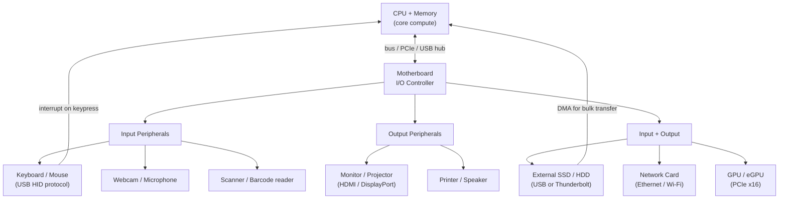

## In simple terms

A **peripheral** is any piece of hardware you connect to a computer that isn't the core processor and memory — the keyboard and mouse you type and click with, the monitor that shows the picture, the printer, the webcam, the external drive, the headphones. The word literally means "on the edge": peripherals sit around the central computing core and are how the machine interacts with the world. Without them, a computer could compute but couldn't take input or show you anything.

## The Visual Map



## More detail

Peripherals are usually grouped by direction:

- **Input:** keyboard, mouse, touchscreen, microphone, scanner, camera, game controller.
- **Output:** monitor, printer, speakers.
- **Storage / both:** external drives, USB sticks (input and output).
- **Network:** Ethernet NIC, Wi-Fi adapter — both directions simultaneously.

They connect through standardised **ports and buses:**
- **USB** (Universal Serial Bus) — the dominant modern connector. USB 3.2 Gen 2×2 = 20 Gbps; USB4 / Thunderbolt 4 = 40 Gbps.
- **HDMI / DisplayPort** — high-bandwidth video + audio output.
- **PCIe** — for internal high-performance cards (GPU, NVMe SSD, 100G NIC).
- **Bluetooth / Wi-Fi** — wireless peripherals (keyboard, mouse, audio).

Each peripheral needs a **device driver** — software in the OS that knows how to talk to that specific hardware and exposes it to applications through a uniform interface. A USB keyboard uses the HID (Human Interface Device) class driver built into every OS; a specialist RAID controller needs a vendor-supplied driver.

**Two important mechanics for performance:**

1. **Interrupts:** peripherals signal the CPU using hardware interrupts when they have data or need attention. A keypress raises an IRQ (Interrupt Request); the CPU suspends its current task, runs the interrupt handler, then resumes. This avoids the CPU constantly polling ("is there data yet?") — wasteful polling is replaced by event-driven interrupt handling.

2. **DMA (Direct Memory Access):** high-throughput peripherals (drives, network cards, GPUs) use [DMA](/t/dma) to move data directly between the device and main memory, without the CPU copying every byte. The CPU initiates a DMA transfer, the DMA controller moves the data in the background, then raises an interrupt when done.

The boundary between "peripheral" and "core component" has shifted over time — network cards and sound are now usually integrated into the [motherboard](/t/motherboard) chipset rather than being separate cards.

## Under the Hood

Simulating how interrupt-driven I/O compares to polling — the key reason peripherals use interrupts:

```python
import time, random

def polling_io(n_events: int, poll_interval_us: float) -> dict:
    """Spin-loop checking for new data — wastes CPU every poll interval."""
    polls     = 0
    found     = 0
    poll_s    = poll_interval_us / 1_000_000

    # Simulate: events arrive at random times
    event_times = sorted(random.uniform(0, n_events * poll_interval_us * 3)
                         for _ in range(n_events))
    t = 0.0
    ei = 0
    while found < n_events:
        polls += 1
        t += poll_interval_us
        if ei < len(event_times) and t >= event_times[ei]:
            found += 1
            ei += 1
    return {"polls": polls, "events": found, "wasted_polls": polls - found}

def interrupt_io(n_events: int) -> dict:
    """Interrupt-driven: CPU wakes only when event arrives — zero wasted polls."""
    return {"polls": n_events, "events": n_events, "wasted_polls": 0}

random.seed(42)
N = 50
for method, result in [
    ("Polling (100us interval)", polling_io(N, 100)),
    ("Interrupt-driven        ", interrupt_io(N)),
]:
    wasted = result["wasted_polls"]
    total  = result["polls"]
    print(f"{method}: {total:>5} CPU checks, {wasted:>5} wasted "
          f"({100*wasted/total:.0f}% overhead)")
```

## Engineering Trade-offs

**Interrupts vs. polling:**
- Interrupts let the CPU do useful work between events, at the cost of interrupt latency (~1–5 µs for a context switch). They're best for bursty, unpredictable events (keystrokes, network packets arriving rarely).
- Polling is better at very high I/O rates (10G+ networking, NVMe): the overhead of 10 million interrupts per second exceeds the cost of polling. Modern high-performance networking uses **interrupt coalescing** (batch multiple events per interrupt) or **NAPI** (network polling hybrid).

**Kernel vs. user-space drivers:** traditional drivers run in kernel mode (full hardware access, a bug crashes the system). **DPDK** (Data Plane Development Kit) and **io_uring** move I/O processing to user space for networking and storage, reducing context-switch overhead and improving throughput.

**USB bandwidth sharing:** USB is a shared bus — all devices on a controller share its bandwidth. Plugging a 10 Gbps USB SSD and a 10 Gbps NIC into the same USB controller halves the available bandwidth for each. PCIe peripherals have dedicated lanes and don't share.

## Real-world examples

- Plugging in a USB keyboard: the OS detects it, loads the HID class driver, and keystrokes start raising IRQs the kernel handles in microseconds.
- A printer that "works" only after installing its driver — the hardware is fine, but the software bridge was missing.
- An external SSD using USB and DMA to transfer a 50 GB file without CPU involvement for most of the transfer.
- A 100G datacenter NIC using DPDK to process 100 million packets/second in user space — far beyond what interrupt-driven networking can sustain.

## Common misconceptions

- **"Peripherals are just optional accessories."** Some are essential — without a display and keyboard, a personal computer is unusable. "Peripheral" describes position (around the core), not importance.
- **"Plugging it in is enough."** Most peripherals also need a driver; without the right software, the OS may not know how to use the device. USB class drivers (HID, Mass Storage, CDC) provide plug-and-play for common types, but specialist hardware still needs vendor drivers.

## Try it yourself

Simulate the polling overhead saved by interrupt-driven I/O:

```bash
python3 - <<'EOF'
import random

random.seed(7)

def simulate(n_events, poll_us, method):
    if method == "interrupt":
        return n_events, 0   # polls = events, 0 wasted

    # Polling: check every poll_us microseconds
    arrival_us = sorted(random.uniform(0, poll_us * n_events * 5)
                        for _ in range(n_events))
    t = 0
    polls = 0
    ei = 0
    found = 0
    while found < n_events:
        t += poll_us
        polls += 1
        if ei < len(arrival_us) and t >= arrival_us[ei]:
            found += 1
            ei += 1
    return polls, polls - n_events

N = 100
for method, interval in [("interrupt", 0), ("polling 1ms", 1000), ("polling 100us", 100)]:
    total, wasted = simulate(N, interval, method if method == "interrupt" else "poll")
    print(f"{method:<18}: {total:>5} CPU wakeups, {wasted:>5} wasted "
          f"({100*wasted/max(total,1):.0f}% CPU overhead)")
EOF
```

## Learn next

- [Motherboard](/t/motherboard) — the board that hosts the I/O controller, USB hub, PCIe slots, and ports; peripherals attach to the motherboard and communicate through its chipset
- [DMA](/t/dma) — the mechanism high-throughput peripherals use to move data directly to memory without burdening the CPU; understanding DMA explains how modern NVMe and networking achieve high throughput
- [Interrupt](/t/interrupt) — the signalling mechanism peripherals use to notify the CPU of events without polling; understanding interrupts explains latency, ISR priority, and why interrupt storms degrade systems
