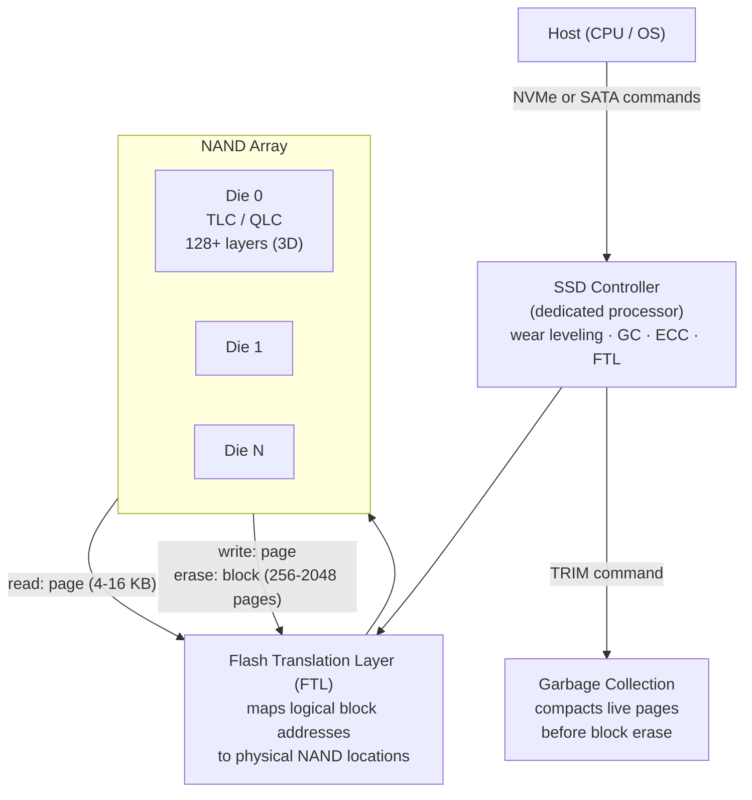

## In simple terms

An **SSD** (solid-state drive) stores your files in [flash memory](/t/flash-memory) chips instead of on a spinning magnetic platter. "Solid-state" means **no moving parts** — nothing spins, nothing seeks. That makes it dramatically faster than the hard disk it replaced, more rugged, silent, and lower-power. The single biggest speed upgrade most computers received in the last fifteen years was swapping a hard drive for an SSD.

## The Visual Map



## More detail

An SSD is built from [flash memory](/t/flash-memory) chips plus a **controller** chip that manages them. Flash has quirks — it's written in pages but erased in larger blocks, and each cell wears out after many writes — so the controller does substantial work:

- **Wear leveling:** spreads writes evenly across blocks so no area wears out prematurely.
- **Garbage collection + TRIM:** when the OS deletes a file (TRIM command), the controller marks those blocks for erasure during idle time, keeping write performance high.
- **Error correction (ECC):** NAND flash is noisy; SSDs use LDPC (Low-Density Parity-Check) codes to detect and correct bit errors.
- **Flash Translation Layer (FTL):** maps the host's logical block addresses (LBAs) to physical NAND locations, making wear leveling and garbage collection invisible to the OS.

**Interface and speed:**

| Interface | Connector | Read (seq.) | IOPS (random 4K) | Notes |
|---|---|---|---|---|
| SATA III | 2.5" / M.2 SATA | ~550 MB/s | ~100K | Legacy disk protocol |
| NVMe Gen 3 | M.2 / PCIe | ~3,500 MB/s | ~600K | Designed for flash |
| NVMe Gen 4 | M.2 / PCIe | ~7,000 MB/s | ~1M | 2× Gen 3 |
| NVMe Gen 5 | M.2 / PCIe | ~14,000 MB/s | ~2M | 2026 high-end |

NVMe (Non-Volatile Memory Express) was designed specifically for flash — it uses PCIe lanes and supports up to 65,535 I/O queues of 65,535 commands each. SATA was designed for spinning disks and has a single command queue of 32 — a significant bottleneck for flash's parallelism.

**Write endurance:** flash cells wear out. Consumer TLC SSDs are rated for 0.3–1 TBW (terabytes written) per GB of capacity. A 1 TB TLC SSD typically has a 300–1000 TBW rating — writing the entire drive once per day for years before endurance is an issue. Over-provisioning (reserving 7–28% of NAND invisible to the OS) provides spare blocks for garbage collection and extends life.

## Under the Hood

Simulating the Flash Translation Layer — how the FTL maps logical to physical to handle out-of-place writes:

```python
PHYSICAL_PAGES = 16
PAGE_SIZE      = 4   # KB (logical)

class SimpleFTL:
    def __init__(self, pages: int):
        self.l2p      = {}             # logical -> physical mapping
        self.p_data   = [None] * pages # physical page content
        self.p_valid  = [False] * pages
        self.next_pp  = 0              # next free physical page
        self.writes   = 0

    def write(self, lba: int, data: str):
        if lba in self.l2p:
            self.p_valid[self.l2p[lba]] = False  # invalidate old location
        pp = self.next_pp % PHYSICAL_PAGES
        self.p_data[pp]  = data
        self.p_valid[pp] = True
        self.l2p[lba]    = pp
        self.next_pp    += 1
        self.writes     += 1

    def read(self, lba: int) -> str:
        pp = self.l2p.get(lba)
        return self.p_data[pp] if pp is not None else None

    def utilization(self) -> float:
        return sum(self.p_valid) / PHYSICAL_PAGES

ftl = SimpleFTL(PHYSICAL_PAGES)
for i in range(8):
    ftl.write(i % 4, f"data_v{i}")   # overwrite same 4 LBAs
    print(f"Write {i}: LBA {i%4} -> PP {ftl.l2p[i%4]}  "
          f"valid pages: {sum(ftl.p_valid)}/{PHYSICAL_PAGES}  "
          f"data: {ftl.read(i%4)}")
```

## Engineering Trade-offs

**NVMe vs. SATA:** the protocol matters as much as the flash. A SATA SSD can't saturate its link because SATA's command queue (32 entries) is too shallow for flash's parallelism. NVMe with 65K queues allows the SSD to issue I/Os to multiple NAND dies in parallel, reaching 10× higher IOPS.

**TLC vs. QLC:** 3 vs. 4 bits per cell doubles density (cheaper per GB) but reduces endurance from ~3,000 P/E cycles to ~1,000 and adds write latency (more voltage levels to distinguish). Consumer drives are TLC or QLC; enterprise databases prefer TLC with heavy over-provisioning; write-intensive workloads (database WAL) need SLC-cached drives or dedicated endurance-optimised models.

**SLC cache:** most consumer SSDs front their TLC/QLC with an SLC cache — a region written at 1 bit/cell for maximum speed. When the cache fills (typically during sustained large writes), speed drops to native TLC rates (~500–800 MB/s vs. 7,000 MB/s peak). This is why benchmark results for "sustained write speed" are far below peak headline numbers.

## Real-world examples

- Replacing an old laptop's hard drive with an SSD is the classic cheap upgrade: boot time drops from 60 s to &lt;10 s.
- A 2 TB NVMe Gen 4 M.2 drive reads at ~7 GB/s — loading a 50 GB game in 7 seconds vs. 3 minutes on HDD.
- Databases (PostgreSQL, MySQL) on NVMe SSDs achieve 100K+ IOPS for random reads — transforming what query latencies are achievable.
- PlayStation 5's custom NVMe SSD (5.5 GB/s) was a key design constraint for game load times.

## Common misconceptions

- **"SSDs wear out fast, so they're unreliable."** Wear leveling and modern endurance ratings mean a typical consumer SSD outlasts the useful life of the computer for normal use. The 300–1000 TBW rating for a 1 TB drive means writing hundreds of GB per day for years.
- **"All SSDs are equally fast."** Interface (SATA vs. NVMe Gen 4 vs. Gen 5) and flash type (TLC vs. QLC, with/without SLC cache) cause 10–25× differences in peak performance.

## Try it yourself

Model SSD vs. HDD latency and calculate the access gap:

```bash
python3 - <<'EOF'
import random, math

RPM   = 7200
TRACK = 10_000

def hdd_latency_us(a, b):
    seek_ms = 1.0 + 9.0 * math.sqrt(abs(b-a)/TRACK)
    rot_ms  = random.random() * (60_000 / RPM)
    return (seek_ms + rot_ms) * 1000   # in microseconds

def ssd_latency_us():
    return random.uniform(50, 150)   # NVMe 4K read

random.seed(1)
N = 100
hdd_us  = [hdd_latency_us(random.randint(0,TRACK), random.randint(0,TRACK)) for _ in range(N)]
ssd_us  = [ssd_latency_us() for _ in range(N)]
hdd_avg = sum(hdd_us) / N
ssd_avg = sum(ssd_us) / N

print(f"Random 4KB read latency (average of {N} samples):")
print(f"  HDD  : {hdd_avg:>8,.0f} us  ({hdd_avg/1000:>5.1f} ms)")
print(f"  NVMe : {ssd_avg:>8.1f} us  ({ssd_avg/1000:>5.3f} ms)")
print(f"  SSD speedup: {hdd_avg/ssd_avg:,.0f}x faster random access")
EOF
```

## Learn next

- [Flash memory](/t/flash-memory) — the NAND technology inside every SSD; understanding page-program and block-erase explains why SSDs need wear leveling, garbage collection, and over-provisioning
- [HDD](/t/hdd) — the mechanical predecessor; comparing seek-time mechanics to SSD latency makes the 1,000× gap concrete
- [File system](/t/file-system) — the software layer above the SSD; file systems have been redesigned (F2FS, ZFS, APFS) to exploit flash's random-write characteristics and avoid unnecessary garbage collection
