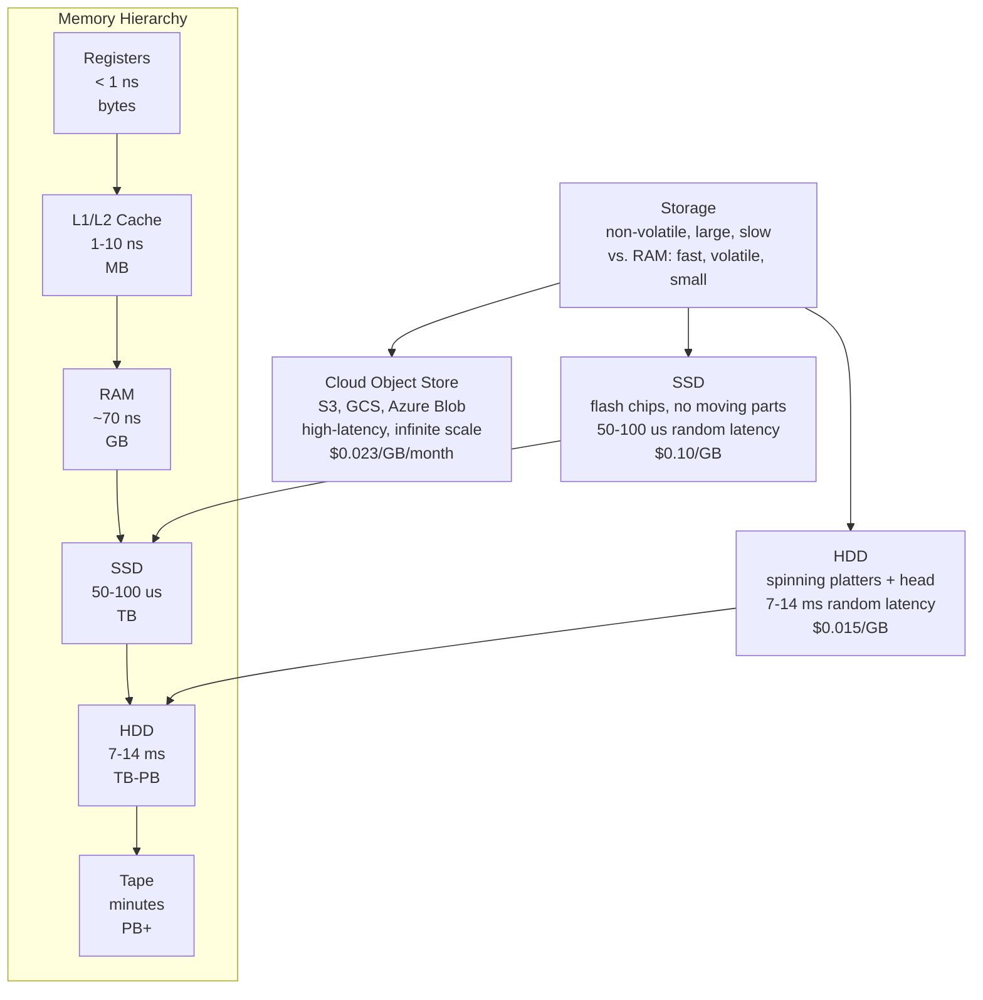

## In simple terms

Storage is where your computer remembers things after you turn it off — your files, your photos, the operating system itself. Unlike [memory](/t/memory), which is fast but forgets everything when power is removed, storage is **non-volatile**: it holds data indefinitely without power. The tradeoff is speed: storage is much slower than memory, but much larger and far cheaper per gigabyte.

## The Visual Map



## More detail

Storage is **non-volatile** — it retains data without a power source. The dominant kinds today are:

- **HDD** (hard disk drive) — spinning magnetic platters with a moving read/write head. Cheap per gigabyte (~$0.015/GB in 2026 for 20+ TB drives), slow random access (~7–14 ms), suitable for sequential bulk data.
- **SSD** (solid-state drive) — flash memory chips with no moving parts. 100–1,000× faster than an HDD for random access (50–150 µs), costs more (~$0.05–0.10/GB), used wherever speed matters.
- **Tape** — sequential magnetic tape still used for deep-archival storage (exabyte-scale) at $0.002/GB — the cheapest per-bit storage available. Access latency is minutes (robot arm).
- **Cloud object storage** (S3, GCS, Azure Blob) — networked storage at $0.023/GB/month with REST API access; effectively infinite scale with high latency (~50–100 ms per object).

**Above the raw device**, an OS imposes a **file system** (NTFS, APFS, ext4, ZFS) that organises bytes into named files and directories, tracks free space, and enforces permissions. Without a file system, the device is just a flat address space of blocks.

**Storage hierarchy:** alongside memory, storage sits in the memory hierarchy. The hierarchy exists because fast memory is expensive and volatile; slow storage is cheap and persistent. Software architects choose the tier that matches their latency budget and durability requirements.

**RAID:** multiple drives combined logically to improve throughput (striping) or reliability (mirroring, parity). RAID 1 mirrors across 2 drives (survives 1 failure). RAID 5/6 use parity for fault tolerance with better capacity efficiency than mirroring. SSDs and cloud replicas have largely replaced hardware RAID in new designs.

## Under the Hood

Modelling storage tier latency and cost to find the right tier for a workload:

```python
tiers = [
    # (name, latency_us, cost_per_gb, iops)
    ("L1 Cache",     0.001,    3_000, 1_000_000_000),
    ("L2/L3 Cache",  0.010,    1_500,   200_000_000),
    ("DRAM",         0.070,        3,    10_000_000),
    ("NVMe SSD",   100.0,     0.080,       500_000),
    ("SATA SSD",   200.0,     0.060,       100_000),
    ("HDD",     10_000.0,     0.015,           150),
    ("Tape",  60_000_000.0,   0.002,             1),
]

print(f"{'Tier':<15} {'Latency':>12} {'Cost/GB':>9} {'IOPS':>14}")
print("-" * 57)
for name, lat_us, cost_gb, iops in tiers:
    if lat_us < 1:
        lat_str = f"{lat_us*1000:.0f} ps"
    elif lat_us < 1000:
        lat_str = f"{lat_us:.3f} us"
    elif lat_us < 1_000_000:
        lat_str = f"{lat_us/1000:.1f} ms"
    else:
        lat_str = f"{lat_us/1_000_000:.0f} s"
    print(f"{name:<15} {lat_str:>12} ${cost_gb:>7.3f}  {iops:>13,}")
```

## Engineering Trade-offs

**Latency vs. cost:** NVMe SSD is 100× cheaper per GB than DRAM but 1,000× slower per access. HDD is 5× cheaper than SSD per GB but 100× slower. Every storage architecture is a tuned combination: hot data in SSD/RAM, cold data on HDD/tape.

**Durability vs. availability:** storage doesn't mean data is safe — drives fail (~1–4% annually for HDDs), SSDs wear out, data centres flood. The **3-2-1 backup rule**: 3 copies of data, 2 on different media types, 1 offsite (cloud or tape). RAID provides high availability but is not a backup — a virus or accidental delete hits all RAID mirrors simultaneously.

**Write amplification:** flash writes in pages (4–16 KB) and erases in blocks (256–2048 pages). Writing a single byte requires read-modify-write of an entire page, and eventually erasing a whole block to reclaim space. Write amplification factor (WAF) > 1 means the drive writes more than the host requested — reducing endurance and throughput.

**Cloud object storage:** optimised for throughput (multiple GB/s per bucket), not latency. Get/Put latency of 50–100 ms is acceptable for media serving and batch pipelines; it is catastrophic for databases. SQL databases do not go on S3 directly; they use block storage (EBS, Persistent Disk) that emulates an SSD over the network.

## Real-world examples

- A laptop "1 TB SSD" is NVMe flash storage — files persist across reboots, loads in under a second.
- Amazon S3 stores > 100 trillion objects — the backbone of web-scale static content, ML datasets, and backups.
- A surveillance camera writes 24/7 video to a high-capacity HDD — sequential writes at low cost per GB, not needing low latency.
- Netflix transcodes video to many quality levels and stores them in cloud object storage (S3/GCS); end-user latency comes from the CDN, not S3.

## Common misconceptions

- **"SSDs are basically RAM."** Both use chips, but DRAM latency is ~70 ns; NVMe SSD latency is ~100 µs (1,400× slower). SSDs trade speed for non-volatility and cost.
- **"My data is safe because it's on a drive."** Drives fail, get dropped, get corrupted. Durability requires redundancy (RAID, backup, cloud replication) — a single drive is a single point of failure.

## Try it yourself

Model the cost-latency trade-off for storing a 1 TB dataset across storage tiers:

```bash
python3 - <<'EOF'
tiers = [
    ("NVMe SSD",     100,   0.08),   # latency_us, cost_per_gb
    ("SATA SSD",     250,   0.06),
    ("HDD",       10_000,   0.015),
    ("Cloud Obj", 80_000,   0.023),  # ~80 ms as us
]

dataset_gb = 1024   # 1 TB

print(f"1 TB dataset across storage tiers:")
print(f"{'Tier':<14} {'Latency':>10} {'Monthly cost':>14}  {'Annual cost':>12}")
print("-" * 58)
for name, lat_us, cost_gb in tiers:
    monthly = dataset_gb * cost_gb
    annual  = monthly * 12
    if lat_us < 1_000:
        lat_str = f"{lat_us} us"
    else:
        lat_str = f"{lat_us/1000:.1f} ms"
    print(f"{name:<14} {lat_str:>10} ${monthly:>12.2f}  ${annual:>10.2f}")
EOF
```

## Learn next

- [Operating system](/t/operating-system) — the software that manages storage devices: mounting file systems, scheduling I/O, providing the read/write system calls applications use
- [File system](/t/file-system) — the structure that organises raw storage blocks into named files and directories; understanding it shows how NTFS, ext4, and APFS differ
- [SSD](/t/ssd) — the dominant storage technology in personal computing: flash-based, no moving parts, 1,000× faster random access than HDD
- [HDD](/t/hdd) — the magnetic predecessor; cheaper per GB, 1,000× slower random access; still used for bulk archival storage
