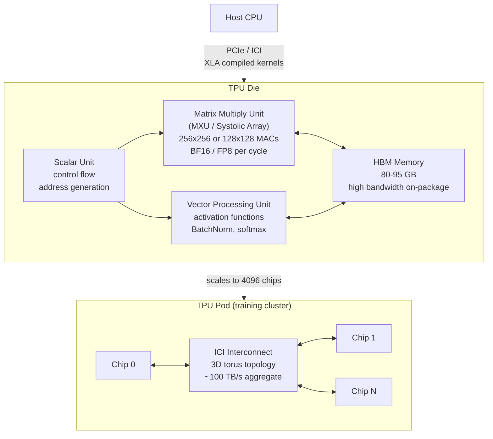

## In simple terms

Google built the TPU because they needed a machine learning accelerator faster and more power-efficient than GPUs for their specific workloads — primarily matrix multiplication for neural networks. A TPU is a custom chip (ASIC) whose core is a massive systolic array of multiply-accumulate units, designed to do one thing incredibly fast: multiply matrices. TPUs trained Google's Gemini, PaLM, and Bard models and run inference for Google Search, Translate, and Photos.

## The Visual Map



## More detail

**Motivation:** in 2013, Google projected that if every user used voice search for 3 minutes per day, Google would need to double its data-centre capacity — all for DNN (deep neural network) inference. GPUs were too expensive in dollars and watts per inference at that scale. Google started designing TPU v1 in 2013 and deployed it in 2015.

**TPU generations:**

| Version | Year | Purpose | Precision | TFLOPS | Memory |
|---|---|---|---|---|---|
| v1 | 2015 | Inference only | INT8 | 92 TOPS | 8 GB |
| v2 | 2017 | Training | BF16 | 45 | 64 GB HBM |
| v3 | 2018 | Training | BF16 | 420 | 128 GB HBM |
| v4 | 2021 | Training | BF16 | 275 | 32 GB HBM |
| v5p | 2023 | Training | BF16/FP8 | 460 | 95 GB HBM |

Google invented **bfloat16** (Brain Float 16) for TPUs — same 8-bit exponent as FP32 (preserving numeric range), but only 7 mantissa bits. Pre-trained FP32 models can be fine-tuned or run inference in BF16 without accuracy loss, while cutting memory and compute in half.

**What makes TPUs efficient vs. GPUs:**
- **Fixed-function systolic array:** all silicon dedicated to MAC operations — no cache hierarchy, no branch predictor, no general-purpose shader cores. The same area on a GPU must serve graphics, shader work, and tensor compute.
- **Deterministic execution:** no caches means no cache-miss jitter. Execution time is predictable — critical for tight pipeline scheduling in XLA.
- **Custom interconnect (ICI):** a 3D torus network between chips in a pod, optimised for model-parallel and data-parallel training. TPU v4 pods connect 4096 chips with optical interconnects.
- **HBM directly on-package:** avoids the DRAM bandwidth bottleneck; HBM provides very high bandwidth with lower power than external DDR.

**Software:** TPUs are programmed via XLA (Accelerated Linear Algebra) — a domain-specific compiler that optimises TensorFlow, JAX, and PyTorch graphs for TPU. JAX with XLA is the primary training framework at Google.

**TPU vs. NVIDIA H100:**

| | TPU v5p | H100 SXM |
|---|---|---|
| BF16 TFLOPS | 460 | 989 |
| Memory | 95 GB HBM | 80 GB HBM3 |
| Power | ~450 W | 700 W |
| Interconnect | ICI 3D torus | NVLink 4.0 |
| Software | JAX/XLA primary | CUDA primary |

Raw TFLOPS comparisons are misleading — utilisation, memory bandwidth, and software ecosystem matter significantly.

## Under the Hood

Simulating a tiny systolic array — the computational heart of a TPU:

```python
def systolic_matmul(A: list, B: list) -> list:
    """
    Systolic array: data flows through a 2D grid of MAC cells.
    Each cell: accumulates A_row_element * B_col_element.
    This naive simulation shows the flow; real TPU is 256x256.
    """
    rows_A = len(A)
    cols_B = len(B[0])
    cols_A = len(A[0])

    # Output C[i][j] = sum(A[i][k] * B[k][j] for k in range(cols_A))
    C = [[0.0] * cols_B for _ in range(rows_A)]

    # Simulate "wavefront" diagonal propagation through the array
    for i in range(rows_A):
        for j in range(cols_B):
            for k in range(cols_A):
                C[i][j] += A[i][k] * B[k][j]   # each (i,j) cell MACs
    return C

A = [[1, 2, 3],
     [4, 5, 6]]

B = [[7,  8],
     [9,  10],
     [11, 12]]

C = systolic_matmul(A, B)
print("A @ B = C  (simulated systolic array):")
for i, row in enumerate(C):
    print(f"  C[{i}] = {row}")

print()
print("A real TPU v5 MXU (128x128 BF16):")
print("  Performs 2 * 128^3 = 4,194,304 FLOPs per cycle")
print("  At 940 MHz: ~3.94 TFLOPS from the MXU alone")
```

## Engineering Trade-offs

**TPU vs. GPU — when TPU wins:**
- Large dense transformer training: TPU's systolic array is purpose-built for the dominant AI operation (attention + FFN matmuls). No cycles wasted on graphics or general-purpose compute.
- Predictable shapes: TPU XLA compiles graphs with fixed tensor shapes ahead of time. Transformers have static shapes → the compiler can pipeline perfectly.
- Pod-scale training: TPU pods (4096 chips) with custom ICI interconnect are designed for model-parallel and pipeline-parallel training of 100B+ parameter models.

**When GPU wins:**
- Dynamic shapes / irregular computation: GPU with CUDA handles variable-length sequences, sparse operations, and custom CUDA kernels better than XLA compilation.
- Ecosystem breadth: CUDA has far more libraries (cuDNN, NCCL, Flash Attention, Triton) and community tooling. PyTorch's native target is CUDA.
- Inference for diverse models: data-centre GPUs run a broader variety of model architectures and customer workloads without recompiling for each.

**Specialisation cost:** every other hyperscaler (AWS Trainium, Amazon Inferentia, Microsoft Maia, Meta MTIA, Apple Neural Engine) now designs custom ML accelerators — because the 7–10× efficiency advantage of a purpose-built chip over a general-purpose GPU justifies the silicon investment at scale.

## Real-world examples

- Google Gemini 1.0 Ultra, 1.5 Pro, and Gemini 2.0 were all trained on TPU pods.
- Google Search uses TPUs for real-time neural ranking of results (billions of queries per day).
- Google Translate's NMT (neural machine translation) was the first production workload that triggered TPU development.
- Google Photos' object recognition and album clustering runs on TPU inference.

## Common misconceptions

- **"TPUs can only run TensorFlow."** TPUs run any computation expressible in XLA — including PyTorch via PyTorch/XLA and JAX. Any framework that emits XLA HLO (High Level Operations) can target TPUs.
- **"TPUs always outperform GPUs."** TPUs excel at large dense matrix operations with predictable shapes. For irregular computation, sparse models, or small batch sizes, GPUs often outperform. NVIDIA H100 has higher raw TFLOPS and a more mature software ecosystem for most workloads.

## Try it yourself

Simulate BF16 vs. FP32 precision trade-off — the key choice that TPUs exploit:

```bash
python3 - <<'EOF'
import struct

def to_bf16(x: float) -> float:
    """Truncate FP32 to BF16: keep top 16 bits (1 sign, 8 exp, 7 mantissa)."""
    packed = struct.pack('>f', x)
    # Zero out the lower 2 bytes (16 mantissa bits -> 7 mantissa bits)
    bf16_bytes = packed[:2] + b'\x00\x00'
    return struct.unpack('>f', bf16_bytes)[0]

values = [3.14159265, 2.71828182, 1.41421356, 0.00012345, 123456.789]

print(f"{'Value':>14} {'BF16':>14} {'Abs error':>12}  {'Rel error'}")
print("-" * 60)
for v in values:
    b = to_bf16(v)
    abs_err = abs(v - b)
    rel_err = abs_err / abs(v) if v != 0 else 0
    print(f"{v:>14.8f} {b:>14.8f} {abs_err:>12.2e}  {rel_err*100:>6.3f}%")

print()
print("BF16 keeps 7 mantissa bits (~2 significant decimal digits precision)")
print("FP32 keeps 23 mantissa bits (~7 significant decimal digits precision)")
print("BF16 saves 2x memory and 2x compute vs FP32 -- acceptable for ML weights")
EOF
```

## Learn next

- [ASIC](/t/asic) — a TPU is an ASIC: understanding the custom silicon design process explains why building a TPU takes years of engineering and hundreds of millions of dollars
- [Linear algebra](/t/linear-algebra) — the mathematical foundation of TPU operations; matrix multiply (GEMM) and batch matrix operations are the primitives every TPU kernel reduces to
- [Neural network](/t/neural-network) — the dominant consumer of TPU compute; transformer layers are sequences of matrix multiplications that map perfectly onto the systolic array architecture
