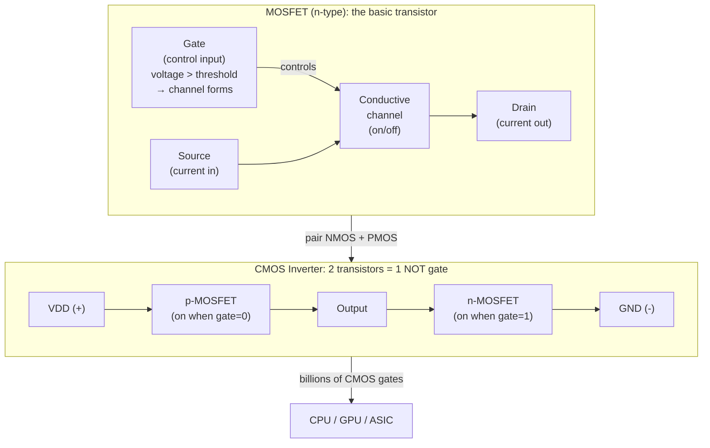

## In simple terms

A **transistor** is a tiny electronic switch. A small voltage on one terminal controls whether current flows between the other two. Modern CPUs contain tens of billions of them, etched onto a fingernail-sized chip and switching billions of times per second. Everything a computer does — every pixel, every network packet, every AI matrix multiply — is ultimately transistors turning on and off in carefully designed patterns.

## The Visual Map



## More detail

The dominant transistor type today is the **MOSFET** (metal-oxide-semiconductor field-effect transistor):

- **Gate:** the control terminal. Applying voltage above a threshold (`V_th`) causes electrons to accumulate in the semiconductor beneath the oxide, creating a conductive channel.
- **Source and drain:** the two terminals through which current flows when the channel is open.
- **Gate oxide:** an insulating layer (SiO2 or high-κ dielectric) that isolates the gate — almost no current flows into it, making the transistor voltage-controlled, not current-controlled.

**CMOS (Complementary MOS):** modern chips pair n-type (NMOS, channel=electrons) and p-type (PMOS, channel=holes) transistors. A CMOS inverter (NOT gate) connects PMOS between VDD and output, NMOS between output and ground. When input is low, PMOS conducts → output is high. When input is high, NMOS conducts → output is low. Crucially, in either stable state, there's no DC path from VDD to GND — power is only drawn *during switching*. This is why CMOS made high-density, low-power digital logic possible.

**Technology nodes:** process generations ("5 nm", "3 nm") describe lithography generations. The headline number is now largely a marketing label — actual physical gate lengths are larger. What scales reliably is transistor density (transistors per mm²).

**3D structures:** once planar MOSFETs ran into short-channel effects as gate lengths shrank below ~25 nm, the industry moved to:
- **FinFET (2012):** the channel rises as a vertical "fin," giving the gate three-sided control over the channel. Used from 22 nm to 5 nm.
- **GAAFET (Gate-All-Around, 2023+):** the gate wraps entirely around a nanosheet or nanowire channel for even better electrostatic control. Used at 3 nm and below.

## Under the Hood

A Python simulation of CMOS gate behaviour — modelling n-type and p-type MOSFETs as voltage-controlled switches:

```python
def nmos(gate: int, vdd: float = 1.0) -> float:
    """n-type MOSFET: conducts (→ GND) when gate=1"""
    return 0.0 if gate == 1 else vdd   # output pulled to GND when on

def pmos(gate: int, vdd: float = 1.0) -> float:
    """p-type MOSFET: conducts (→ VDD) when gate=0"""
    return vdd if gate == 0 else 0.0   # output pulled to VDD when on

def cmos_not(a: int) -> int:
    """2-transistor CMOS NOT gate: wire PMOS + NMOS in series."""
    p = pmos(a)   # PMOS pulls output high when a=0
    n = nmos(a)   # NMOS pulls output low when a=1
    out = p if a == 0 else n
    return int(out > 0.5)

def cmos_nand(a: int, b: int) -> int:
    """4-transistor CMOS NAND: 2 PMOS in parallel + 2 NMOS in series."""
    p_out = 1 if (a == 0 or b == 0) else 0   # PMOS parallel: on if either input=0
    n_out = 0 if (a == 1 and b == 1) else 1   # NMOS serial: both must be 1 to pull low
    return p_out if (a == 0 or b == 0) else (1 - (a & b))

print("NOT gate:    NAND gate:")
print("A  out       A  B  out")
print("-" * 28)
for a in range(2):
    n = cmos_not(a)
    for b in range(2):
        nd = cmos_nand(a, b)
        print(f"{a}  {n}           {a}  {b}  {nd}")
```

## Engineering Trade-offs

**Speed vs. power:** switching power in CMOS is `P = α × C × V² × f` (α = activity factor, C = capacitance, V = voltage, f = frequency). Reducing V dramatically cuts power (quadratic), but reduces noise margin and requires lowering `V_th`, which increases leakage. Modern designs run at ~0.7–1.0 V, a compromise between speed and leakage.

**Leakage current:** at nanometre scales, transistors leak current even when "off" due to sub-threshold conduction and gate oxide tunnelling. This static power dominates at advanced nodes and is why Dennard scaling broke: you can't just run all transistors at once without exceeding thermal design power.

**FinFET vs. GAAFET:** FinFETs improved electrostatic control vs. planar, enabling scaling from 22 nm to 5 nm. GAAFET (nanosheet) gives better control and enables scaling below 3 nm, at higher manufacturing complexity and cost. Each 2-3 year node transition costs billions in R&D and tooling.

## Real-world examples

- A 2024 Apple M4 packs ~28 billion transistors in a 3 nm die smaller than a thumbnail — a density that took 70+ years of Moore's Law doubling to reach.
- A single modern NAND gate uses 4 transistors. An x86 instruction decoder contains hundreds of millions of them.
- The first commercial transistor radio (1954) had four transistors. A smartphone SoC has 20 billion.

## Common misconceptions

- **"Smaller process = smaller transistor."** Process nodes (3 nm, 2 nm) are now largely marketing labels. The actual gate length is larger; the node number measures density rules. TSMC 3 nm ≠ 3 nm physical gate.
- **"Transistors are analog."** The physics is analog (threshold voltage, carrier mobility), but in digital chips, transistors are driven hard into saturation or cutoff — behaving as binary switches. Analog chip design explicitly exploits the intermediate regime.

## Try it yourself

Simulate all 7 classic gates built from transistor-level CMOS primitives:

```bash
python3 - <<'EOF'
def NOT(a):  return 1 - a
def AND(a, b): return a & b
def OR(a, b):  return a | b
def NAND(a, b): return NOT(AND(a, b))
def NOR(a, b):  return NOT(OR(a, b))
def XOR(a, b):  return (a | b) & NAND(a, b)
def XNOR(a, b): return NOT(XOR(a, b))

gates = {
    "NOT" : lambda a, b: NOT(a),
    "AND" : AND,
    "OR"  : OR,
    "NAND": NAND,
    "NOR" : NOR,
    "XOR" : XOR,
    "XNOR": XNOR,
}
header = f"{'A':>2} {'B':>2}  " + "  ".join(f"{g:>5}" for g in gates)
print(header)
print("-" * len(header))
for a in range(2):
    for b in range(2):
        row = f"{a:>2} {b:>2}  " + "  ".join(f"{fn(a,b):>5}" for fn in gates.values())
        print(row)
EOF
```

## Learn next

- [Logic gates](/t/logic-gates) — how transistors are wired into NOT / AND / OR gates and the combinational + sequential building blocks of digital circuits
- [CPU](/t/cpu) — the end result of combining billions of transistors: a general-purpose instruction-executing machine made entirely from transistor switches
- [Moore's Law](/t/moore-s-law) — the observation that transistor density doubled every two years for 50 years, and why it is now slowing
