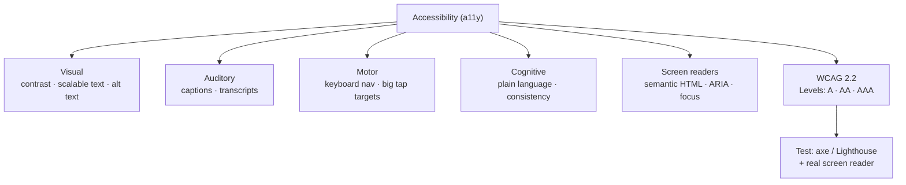

## In simple terms

**Accessibility** (often abbreviated **a11y**) means building software that works for people who don't see well, can't hear, have limited dexterity, use a screen reader, or experience the world differently from the average developer. Good accessibility is also good UX — many of the same patterns make the product better for everyone.

## The Visual Map



## More detail

Common areas of accessibility:

- **Visual** — sufficient colour contrast, scalable text, alt text on images, support for high-contrast modes.
- **Auditory** — captions, transcripts, no audio-only critical information.
- **Motor** — full keyboard navigation, large tap targets, no time-pressure unless you can extend it.
- **Cognitive** — simple language, consistent navigation, error prevention.
- **Screen readers** — semantic HTML, ARIA roles, focus management.

The dominant standard is the **W3C's Web Content Accessibility Guidelines (WCAG)**, currently 2.2. It defines testable success criteria at three levels: A (minimum), AA (the practical bar most regulations cite), AAA (aspirational). Quick practical wins: use real semantic elements (`<button>`, `<a>`, `<label>`), not styled `<div>`s; make every interactive element keyboard-reachable; provide alt text for meaningful images; maintain a contrast ratio of at least 4.5:1 for normal text; caption your videos; and test with a screen reader (VoiceOver, NVDA, JAWS, TalkBack) at least once.

Tooling splits into **automated checks** (axe-core, Lighthouse, WAVE — they catch a surprising amount but miss most semantic issues), **manual testing** with a keyboard and screen reader (irreplaceable), and **testing with disabled users** (the only way to find real friction). Accessibility is legally required in many jurisdictions (ADA, EAA, AODA, EN 301 549), and beyond compliance it's good engineering: roughly 15% of the world's population has a disability, and accessible products tend to be more robust, more keyboard-friendly, and easier to automate.

## Under the Hood

The WCAG contrast rule is a precise formula, not a judgement call. Each colour gets a *relative luminance*; the contrast ratio is `(L_light + 0.05) / (L_dark + 0.05)`, and AA normal text needs ≥ 4.5:1. Here is the exact algorithm a tool like Lighthouse runs:

```python
def luminance(rgb):
    def chan(c):
        c /= 255
        return c / 12.92 if c <= 0.03928 else ((c + 0.055) / 1.055) ** 2.4
    r, g, b = (chan(v) for v in rgb)
    return 0.2126 * r + 0.7152 * g + 0.0722 * b   # WCAG relative luminance

def contrast(fg, bg):
    l1, l2 = sorted((luminance(fg), luminance(bg)), reverse=True)
    return (l1 + 0.05) / (l2 + 0.05)

pairs = {
    "grey on white  ": ((153, 153, 153), (255, 255, 255)),
    "black on white ": ((0, 0, 0),       (255, 255, 255)),
    "white on #1E88E5": ((255, 255, 255), (30, 136, 229)),
}
for name, (fg, bg) in pairs.items():
    r = contrast(fg, bg)
    print(f"{name}: {r:4.1f}:1  AA normal text? {'PASS' if r >= 4.5 else 'FAIL'}")
```

This is why "light grey on white" placeholder text so often fails audits: its ratio falls below 4.5:1.

## Engineering Trade-offs

- **Automated vs manual testing.** Linters and axe-core run in CI and catch low-hanging fruit cheaply, but they miss most semantic and focus-order problems that only a human with a screen reader finds.
- **Semantic HTML vs custom components.** Native `<button>`/`<select>` are accessible for free but hard to restyle; fully custom widgets give design control at the cost of re-implementing keyboard, focus, and ARIA semantics correctly.
- **Visual design vs contrast minimums.** Brand colours and subtle greys can clash with the 4.5:1 rule; meeting it may mean darkening text or enlarging it (large text needs only 3:1).
- **Retrofit vs build-in.** Baking accessibility into a design system once is far cheaper than auditing and patching hundreds of screens after the fact.

## Real-world examples

- A login form with a missing `<label>` is unusable to most screen readers.
- A modal that traps keyboard focus inside itself is a usability win for everyone, not just keyboard users.
- A "skip to main content" link benefits anyone navigating a long page by keyboard.
- Voice control and dictation — designed for users with motor impairments — became mainstream interfaces, a recurring story of accessibility features going general.

## Common misconceptions

- **"Accessibility is for blind people."** That's one audience among many — keyboard-only, low-vision, cognitive, motor, situational (one-handed, sunlight, baby in arm).
- **"Accessible means ugly."** Excellent design and accessibility are entirely compatible.

## Try it yourself

Check whether your colour choices pass WCAG AA — feed in any foreground/background RGB pair (`python3` only):

```bash
python3 - <<'EOF'
def lum(rgb):
    def c(v):
        v/=255
        return v/12.92 if v<=0.03928 else ((v+0.055)/1.055)**2.4
    r,g,b=(c(x) for x in rgb)
    return 0.2126*r+0.7152*g+0.0722*b
def ratio(fg,bg):
    a,b=sorted((lum(fg),lum(bg)),reverse=True)
    return (a+0.05)/(b+0.05)

for fg,bg,label in [((117,117,117),(255,255,255),"grey #757575 on white"),
                    ((255,255,255),(33,150,243),"white on blue #2196F3")]:
    r=ratio(fg,bg)
    print(f"{label:30} {r:4.2f}:1  ->  AA normal {'PASS' if r>=4.5 else 'FAIL'}")
EOF
```

## Learn next

- [UX](/t/ux) — the broader discipline accessibility is a core part of
- [User interface](/t/user-interface) — the component layer that has to carry semantic and ARIA attributes
- [Design system](/t/design-system) — where accessible defaults get encoded once for every screen
- [Touch interface](/t/touch-interface) — target-size and no-hover rules that are accessibility wins on mobile
