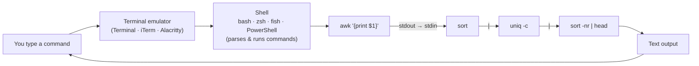

## In simple terms

A **command-line interface** (CLI) is a way of using a computer by typing commands at a text prompt. Instead of clicking buttons, you type a verb (`ls`, `git`, `cat`) and some arguments, press Enter, and read the response. It's faster, scriptable, and less friendly to discover — exactly the opposite trade-off of a GUI.

## The Visual Map



## More detail

The CLI runs inside a **terminal emulator** (Terminal, iTerm2, Windows Terminal, Alacritty, Wezterm). Inside the terminal a **shell** parses your input and runs commands: bash, zsh, fish, PowerShell, nushell.

The Unix philosophy shapes most CLI tools: each program does one thing well; programs read text from standard input and write text to standard output; the pipe (`|`) connects one program's output to the next's input; and together, small tools compose into larger workflows. For example, counting the top IP addresses in a log is five tiny tools and one line:

```bash
awk '{print $1}' access.log | sort | uniq -c | sort -nr | head
```

Modern CLI ergonomics make this far friendlier than it used to be: tab completion, history search, and syntax highlighting (zsh/fish defaults, bash plugins); full-screen TUI tools that render interactive interfaces in the terminal (`htop`, `tig`, `lazygit`, `fzf`); aliases and shell functions for personal shortcuts; and discoverability aids like `man`, `--help`, and tldr summaries. Most servers have no GUI, so if you administer them you live in the CLI — and it's the only practical way to script repetitive work, version-control your environment, and reproduce a workflow exactly.

## Under the Hood

A pipe is the CLI's core abstraction: the shell connects one process's standard output to the next's standard input through an in-kernel buffer, so data streams between programs that know nothing about each other. This Python version of the IP-counting pipeline shows what each stage does:

```python
log = """\
10.0.0.1 GET /
10.0.0.2 GET /a
10.0.0.1 GET /b
10.0.0.1 POST /c
10.0.0.3 GET /
10.0.0.2 GET /d"""

from collections import Counter
ips = (line.split()[0] for line in log.splitlines())  # awk '{print $1}'
counts = Counter(ips)                                  # sort | uniq -c
for ip, n in counts.most_common():                     # sort -nr | head
    print(f"{n:>3} {ip}")
```

Each shell stage maps to one transformation here — extract a field, tally, rank — and the `|` between them is exactly the generator handing values to `Counter`.

## Engineering Trade-offs

- **Discoverability vs power.** A GUI shows every option; a CLI hides them behind names you must know, but rewards that learning with composability a GUI can't match.
- **Speed vs safety.** One command can process millions of lines in seconds — and one mistyped `rm -rf` can delete just as fast, with no undo dialog.
- **Text streams vs structured data.** Piping plain text is universal and language-agnostic but fragile when fields contain spaces or newlines; structured shells (nushell, PowerShell) pass typed objects at the cost of universality.
- **Front-loaded learning.** The curve is steep up front, then everything gets faster — the inverse of a GUI's gentle start and lower ceiling.

## Real-world examples

- `git`, `npm`, `kubectl`, `docker`, `ssh` — every developer tool of consequence is a CLI first, GUI second.
- A 50-line shell script can do the work of an afternoon of clicking.
- Cloud administration commonly happens over SSH into terminals halfway across the planet.
- `fzf`, `ripgrep`, `lazygit`, `bat`, `eza`, `zoxide` — a wave of Rust- and Go-based rewrites made the terminal dramatically friendlier without abandoning its strengths.

## Common misconceptions

- **"CLIs are obsolete."** They are more popular than ever among developers and admins — and getting better tooling, not less.
- **"GUI users can't learn CLI."** They can; the learning curve front-loads, then everything gets faster.

## Try it yourself

Build the classic "top talkers" pipeline on synthetic data — no log file needed, just coreutils on stock WSL/Ubuntu:

```bash
printf '10.0.0.1 GET /\n10.0.0.2 GET /a\n10.0.0.1 GET /b\n10.0.0.1 POST /c\n10.0.0.3 GET /\n10.0.0.2 GET /d\n' \
  | awk '{print $1}' | sort | uniq -c | sort -nr
```

Each stage transforms the stream: `awk` keeps the IP, `sort | uniq -c` tallies, `sort -nr` ranks. Swap `$1` for `$2` to count HTTP methods instead.

## Learn next

- [GUI](/t/gui) — the visual counterpart with the opposite discoverability/efficiency trade-off
- [Shell](/t/shell) — the program that parses your commands and wires pipes together
- [User interface](/t/user-interface) — the broader concept the CLI and GUI are both forms of
- [Keyboard shortcut](/t/keyboard-shortcut) — the keyboard-first mindset taken into graphical apps
