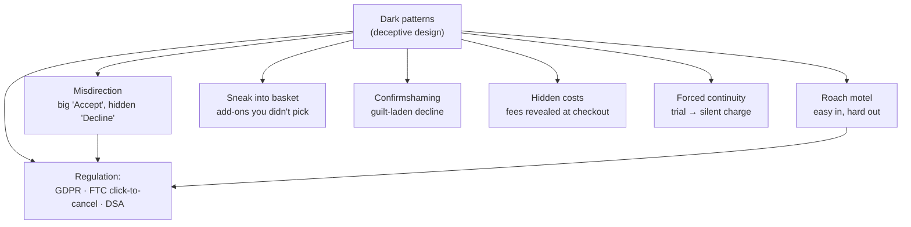

## In simple terms

A dark pattern is a user interface specifically designed to trick you into doing something against your own interests. The cookie banner where "Accept all" is big and blue and "Decline" is tiny, grey, and buried — that's a dark pattern. So is the unsubscribe button disguised as an error message, or the pre-checked "Yes, send me spam" box hidden in a long form. Dark patterns are the deliberate *misapplication* of UX knowledge — exploiting the same cognitive principles that make good design intuitive, but for manipulation instead of clarity.

## The Visual Map

## More detail

**Common dark-pattern types (from Harry Brignull's taxonomy):**

- **Trick questions** — confusingly worded checkboxes ("Uncheck this box if you don't want to not receive emails") that force careful re-reading.
- **Sneak into basket** — unwanted items (insurance, warranty, donation) added to a cart without explicit consent.
- **Roach motel** — easy to get in, hard to get out: one click to subscribe, a phone call and a retention agent to cancel.
- **Privacy zuckering** — confusing settings that lead users to share more than intended; data-sharing defaults on, controls buried.
- **Confirmshaming** — guilt-laden decline copy ("No thanks, I don't want to save money").
- **Disguised ads** — ads styled to look like editorial or organic results.
- **Bait and switch** — the UI performs a different action than the one the user initiated.
- **Hidden costs** — a low headline price with fees revealed only at checkout (Ticketmaster being the canonical case).
- **Forced continuity** — free trials that convert to paid charges with no clear warning.
- **Misdirection** — drawing attention to "Accept" (large, colourful, primary) while burying "Decline" (small, grey, peripheral) — exploiting Fitts's Law and attention.

**Regulatory context** has tightened sharply: the EU **GDPR** (Art. 7) requires consent to be freely given, specific, informed, and unambiguous, making deceptive cookie banners illegal; the US **FTC "Click to Cancel" rule (2024)** requires cancellation to be as easy as sign-up; the UK's unfair-trading regulations prohibit misleading practices; and the EU **Digital Markets/Services Acts** require clear, prominent alternatives to default tracking. Dark patterns are pervasive — a 2019 Princeton study found 11% of the top 11,000 shopping sites used at least one — and for engineers, recognising and refusing to implement one is both an ethical and an increasingly practical (regulatory) matter.

{/* no-under-the-hood: an ethics-and-design topic with no algorithm to implement; the taxonomy and examples carry it */}

## Engineering Trade-offs

- **Short-term conversion vs long-term trust.** Dark patterns can lift opt-in or purchase rates immediately, but they raise chargebacks, support load, and churn as users feel cheated — the long-term business case is weak.
- **Compliance vs manipulation.** A consent banner can be technically "GDPR-compliant" yet still nudge hard toward acceptance; the gap between the letter and the spirit is exactly where regulators are now acting.
- **Persuasion vs deception.** Legitimate persuasion (a clear, prominent call-to-action) and a dark pattern can look similar — the line is whether the design *informs* the choice or *obscures* it.
- **Metric-driven design risk.** Optimising purely for a conversion metric tends to evolve dark patterns by default; guarding against it needs explicit ethical review, not just A/B wins.

## Real-world examples

- Cookie consent banners: an entire industry built on "compliant" banners that still maximise opt-in; EU regulators have fined Google and Meta over consent-flow dark patterns.
- Amazon Prime cancellation: the FTC sued Amazon in 2023 over enrollment and cancellation flows designed to discourage cancelling.
- LinkedIn "Import contacts": emailed users' contacts without clear disclosure of what would be sent.
- Hidden booking and service fees revealed only at the final checkout step.

## Common misconceptions

- **"Dark patterns are just good conversion optimisation."** They erode trust, raise chargebacks, and invite regulatory action; evidence of long-term benefit is weak, evidence of risk is growing.
- **"Dark patterns are illegal everywhere now."** They are increasingly regulated (GDPR, FTC, DSA) but enforcement is still patchy and varies by jurisdiction.

{/* no-try-it-yourself: nothing to run; the exercise is to spot these patterns in the next cookie banner or checkout you use */}

## Learn next

- [Gestalt principles](/t/gestalt-principles) — the perceptual grouping dark patterns weaponise to mislead
- [Fitts's Law](/t/fitts-law) — dark patterns make harmful actions easy and beneficial ones hard
- [User interface](/t/user-interface) — the surface where these deceptive choices are built
- [Usability testing](/t/usability-test) — the honest counterpart: observe real users instead of trapping them
