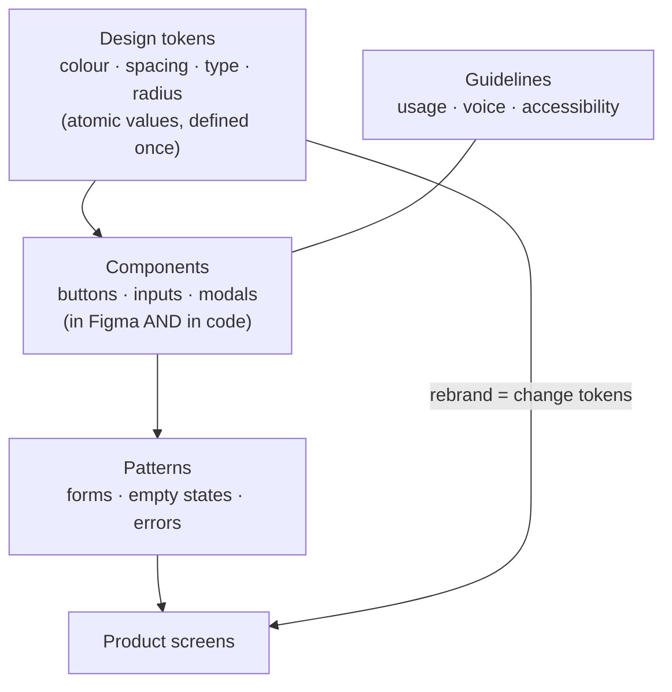

## In simple terms

A **design system** is the single source of truth for how a product looks and behaves. Instead of every designer and developer reinventing buttons, forms, colours, and spacing — and drifting into inconsistency — a design system provides a shared library of ready-made components and rules for using them. It's part style guide, part component toolkit, part documentation. The payoff: a consistent [user interface](/t/user-interface) across a whole product (or company), built much faster because the pieces already exist.

## The Visual Map



## More detail

A mature design system usually has several layers:

- **Design tokens** — the atomic values: colours, font sizes, spacing units, border radii. Defined once, used everywhere, so a rebrand is a token change rather than thousands of edits.
- **Components** — reusable building blocks (buttons, inputs, modals, navigation) implemented in both the design tool (e.g. Figma) and in code (e.g. React), kept in sync.
- **Patterns** — recommended ways to combine components for common tasks (forms, empty states, error handling).
- **Guidelines** — usage rules, content/voice standards, and crucially [accessibility](/t/accessibility) requirements baked into every component.

The defining principle is **consistency through reuse**: when a button is fixed or improved once in the library, every screen using it benefits. This is essentially the [abstraction](/t/abstraction) and reuse philosophy of software engineering applied to interface design. Well-known public examples include Google's **Material Design**, IBM's **Carbon**, Atlassian's, and Shopify's **Polaris**. Building and maintaining one is real, ongoing work — a design system is a product in its own right, with its own users (the teams who consume it). For any organisation beyond a small size, it keeps the experience coherent and the team efficient, encoding accessibility and brand standards so they're followed by default.

## Under the Hood

Tokens are the mechanism that makes a rebrand a one-line change. A token file holds raw values and *semantic aliases*; a build step resolves the aliases and emits CSS custom properties that every component reads:

```python
tokens = {
    "color.blue.500":   "#2196F3",
    "color.grey.900":   "#1A1A1A",
    "space.2":          "8px",
    # semantic aliases point at primitives — components use THESE
    "color.action":     "{color.blue.500}",
    "color.text":       "{color.grey.900}",
    "button.padding":   "{space.2}",
}

def resolve(value, table):
    while value.startswith("{") and value.endswith("}"):
        value = table[value[1:-1]]          # follow the alias chain
    return value

print(":root {")
for name, raw in tokens.items():
    if name.startswith(("color.action", "color.text", "button.")):
        css_var = "--" + name.replace(".", "-")
        print(f"  {css_var}: {resolve(raw, tokens)};")
print("}")
```

Change `color.action` to point at `color.green.500` and every button, link, and focus ring across the product recolours at once — no per-component edits.

## Engineering Trade-offs

- **Consistency vs flexibility.** A shared library guarantees coherence and speed but constrains one-off screens; teams need an escape hatch for genuinely novel UI without forking the system.
- **Upfront cost vs long-term leverage.** Building and staffing a design system is expensive early and pays back only at scale — premature for a tiny product, essential for a large one.
- **Token abstraction vs directness.** Semantic tokens make rebrands trivial and enforce theming, but the extra indirection makes "why is this blue?" harder to trace than a hardcoded colour.
- **Versioning vs velocity.** Treating the system as a versioned product protects consumers from breaking changes, but the release/migration overhead slows how fast the system itself can evolve.

## Real-world examples

- **Material Design** (Google) and **Polaris** (Shopify) are public design systems used across many products.
- A company's shared **Figma component library** paired with a matching **React component library**, so designs and code stay in sync.
- A rebrand executed by changing **design tokens**, instantly propagating new colours and type across every screen.

## Common misconceptions

- **"A design system is just a UI component library."** The code components are one part; it also includes design tokens, usage guidelines, accessibility standards, content rules, and documentation.
- **"Build it once and you're done."** A design system is a living product that needs ongoing maintenance, versioning, and support for the teams that depend on it.

## Try it yourself

Resolve semantic design tokens into CSS variables and see how one alias change recolours everything (`python3` only):

```bash
python3 - <<'EOF'
tokens={"color.blue.500":"#2196F3","color.green.500":"#43A047",
        "color.action":"{color.blue.500}","color.link":"{color.action}"}
def resolve(v):
    while v.startswith("{"): v=tokens[v[1:-1]]
    return v
print("before:", "action =", resolve("{color.action}"), "| link =", resolve("{color.link}"))
tokens["color.action"]="{color.green.500}"     # rebrand: one line
print("after :", "action =", resolve("{color.action}"), "| link =", resolve("{color.link}"))
EOF
```

## Learn next

- [User interface](/t/user-interface) — the surface a design system makes consistent
- [UX](/t/ux) — the experience quality a system encodes once and reuses
- [Accessibility](/t/accessibility) — baked into components so every screen meets the bar by default
- [Abstraction](/t/abstraction) — the software-engineering principle a design system applies to UI
