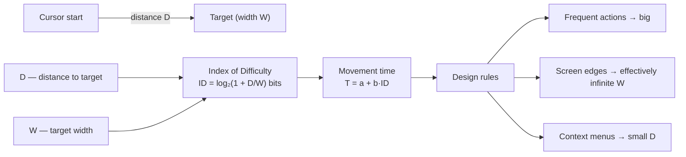

## In simple terms

Fitts's Law says: the time it takes to move a mouse pointer (or finger, or stylus) to a target depends on two things — how far away the target is, and how big it is. Larger and closer targets are faster to hit. This is not just intuition — it's a mathematical model validated in thousands of experiments since Paul Fitts published it in 1954. Every time a designer makes a button larger, puts frequently used controls closer to the cursor, or moves the menu bar to the top edge of the screen (where it's effectively infinitely tall), they're applying Fitts's Law.

## The Visual Map



## More detail

**The formula:** `T = a + b · log₂(1 + D/W)`

- `T` — movement time (seconds).
- `D` — distance from the starting position to the centre of the target.
- `W` — width of the target (in the direction of movement).
- `a`, `b` — empirical constants depending on the input device.
- `log₂(1 + D/W)` — the "index of difficulty" (ID), measured in bits.

**Key consequences.** *Size matters more than you think:* doubling target size reduces difficulty by about a bit, as does halving distance, so high-frequency targets (primary CTA, submit button) should be large. *Edges and corners are effectively infinite:* a menu bar at the top screen edge needs no fine motor control — you slam the cursor up and it stops — which is why macOS puts the menu bar at the screen edge rather than inside the window. *Radial (pie) menus* place every option equidistant from the cursor, minimising D, and are consistently faster than linear menus. *Touch has higher variance* (a fingertip is ~5 mm imprecise), so targets must be larger — Apple's HIG recommends 44×44 pt, Material Design 48×48 dp.

This translates straight into design: primary actions get the largest, most prominent buttons; toolbars sit along screen edges (the macOS Dock, the Windows taskbar); context menus open near the cursor; and tiny targets for common actions (the 16×16 px "close tab" button) are a known Fitts's-Law violation. Larger targets also help users with motor impairments, tremors, or reduced precision — WCAG 2.5.5 (AAA) sets a 44×44 px minimum. The model has limits: it predicts pointing *time* only, not accuracy or the *decision* of what to click, and 3D or multi-touch tasks need extensions.

## Under the Hood

Fitts's Law is directly computable. Plugging distances and widths into the index-of-difficulty formula shows quantitatively why a big edge target beats a small distant one:

```python
from math import log2

def index_of_difficulty(D, W):
    return log2(1 + D / W)                 # bits

def movement_time(D, W, a=0.05, b=0.15):   # typical mouse constants (seconds)
    return a + b * index_of_difficulty(D, W)

targets = [
    ("tiny close button", 600, 16),
    ("normal button",     600, 80),
    ("big CTA",           600, 200),
    ("screen-edge target",600, 10_000),    # edge: huge effective W
]
for name, D, W in targets:
    print(f"{name:20} ID={index_of_difficulty(D, W):4.2f} bits  "
          f"T={movement_time(D, W)*1000:5.0f} ms")
```

The screen-edge target's enormous effective width drives its ID toward zero — the mathematical reason edge menus feel instant.

## Engineering Trade-offs

- **Target size vs information density.** Bigger targets are faster to hit but consume finite screen space; cramming more controls in raises density at the cost of slower, error-prone pointing.
- **Edge placement vs window independence.** Screen-edge toolbars exploit infinite effective width but only work for the focused full-screen app; in-window controls are portable but finite.
- **Pie menus vs linear menus.** Radial menus minimise travel distance and are faster, but they scale poorly past ~8 items and are less familiar than lists.
- **Pointer vs touch tuning.** A layout optimised for a precise cursor can be unusable by finger; serving both means sizing for the *least* precise input, which wastes space on desktop.

## Real-world examples

- macOS menu bar: always at the screen edge, exploiting effectively infinite target size — a measurable usability edge over in-window menu bars.
- Android and iOS home screens: icon minimum sizes (48 dp / 44 pt) derive from Fitts's accuracy requirements for touch.
- Windows 11 centred taskbar: moving the Start button from the edge to the centre reduced its effective size — criticised by HCI designers for violating Fitts's Law.
- Game controllers: frequently-used buttons (A/X) sit in easy thumb reach; rarely-used options are placed harder to hit.

## Common misconceptions

- **"Just make everything bigger."** Larger targets are faster to acquire, but screen space is finite — the real trade-off is information density vs interaction speed.
- **"Fitts's Law only applies to mouse input."** It applies to any pointing movement: mouse, touchpad, touchscreen, stylus, eye tracking, even reaching for physical objects.

## Try it yourself

Compute movement time for targets of different sizes and watch a screen edge collapse the difficulty to near zero (`python3` only):

```bash
python3 - <<'EOF'
from math import log2
def T(D,W,a=0.05,b=0.15): return a + b*log2(1+D/W)
print(f"{'target':22}{'ID (bits)':>10}{'time (ms)':>12}")
for name,D,W in [("16px close btn",600,16),("80px button",600,80),
                 ("200px CTA",600,200),("screen edge",600,10000)]:
    print(f"{name:22}{log2(1+D/W):10.2f}{T(D,W)*1000:12.0f}")
EOF
```

## Learn next

- [Gestalt principles](/t/gestalt-principles) — how users *perceive* an interface, complementing how they *reach* into it
- [Dark pattern](/t/dark-pattern) — designs that deliberately violate Fitts's Law to make harmful actions easy
- [Accessibility](/t/accessibility) — minimum target sizes are a direct Fitts's-Law application for motor impairments
- [User interface](/t/user-interface) — the layouts these pointing predictions inform
