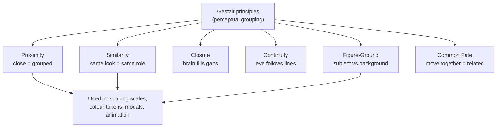

## In simple terms

Gestalt ("whole form" in German) psychology, developed in the 1920s, discovered that the human brain perceives organised wholes rather than collections of individual parts. You see a face before you see two eyes, a nose, and a mouth. A handful of principles describe how the brain groups visual elements automatically — without conscious thought. UI designers use them constantly: grouping related controls by proximity, using consistent colours to show similar functions, and creating clear figure-ground separation for important information.

## The Visual Map

## More detail

**The core Gestalt principles:**

**Proximity:** elements close together are perceived as a group. Form fields sit near their labels; larger gaps separate one section from the next. Use consistent spacing within a group and bigger gaps between groups — navigation links clustered together read as a nav system; scattered, they read as unrelated.

**Similarity:** elements that look alike (shape, colour, size, pattern) are perceived as a group. Blue text reads as links; grey text as disabled. Use the same visual treatment for the same function — inconsistent button styles break similarity and confuse users about what is actionable.

**Closure:** the brain fills in missing information to perceive complete shapes. An arc of dots reads as a circle; a hamburger icon (three lines) reads as "menu". Progress bars, pie charts, and icons exploit this.

**Continuity:** elements arranged on a line or curve are perceived as related — the eye follows the path. Breadcrumbs (`Home > Category > Item`) and column grids create implicit lines.

**Figure-Ground:** the brain splits a field into a figure (foreground subject) and ground (background). Modal dialogs dim the background to become the figure; high-contrast text becomes the figure against its ground.

**Common Fate:** elements that move in the same direction are perceived as a group, which is why elements of one component should animate together. Supporting ideas — *Prägnanz* (the brain prefers the simplest interpretation), *symmetry*, and *connectedness* (shared borders or backgrounds) — round out the set.

Design systems (Material Design, HIG, Ant Design) encode these systematically: spacing scales define proximity groupings, typography and colour tokens define similarity, component hierarchy (card, modal, sheet) uses figure-ground, and animation specs define common fate. The principles explain *why* clear UIs look clear and cluttered ones look cluttered — at a perceptual level, not just aesthetic preference.

{/* no-under-the-hood: a perceptual-psychology principle has no code implementation; the Visual Map and examples carry it */}

## Engineering Trade-offs

- **Whitespace vs density.** Proximity grouping needs generous spacing to read clearly, but every gap spends screen real estate — dense dashboards must group with subtler cues (dividers, shading) instead.
- **Similarity vs distinctiveness.** Making same-function elements look identical aids grouping, but overusing one style erases the figure-ground contrast that should make the primary action stand out.
- **Closure/animation richness vs performance.** Common-fate transitions and skeleton screens that exploit closure feel polished but add motion and rendering cost, and can harm users who are sensitive to motion.
- **Convention vs novelty.** Leaning on learned groupings (links look like links) is instantly legible; a novel visual language may look striking but fights the perception users already have.

## Real-world examples

- Google Search results: query, blue links, and the URL use similarity and proximity to group each result.
- Apple's HIG: dark overlays behind alerts (figure-ground), grouped bottom-sheet controls (proximity), consistent button styles (similarity).
- Data tables: alternating row colours use similarity to group rows; bold headers create figure-ground.
- Loading skeletons (Facebook, LinkedIn): grey shapes use closure to imply the content that will fill them.

## Common misconceptions

- **"Gestalt is just common sense."** Several insights are counterintuitive — figure-ground explains why some layouts feel unstable even when they "look fine". Explicit knowledge makes the intuition reliable.
- **"These principles only apply to visual design."** They extend to typography hierarchy, audio patterns, and even code organisation (proximity = co-locating related code).

{/* no-try-it-yourself: nothing to run in a terminal — to experience these, open any app and notice how spacing and colour group elements */}

## Learn next

- [Fitts's Law](/t/fitts-law) — how users *interact* with a layout, complementing how they *perceive* it
- [Dark pattern](/t/dark-pattern) — designs that weaponise similarity and figure-ground to mislead
- [Design system](/t/design-system) — where these principles get encoded as spacing scales and tokens
- [User interface](/t/user-interface) — the visual layer Gestalt grouping organises
