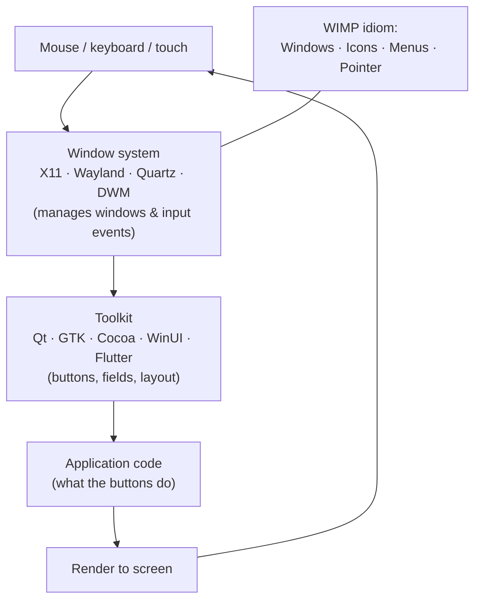

## In simple terms

A **GUI** (graphical user interface) is what most people picture when they think of "using a computer": windows, icons, menus, buttons, a pointer you move with a mouse or finger. You see what's available and click on it, instead of typing a command.

## The Visual Map



## More detail

GUIs were pioneered at Xerox PARC in the 1970s (Smalltalk, the Alto) and popularised by the Apple Lisa and Macintosh, then Windows. The "WIMP" acronym — Windows, Icons, Menus, Pointer — captures the original idiom.

A typical GUI stack has three layers: the **window system** manages on-screen windows and input events (X11, Wayland, Quartz, DWM); the **toolkit** provides buttons, text fields, and layout (Qt, GTK, Cocoa/UIKit, WinUI, Flutter, React Native); and the **application code** decides what the buttons actually do. Modern variants drop or extend the pointer: touch interfaces add gestures and larger targets, web GUIs reimplement the same patterns in HTML/CSS/JS, and voice or conversational interfaces coexist with GUIs without being one.

The trade-offs against the command line are the classic discoverability-versus-efficiency split: a GUI shows you the options (discoverable, lower learning curve) but is slow to repeat and hard to script, while a CLI is memorised, fast for repeat tasks, and composable, with a higher ceiling. Most powerful tools end up offering both, and power users live in the CLI while everyone else uses the GUI. GUIs made computers usable by non-specialists, and every consumer-facing piece of software is built around one.

## Under the Hood

When you click, the window system reports a pixel coordinate and the toolkit performs **hit-testing**: walk the widget tree, find the topmost widget whose rectangle contains the point, and fire its handler. That dispatch is the heart of every GUI:

```python
# Widgets as (name, x, y, width, height), drawn back-to-front
widgets = [
    ("background", 0,   0,   400, 300),
    ("toolbar",    0,   0,   400,  40),
    ("save_btn",  10,   5,    60,  30),
    ("canvas",     0,  40,   400, 260),
]

def hit_test(x, y):
    hit = None
    for name, wx, wy, w, h in widgets:        # later widgets are "on top"
        if wx <= x < wx + w and wy <= y < wy + h:
            hit = name
    return hit

for click in [(35, 18), (200, 150), (390, 295)]:
    print(f"click {click} -> {hit_test(*click)}")
```

Real toolkits add a tree (not a flat list), z-ordering, event bubbling, and focus — but the "which widget is under the pointer?" search is exactly this.

## Engineering Trade-offs

- **Discoverable vs fast.** A GUI surfaces every option visually so newcomers succeed by exploring; that same visibility costs screen space and is slower than a memorised shortcut or command for repeat work.
- **Retained vs immediate mode.** Retained-mode toolkits (a persistent widget tree, like Qt) simplify state but cost memory and bookkeeping; immediate-mode GUIs (redraw every frame, like Dear ImGui) are simpler and great for tools at the cost of redrawing constantly.
- **Native vs cross-platform.** Native toolkits look and feel correct per OS but mean separate codebases; cross-platform frameworks (Electron, Flutter) share one codebase but ship a heavier runtime and can feel slightly foreign.
- **Pixel layout vs responsive layout.** Fixed positions are simple but break on different screen sizes; constraint/flow layouts adapt everywhere at the cost of more complex layout logic.

## Real-world examples

- macOS Finder, Windows Explorer, the file manager you use on Linux.
- Photoshop, Figma, Excel, your email app.
- The browser is itself a GUI app — and a runtime for further GUIs.
- The original 1984 Macintosh introduced the menu bar, drag and drop, desktop icons, and overlapping windows — almost the entire vocabulary modern GUIs still use.

## Common misconceptions

- **"GUIs are easier than CLIs."** Easier to start, often slower to master. Skilled CLI users routinely outpace GUI workflows for repeat tasks.
- **"GUIs are old hat."** They are universal. Web, mobile, desktop — all GUI-first.

## Try it yourself

Implement a GUI's core hit-test and see why overlapping widgets resolve to the topmost one (`python3` only):

```bash
python3 - <<'EOF'
widgets = [("background",0,0,400,300),("toolbar",0,0,400,40),
           ("save_btn",10,5,60,30),("canvas",0,40,400,260)]
def hit(x,y):
    found=None
    for name,wx,wy,w,h in widgets:
        if wx<=x<wx+w and wy<=y<wy+h: found=name   # last (topmost) wins
    return found
for c in [(35,18),(120,20),(200,150)]:
    print(f"click {c} -> {hit(*c)}")
EOF
```

## Learn next

- [Command-line interface](/t/command-line-interface) — the text-based alternative with the opposite trade-offs
- [User interface](/t/user-interface) — the broader surface a GUI is one form of
- [Touch interface](/t/touch-interface) — a GUI adapted for direct finger manipulation
- [Keyboard shortcut](/t/keyboard-shortcut) — the accelerators that give GUI experts CLI-like speed
