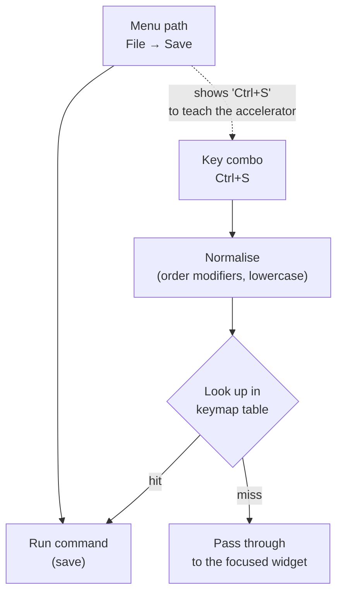

## In simple terms

A **keyboard shortcut** is a key combination — Ctrl+C, Cmd+Z, Ctrl+Shift+T — that runs a command instantly, without reaching for the mouse or hunting through menus. Shortcuts trade **discoverability** for **speed**: a beginner won't *find* them, but once learned they make frequent actions dramatically faster, because your hands never leave the keyboard. They're a small but pervasive part of interface design and one of the clearest examples of designing differently for novices versus experts.

## The Visual Map



## More detail

Shortcuts embody a core HCI principle: **accelerators for expert users**. A good interface lets newcomers succeed by exploring visible menus, *and* lets experts go fast via shortcuts — the same command reachable two ways. The menu item that also lists its shortcut (`Save  Ctrl+S`) is doing exactly this, teaching the accelerator as you use the slow path.

Design considerations that make shortcuts good or bad:

- **Consistency and convention.** Ctrl/Cmd+C/V/Z/S are near-universal; violating these ingrained expectations frustrates users badly. Platform conventions differ (Ctrl on Windows/Linux, Cmd on macOS).
- **Mnemonics.** Memorable mappings (**S**ave, **C**opy, **B**old) are far easier to retain than arbitrary ones.
- **Discoverability aids** — showing shortcuts in menus and tooltips, or a searchable **command palette** (Ctrl/Cmd+K, popularised by editors like VS Code) that surfaces every command *and* its shortcut.
- **Conflict and customization.** Power tools let users remap keys and define their own; conflicts between app and OS shortcuts are a common annoyance.

Shortcuts also connect to broader interaction styles: the [command-line interface](/t/command-line-interface) is the extreme keyboard-first end of the spectrum, while a pure [GUI](/t/gui) leans on pointing and clicking — most modern apps blend both. For software people use all day — editors, design tools, spreadsheets, terminals — keyboard shortcuts are a major driver of real productivity, and the speed difference compounds over thousands of daily actions. They also matter for [accessibility](/t/accessibility), since keyboard operability is essential for users who can't use a pointer.

## Under the Hood

An app dispatches shortcuts through a **keymap**: normalise the pressed combination into a canonical string, then look it up in a table of bindings. Getting the normalisation right (consistent modifier order) is what makes `Ctrl+Shift+S` and `Shift+Ctrl+S` the same shortcut:

```python
def normalize(mods, key):
    order = ["ctrl", "alt", "shift", "meta"]            # canonical modifier order
    parts = [m for m in order if m in mods] + [key.lower()]
    return "+".join(parts)

keymap = {
    "ctrl+s":        "save",
    "ctrl+z":        "undo",
    "ctrl+shift+z":  "redo",
    "ctrl+k":        "command_palette",
}

def dispatch(mods, key):
    return keymap.get(normalize(mods, key), "(pass to focused widget)")

print(dispatch({"ctrl"}, "S"))                  # save
print(dispatch({"shift", "ctrl"}, "z"))         # redo  (order-independent)
print(dispatch({"ctrl"}, "Q"))                  # unbound -> passthrough
```

Real frameworks add focus scoping (a shortcut can mean different things in different panes) and chords (`Ctrl+K` then `Ctrl+C`), but the lookup is this table.

## Engineering Trade-offs

- **Speed vs discoverability.** Shortcuts are the fastest path for experts but invisible to newcomers; the fix is to advertise them in menus and a command palette rather than hide them.
- **Coverage vs memorability.** Binding every command produces an unmemorable, conflict-prone mess; the value is in accelerating the *frequent* actions and leaving the rest to menus.
- **Convention vs customization.** Honouring platform defaults (Ctrl/Cmd+S) is safe and learnable; letting users remap keys empowers power users but fragments documentation and support.
- **App vs OS scope.** Global hotkeys are powerful but collide with OS- and other-app bindings; app-scoped ones are safer but only work while focused.

## Real-world examples

- **Ctrl/Cmd+Z** (undo) and **Ctrl/Cmd+S** (save) are so ingrained that breaking them feels like a bug.
- A **command palette** (Cmd+K / Ctrl+Shift+P) in editors and modern apps searches every action and shows its shortcut.
- Power users of Vim, Photoshop, or Excel work almost entirely from the keyboard for speed.

## Common misconceptions

- **"Shortcuts are just a nice-to-have."** For frequently-used professional tools they're a serious productivity multiplier — and for keyboard-only users, essential accessibility.
- **"Every command should have a shortcut."** Too many shortcuts are unmemorable and conflict-prone; accelerate the *frequent* actions and reach the rest via menus or a palette.

## Try it yourself

Build a keymap dispatcher and confirm modifier order doesn't matter (`python3` only):

```bash
python3 - <<'EOF'
def norm(mods, key):
    order=["ctrl","alt","shift","meta"]
    return "+".join([m for m in order if m in mods]+[key.lower()])
keymap={"ctrl+s":"save","ctrl+z":"undo","ctrl+shift+z":"redo","ctrl+k":"palette"}
for mods,key in [({"ctrl"},"S"),({"shift","ctrl"},"Z"),({"ctrl"},"K"),({"alt"},"F4")]:
    print(f"{sorted(mods)} + {key:2} -> {keymap.get(norm(mods,key),'(unbound)')}")
EOF
```

## Learn next

- [GUI](/t/gui) — shortcuts are the expert accelerator layered over point-and-click
- [Command-line interface](/t/command-line-interface) — the keyboard-first extreme of the interaction spectrum
- [User interface](/t/user-interface) — the surface shortcuts accelerate for frequent actions
- [Accessibility](/t/accessibility) — keyboard operability is essential for users who can't use a pointer
