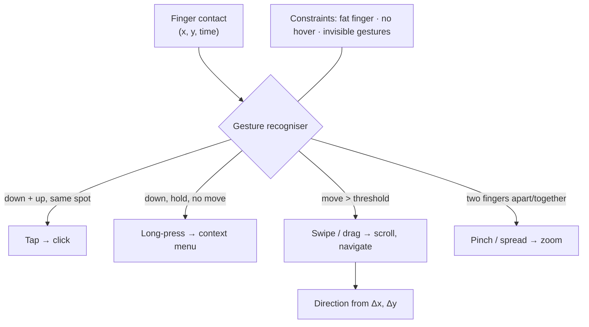

## In simple terms

A **touch interface** lets you operate a device by touching the screen directly — tapping a button, swiping to scroll, pinching to zoom — instead of using a mouse and keyboard. By collapsing the pointer and the display into the same surface, touch made computing feel direct and intuitive: you manipulate things by touching them. It's the interaction model that powers smartphones and tablets, and it brought computing to billions of people who never used a traditional [GUI](/t/gui) with a mouse.

## The Visual Map



## More detail

Touch is a distinct interaction paradigm with its own constraints and conventions, not just a [GUI](/t/gui) without a mouse:

- **Gestures** form the vocabulary: tap (click), long-press (context), swipe/drag (scroll, navigate), pinch and spread (zoom), and two-finger or edge gestures. These have to be *learned* and *discoverable*, which is a real design challenge since gestures are invisible.
- **Fingers are imprecise.** A fingertip is far larger and less exact than a cursor, so touch targets must be big enough (Apple and Google recommend roughly 44–48px minimums) and well-spaced to avoid mis-taps — the "fat finger" problem.
- **No hover.** A mouse can hover to reveal tooltips or menus; touch has no hover state, so designs that depend on hover break and must offer another path.
- **Direct manipulation.** Because you touch the object itself, touch interfaces lean heavily on physical metaphors — momentum scrolling, things that drag and snap — to feel natural.

Touch also reshaped design broadly: its rise drove **responsive design** (interfaces that adapt to screen size and input type) and mobile-first thinking, since the same web page might be used with a fingertip or a cursor. Touch is the primary computing interface for most of the world — the smartphone is the device through which billions access the internet — so designing well for touch isn't a niche skill but a default requirement.

## Under the Hood

A gesture recogniser turns a stream of contact points into a discrete command. The classic case is a swipe: measure the displacement from touch-down to touch-up; if it exceeds a threshold, classify the dominant axis as the swipe direction:

```python
import math

def recognize(down, up, move_threshold=30):
    (x0, y0, t0), (x1, y1, t1) = down, up
    dx, dy = x1 - x0, y1 - y0
    dist = math.hypot(dx, dy)
    if dist < move_threshold:
        return "long_press" if (t1 - t0) > 0.5 else "tap"
    # dominant axis decides the swipe direction
    if abs(dx) > abs(dy):
        return "swipe_right" if dx > 0 else "swipe_left"
    return "swipe_down" if dy > 0 else "swipe_up"

events = [((100,100,0.0), (104,103,0.1)),     # tiny move, quick -> tap
          ((100,100,0.0), (100,101,0.7)),     # no move, slow  -> long press
          ((100,100,0.0), (280,110,0.2)),     # big +x         -> swipe right
          ((100,300,0.0), (108, 40,0.2))]     # big -y         -> swipe up
for down, up in events:
    print(recognize(down, up))
```

Production recognisers track velocity (for momentum scrolling), multiple simultaneous contacts (pinch), and resolve conflicts between competing gestures — but each starts from this displacement test.

## Engineering Trade-offs

- **Direct vs precise.** Touch feels immediate because you act on the object itself, but a fingertip's ~5 mm contact patch is far less precise than a cursor — hence large, well-spaced targets.
- **Gestures vs discoverability.** Gestures are fast and uncluttered once learned, but they're invisible; relying on them risks users never discovering core features without onboarding hints.
- **Screen real estate vs reachability.** Big targets reduce mis-taps but consume space; one-handed reach zones (thumb arcs) further constrain where primary actions can sit.
- **Shared codebase vs per-input tuning.** Responsive design serves touch and pointer from one page, but the no-hover and target-size differences often need input-specific tweaks to feel right on each.

## Real-world examples

- The **smartphone** itself — a multi-touch screen is its main and often only input.
- **Pinch-to-zoom** on a map and **swipe-to-delete** on a list — gestures that feel obvious now but had to be invented and taught.
- A website redesigned with larger tap targets and no hover-dependent menus so it works on phones — touch driving responsive design.

## Common misconceptions

- **"A touch interface is just a GUI you poke instead of click."** Touch has genuinely different constraints — imprecise input, no hover, gesture-based commands — that demand their own design patterns, not a shrunk-down desktop UI.
- **"Bigger screens make touch precise."** Precision is limited by the fingertip, not the screen; touch targets must stay finger-sized regardless of display size.

## Try it yourself

Classify gestures from raw touch-down/up coordinates and see how the dominant axis decides swipe direction (`python3` only):

```bash
python3 - <<'EOF'
import math
def gesture(down, up, thr=30):
    (x0,y0,t0),(x1,y1,t1)=down,up
    dx,dy=x1-x0,y1-y0
    if math.hypot(dx,dy)<thr:
        return "long-press" if t1-t0>0.5 else "tap"
    return ("swipe-right" if dx>0 else "swipe-left") if abs(dx)>abs(dy) \
           else ("swipe-down" if dy>0 else "swipe-up")
for d,u in [((100,100,0),(103,102,0.1)),((100,100,0),(100,100,0.8)),
            ((50,200,0),(260,210,0.2)),((200,300,0),(195,60,0.2))]:
    print(gesture(d,u))
EOF
```

## Learn next

- [GUI](/t/gui) — the pointer-based idiom touch adapts for direct manipulation
- [Fitts's Law](/t/fitts-law) — the model behind minimum touch-target sizes
- [Accessibility](/t/accessibility) — large targets and no-hover paths are accessibility wins on mobile
- [User interface](/t/user-interface) — the broader surface touch is one form of
