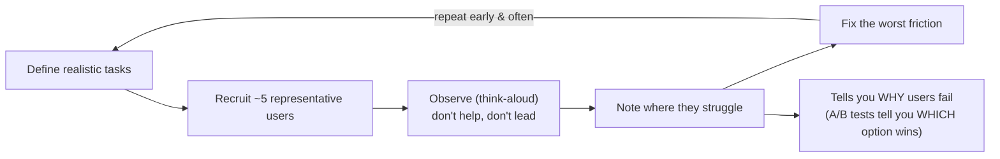

## In simple terms

**Usability testing** is the simple, powerful practice of *watching real people use your product* and seeing where they get stuck. You give a participant a realistic task — "buy this item", "find your account settings" — and observe, without helping, where they hesitate, click the wrong thing, or give up. It cuts through assumptions and opinions: the team may be sure a design is obvious, but watching five real users fumble with it tells the truth. It's the difference between guessing whether a design works and *knowing*.

## The Visual Map



## More detail

The core method is **task-based observation**: define realistic tasks, recruit representative users, ask them to complete the tasks (often "thinking aloud" so you hear their reasoning), and watch — noting where they struggle rather than what they *say* they like.

A few important principles:

- **Small numbers reveal most problems.** A famous finding (Nielsen) is that around **five users** typically surface the large majority of usability issues — so testing is cheap and worth doing early and often, not once at the end.
- **Watch behaviour, not opinions.** What people *do* is far more revealing than what they *say*; users will route around a confusing design and still rate it "fine".
- **Don't lead.** The facilitator stays quiet and resists helping, or the test just measures how well you can give hints.

Variations include **moderated** (a facilitator guides a live session) vs **unmoderated** (users complete tasks alone, recorded), **in-person** vs **remote**, and testing anything from a paper sketch to a finished product. It complements other research: A/B tests tell you *which* option performs better at scale; usability testing tells you *why* people struggle and *how* to fix it. Because even a handful of sessions exposes most major issues cheaply, it's one of the highest-return activities in product design — catching confusing flows before they ship, when they're cheap to fix.

## Under the Hood

Nielsen's "five users" rule isn't folklore — it falls out of a simple model. If each user independently has probability `L` (~0.31 in Nielsen's data) of hitting any given problem, the fraction of problems found with `n` users is `1 − (1 − L)ⁿ`. That curve is why returns diminish so fast:

```python
def found_fraction(n, L=0.31):
    return 1 - (1 - L) ** n

print(f"{'users':>5}{'% problems found':>18}")
for n in range(0, 16, 1):
    if n in (1, 2, 3, 5, 10, 15):
        print(f"{n:>5}{found_fraction(n)*100:>17.0f}%")
```

By 5 users you're near 85%; the 6th through 15th users add little — so the cost-effective move is to run **several small rounds** (test 5, fix, test 5 again) rather than one large study.

## Engineering Trade-offs

- **Few users, fix fast vs many users, measure.** Five users find most *qualitative* problems cheaply; large samples are needed only for *quantitative* metrics (conversion, task-time distributions).
- **Moderated vs unmoderated.** A live facilitator can probe "why did you do that?" but is slow and scheduling-heavy; unmoderated remote tests scale to dozens overnight but can't ask follow-ups.
- **Realism vs control.** Testing the real product in real conditions surfaces genuine friction but is noisy; a scripted lab task isolates one flow but may miss context.
- **Speed vs rigour.** Quick guerrilla tests catch glaring issues in an afternoon; statistically defensible studies cost far more for incremental certainty.

## Real-world examples

- A team watches five people try to complete checkout and discovers everyone misses the "apply coupon" field — a fix worth real revenue.
- A **think-aloud** session where a user mutters "wait, where did the save button go?" pinpoints a navigation problem instantly.
- An **unmoderated remote test** where dozens of users record themselves attempting a task, reviewed later for common stumbling points.

## Common misconceptions

- **"You need many participants to learn anything."** A small handful (around five) reveals most major usability problems; huge samples are for quantitative metrics, not for finding what confuses people.
- **"Asking users if they liked it is usability testing."** Opinions are weak evidence — usability testing is about *observing behaviour* on real tasks, not collecting satisfaction ratings.

## Try it yourself

Plot the problem-discovery curve and see why testing stops paying off after ~5 users (`python3` only):

```bash
python3 - <<'EOF'
def found(n, L=0.31): return 1-(1-L)**n
for n in range(1, 16):
    bar = "#" * round(found(n)*40)
    print(f"{n:>2} users |{bar:<40}| {found(n)*100:3.0f}%")
EOF
```

## Learn next

- [UX](/t/ux) — the research discipline usability testing is the core method of
- [User interface](/t/user-interface) — what testing reveals is confusing and needs fixing
- [Accessibility](/t/accessibility) — testing with disabled users finds friction automated tools miss
- [Design system](/t/design-system) — fixes found in testing are encoded back into shared components
