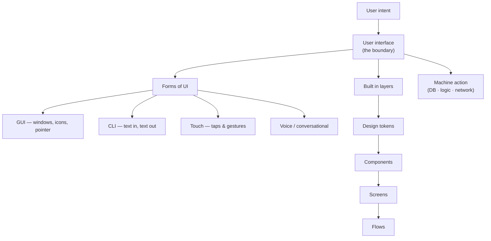

## In simple terms

The **user interface** of a system is everything the user perceives and manipulates: the buttons, screens, voices, lights, gestures, keys, and text. It's the boundary between human intent and machine action. Everything else in the product — the database, the algorithms, the network calls — only exists for the user to the extent it shows up in the UI.

## The Visual Map



## More detail

User interfaces come in many kinds, often layered:

- **Graphical UI (GUI)** — windows, icons, menus, pointers. The default for desktops, laptops, phones.
- **Command-line interface (CLI)** — text in, text out. Dense, fast, scriptable.
- **Touch UI** — direct manipulation on a screen. Gestures (tap, pinch, swipe) as first-class input.
- **Voice UI** — spoken commands and replies (Alexa, Siri, Google Assistant).
- **Conversational UI** — text chat, increasingly powered by LLMs.
- **Tangible / physical UI** — knobs, sliders, dials on hardware.
- **VR / AR / spatial UI** — three-dimensional, body-aware interfaces.
- **No UI** — programmatic interfaces (an API is a UI for developers).

Cross-cutting concerns every UI has to handle:

- **Affordance**: does it look like what it does? A button should look pressable; a link should look clickable.
- **Feedback**: did the action succeed? Was anything happening during the slow bit?
- **State**: where am I, where can I go, where have I been?
- **Errors**: when something fails, the message should help the user recover.
- **Consistency**: similar things look and behave similarly across the product.
- **Accessibility**: works with screen readers, keyboards, varied physical abilities, varied cognitive styles.
- **Performance**: a UI that responds in under 100 ms feels instant; past 1 s, users start losing the thread.
- **Internationalisation**: text expands by 30%+ in other languages; right-to-left layouts mirror; dates and numbers vary by locale.

A UI is built in **layers**: a design system (tokens, primitives), components (buttons, modals, tables), screens (login, settings), and flows (signup, checkout). Mature products invest heavily in the design system because consistency is what lets the rest scale. A great UI makes a mediocre product usable; a bad UI makes a great product unusable — and the UI is where most accessibility and inclusivity decisions land.

## Under the Hood

Almost every interactive UI, from a GUI toolkit to a game engine, is an **event loop**: wait for input, dispatch it to a handler, update state, re-render. Stripped to its essence it is a dozen lines — the same shape whether the events come from a mouse, a touchscreen, or a key:

```python
# A minimal event-driven UI core: state + handlers + render
state = {"count": 0}

def on_event(ev):
    if ev == "increment": state["count"] += 1
    elif ev == "reset":    state["count"] = 0

def render():
    return f"[ Count: {state['count']} ]  (buttons: +  reset)"

# The loop a real toolkit runs ~60 times/sec against the OS event queue
for ev in ["increment", "increment", "increment", "reset", "increment"]:
    on_event(ev)            # 1. dispatch input to a handler
    print(render())         # 2. re-render from the new state
```

A browser's DOM, React's virtual DOM diffing, and Qt's signal/slot system are all elaborations of this dispatch-update-render cycle.

## Engineering Trade-offs

- **Discoverability vs efficiency.** Visible controls (menus, buttons) teach newcomers but slow experts; accelerators (shortcuts, CLIs) are fast but hidden. Mature tools offer both paths to the same command.
- **Consistency vs optimisation.** A shared design system keeps everything coherent and cheap to change, but a bespoke screen tuned for one critical flow can outperform the generic component.
- **Density vs clarity.** Packing more controls onto a screen serves power users but raises cognitive load for everyone else — every added control is one more decision.
- **Immediate vs eventual feedback.** Optimistic UI (show success before the server confirms) feels instant but must handle rollback when the action actually fails.

## Real-world examples

- Apple's **Human Interface Guidelines** and Google's **Material Design** are the canonical reference UI design systems for iOS and Android.
- A bank's **mobile app** is a stack of UIs — a touch UI for everyday users, a desktop GUI for staff, a CLI/API for systems integration.
- **Discord** is essentially the same chat UI on web, desktop (Electron), and mobile — that consistency is intentional.
- **Excel** has barely changed its core spreadsheet UI in 30 years because the model works; the rest of the product evolved around it.

## Common misconceptions

- **"UI = graphic design."** The graphic design is one layer. UI also covers interaction, motion, feedback, accessibility, performance, error handling, and the underlying conceptual model.
- **"More features = better UI."** Often the opposite. Each added control is one more decision the user has to make and one more thing to learn.
- **"You can fix a UI by polishing it."** Visual polish can't save a UI built on the wrong conceptual model. The model has to be right first.

## Try it yourself

Run the event loop above and watch state drive the render — `python3` only:

```bash
python3 - <<'EOF'
state = {"count": 0}
def on_event(ev):
    if ev == "increment": state["count"] += 1
    elif ev == "reset":    state["count"] = 0
def render(): return f"[ Count: {state['count']} ]"

for ev in ["increment", "increment", "increment", "reset", "increment"]:
    on_event(ev)
    print(f"event={ev:>10}  ->  {render()}")
EOF
```

## Learn next

- [UX](/t/ux) — the discipline of designing the whole experience the UI sits inside
- [GUI](/t/gui) — the dominant graphical idiom of windows, icons, and pointers
- [Command-line interface](/t/command-line-interface) — the text-based alternative with the opposite trade-offs
- [Accessibility](/t/accessibility) — the non-negotiable cross-cutting concern every UI must meet
