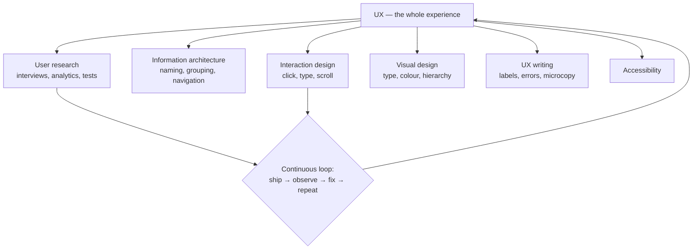

## In simple terms

**UX** (user experience) is everything about how someone *experiences* a product: how easy it is to figure out, how it feels to use, how well it fits the job they came for. The *interface* — buttons, screens — is one part of UX; the rest is flow, copywriting, performance, error states, even brand.

## The Visual Map

## More detail

UX work draws from several disciplines:

- **User research** — interviews, surveys, analytics, usability tests to understand who the users are and what they're trying to do.
- **Information architecture** — how content is named, grouped, and navigated.
- **Interaction design** — the moment-to-moment dance of clicking, typing, scrolling.
- **Visual design** — type, colour, spacing, hierarchy.
- **Content / UX writing** — labels, errors, microcopy.
- **Accessibility** — making the product usable by people with diverse abilities.
- **Measurement** — usability metrics, task success rates, satisfaction scores.

Heuristics that get reused a lot (Nielsen, Norman): match the system to the real world (use the user's language); show system status so the user is never left wondering; give easy undo and exit; stay consistent within the product and with platform conventions; help users recognise, diagnose, and recover from errors; and prevent errors in the first place where possible.

UX is most useful when treated as a continuous loop: ship something, observe how real people use it, fix the worst friction, repeat. Software that's technically capable but a pain to use loses to less powerful competitors that respect the user's time — UX is what turns capability into adoption.

## Engineering Trade-offs

- **Research depth vs shipping speed.** Deep upfront research de-risks big bets but delays release; lightweight continuous testing learns faster but in smaller increments. Most teams blend a little of both.
- **Designer taste vs measured behaviour.** Strong opinions move fast but drift from reality; grounding decisions in observed behaviour is more reliable but slower and costs research time.
- **Consistency vs delight.** Following platform conventions is safe and learnable; novel interactions can delight but risk confusing users and breaking muscle memory.
- **Defaults vs control.** Most users only ever see the defaults, so a good default is a high-leverage UX decision — but over-simplifying frustrates power users who need the knobs.

## Real-world examples

- A "Forgot password" link has saved more accounts than most marketing campaigns.
- Adding a **guest checkout** option to e-commerce is a famous intervention measured to lift conversion by 10–30% — usually more than any visual redesign.
- The default settings of an app are, in practice, the only ones most users ever see — defaults are a UX decision.

## Common misconceptions

- **"UX = pretty UI."** UI is a subset; UX includes onboarding, error states, performance, and beyond-screen interactions (emails, notifications, support).
- **"UX is opinion."** Good UX is grounded in observed user behaviour, not designer taste.

## Learn next

- [User interface](/t/user-interface) — the visible layer UX shapes and measures
- [Usability testing](/t/usability-test) — the core research method for finding where the experience breaks
- [Accessibility](/t/accessibility) — the often-forgotten audience that good UX serves by default
- [Design system](/t/design-system) — how UX decisions are encoded once and reused at scale
