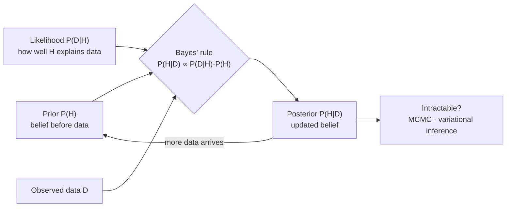

## In simple terms

Bayesian inference answers: "given what I already believed, and what I just observed, what should I believe now?" The answer is always a distribution — not a single number, but a range of possibilities with confidence attached. You start with a **prior** (your belief before seeing data), observe evidence, and the math outputs a **posterior** (your updated belief). Every new observation narrows or shifts the posterior further.

## The Visual Map



## More detail

The engine is **Bayes' rule**:

```
P(hypothesis | data) = P(data | hypothesis) × P(hypothesis) / P(data)
```

- **Prior** `P(hypothesis)` — what you believed before.
- **Likelihood** `P(data | hypothesis)` — how probable is this data, assuming the hypothesis is true?
- **Posterior** `P(hypothesis | data)` — the updated belief, combining both.
- **Evidence / marginal likelihood** `P(data)` — a normalising constant.

The step from a formula to an *inference method* is: treat model parameters as random variables, write down a prior over them, observe data, and compute (or approximate) the posterior. Classical (frequentist) statistics instead treats parameters as fixed unknowns and asks whether data is consistent with them. Bayes treats uncertainty about parameters symmetrically with uncertainty about data.

In practice the posterior is often intractable and must be approximated — with **Markov Chain Monte Carlo (MCMC)** (drawing samples from the posterior) or **variational inference** (fitting a simpler distribution). Many ML models have Bayesian interpretations: Gaussian naive Bayes, a Bayesian neural network, or a Gaussian process are all posteriors over parameters.

Bayesian thinking changes how you design and interpret models: it forces you to declare what you believe before seeing data (avoiding overfitting to noise), it lets uncertainty propagate through a whole pipeline, and it naturally handles small data. Spam filters, recommendation systems, medical diagnosis, sensor fusion, and most of modern probabilistic ML lean on it. It also sharpens A/B testing — a Bayesian test reports "probability variant B is better" directly, instead of the often-misread *p*-value.

## Under the Hood

The most instructive case is the medical test: even a 99%-accurate test for a rare disease yields a *low* posterior, because the prior (base rate) dominates. Bayes' rule makes this precise:

```python
def posterior(prior, sensitivity, false_pos_rate):
    # P(disease | positive) via Bayes' rule
    p_pos = sensitivity * prior + false_pos_rate * (1 - prior)
    return sensitivity * prior / p_pos

prior = 0.001          # 1 in 1000 has the disease
sens  = 0.99           # P(positive | disease)
fpr   = 0.01           # P(positive | healthy)

post = posterior(prior, sens, fpr)
print(f"prior belief:      {prior:.3%}")
print(f"after one positive: {post:.1%}")   # ~9% — far from 99%!

# A second independent positive test uses the first posterior as the new prior
post2 = posterior(post, sens, fpr)
print(f"after two positives: {post2:.1%}")  # belief compounds upward
```

Chaining observations — feeding each posterior back as the next prior — is exactly how a spam filter or a Kalman filter updates incrementally.

## Engineering Trade-offs

- **Prior strength vs data.** A strong prior regularises and shines under little data but biases results if it is wrong; a weak (flat) prior lets data speak but offers no protection against overfitting noise.
- **Exact vs approximate inference.** Closed-form (conjugate) posteriors are instant but only exist for special prior/likelihood pairs. MCMC is general and asymptotically exact but slow and needs convergence diagnostics; variational inference is fast but only approximate.
- **Full posterior vs point estimate.** Carrying the whole distribution propagates uncertainty honestly but costs compute and memory; collapsing to the maximum-a-posteriori point is cheap but throws the uncertainty away.
- **Interpretability vs cost.** Bayesian outputs ("87% chance B beats A") are directly actionable, but getting them reliably is more expensive than a frequentist test.

## Real-world examples

- A spam filter scores incoming email by updating the posterior probability of "spam" given the words it sees.
- GPS fuses noisy sensor readings with a motion model using a **Kalman filter** — a linear-Gaussian form of Bayesian inference.
- Drug-trial analysis starts with a prior over efficacy and updates with outcomes to get a posterior probability the drug works.
- Bayesian optimisation tunes hyperparameters by maintaining a posterior over the loss surface and picking the next configuration to maximise expected improvement.

## Common misconceptions

- **"The prior is subjective, so Bayes is unscientific."** The prior makes assumptions *explicit*; frequentist methods also have implicit assumptions that are just harder to see.
- **"You always need a lot of data for Bayesian methods."** The opposite is an advantage: priors regularise inference under small data, where maximum-likelihood estimation overfits.

## Try it yourself

Feel the base-rate effect — see how a "99% accurate" test still leaves you probably healthy, then how repeated positives compound (`python3` only):

```bash
python3 - <<'EOF'
def posterior(prior, sens, fpr):
    p_pos = sens * prior + fpr * (1 - prior)
    return sens * prior / p_pos

prior, sens, fpr = 0.001, 0.99, 0.01
print(f"base rate: {prior:.2%}")
for test in range(1, 5):
    prior = posterior(prior, sens, fpr)   # yesterday's posterior is today's prior
    print(f"after {test} positive test(s): P(disease) = {prior:.1%}")
EOF
```

## Learn next

- [Probability and statistics](/t/probability-statistics) — Bayes' rule is conditional probability; this is its foundation
- [Information theory](/t/information-theory) — KL divergence measures how far a posterior has moved from its prior
- [Supervised learning](/t/supervised-learning) — many classifiers (naive Bayes, logistic regression) have a Bayesian reading
- [Machine learning](/t/machine-learning) — Bayesian neural networks and Gaussian processes carry uncertainty end to end
