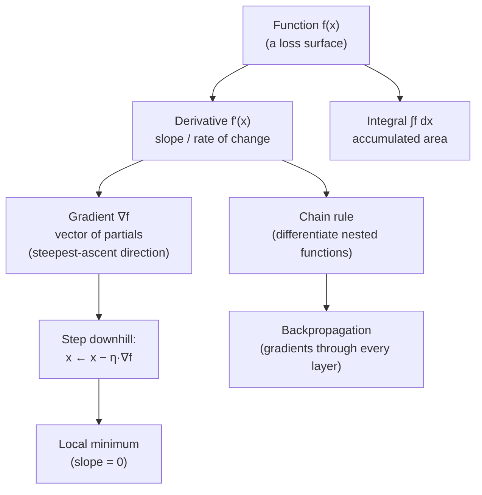

## In simple terms

Calculus is the study of how things change. The **derivative** answers "how fast is this changing right now, and in which direction?" — the slope of a curve at a point. The **integral** answers the reverse: "if I add up all these tiny changes, how much accumulates in total?" — the area under a curve. Most of computing's use of calculus is about the first one: finding which way is downhill.

## The Visual Map



## More detail

The derivative of a function `f(x)` is its instantaneous rate of change, written `f'(x)` or `df/dx`. Geometrically it's the slope of the tangent line; where the slope is zero, the function has a peak, valley, or plateau — which is exactly where optima live.

The pieces that matter for computing:

- **The chain rule** — how to differentiate a function built from nested functions. This is the mathematical core of **backpropagation**: a neural network is one big composed function, and the chain rule propagates error gradients back through every layer.
- **Gradients** — for a function of many variables, the gradient is the vector of all its partial derivatives. It points in the direction of steepest increase, so its negative points downhill toward a minimum.
- **Optimisation** — minimising a *loss function* by repeatedly stepping in the direction the gradient says reduces it fastest. That single idea, **gradient descent**, trains almost every modern model.
- **Integrals** — accumulation: total probability under a distribution, total signal energy, expected values.

You rarely compute these by hand in practice; frameworks perform *automatic differentiation*. But understanding what a gradient *is* explains why training works, why learning rates matter, and why models get stuck.

Training a machine-learning model is, at heart, an optimisation problem, and optimisation is calculus. Every time a model improves during training, a gradient told it which way to nudge millions of parameters. Calculus also underlies physics simulation, signal processing, computer graphics (curves and surfaces), and control systems — anywhere a quantity varies continuously.

## Under the Hood

You don't need a symbolic engine to take a derivative — a finite-difference approximation reveals the slope, and stepping against it minimises a function. This is gradient descent in a dozen lines:

```python
def f(x):            # a parabola with minimum at x = 3
    return (x - 3) ** 2 + 1

def deriv(f, x, h=1e-6):
    return (f(x + h) - f(x - h)) / (2 * h)   # central difference

x = 0.0
lr = 0.1
for step in range(40):
    g = deriv(f, x)        # slope at x
    x -= lr * g            # step downhill
print(f"converged to x = {x:.4f}  (true minimum at 3)")
print(f"slope there  = {deriv(f, x):.2e}  (≈ 0 at a minimum)")
```

Real frameworks (PyTorch, JAX) replace the noisy finite difference with *automatic differentiation*, which applies the chain rule exactly through the computation graph — but the loop is the same: evaluate the gradient, step against it, repeat.

## Engineering Trade-offs

- **Automatic vs numerical differentiation.** Finite differences are trivial to write but cost two function evaluations per variable and lose precision to rounding. Automatic differentiation is exact and cheap per parameter but requires a framework to record the computation graph.
- **Learning rate.** Too large and gradient descent overshoots and diverges; too small and it crawls. The step size is the single most consequential knob in training.
- **Local vs global minima.** Gradient methods follow the slope to the *nearest* valley, not the deepest one. For non-convex losses (every deep network) this means initialisation and momentum matter.
- **Smoothness requirement.** Gradient descent needs a differentiable objective; non-smooth or discrete problems need sub-gradients or entirely different methods.

## Real-world examples

- Neural-network training computes the gradient of a loss with respect to every weight and steps downhill — pure calculus at scale.
- Physics engines integrate acceleration into velocity and velocity into position, frame by frame.
- A camera's autofocus hunts for the lens position that maximises image sharpness — finding where a derivative is zero.
- Animation eases motion using smooth curves whose slopes are tuned for natural acceleration.

## Common misconceptions

- **"You need to be fluent in symbolic calculus to do ML."** Frameworks differentiate automatically; what you need is intuition for gradients, slopes, and minima.
- **"Gradient descent always finds the best answer."** It finds a *local* minimum along the path it took; the global optimum may lie elsewhere, which is why initialisation and step size matter.

## Try it yourself

Watch a derivative find the bottom of a curve — minimise `(x-3)² + 1` from scratch with `python3`:

```bash
python3 - <<'EOF'
f = lambda x: (x - 3) ** 2 + 1
d = lambda x, h=1e-6: (f(x + h) - f(x - h)) / (2 * h)

x, lr = 0.0, 0.1
for i in range(0, 41, 10):
    print(f"step {i:>2}: x = {x:6.3f}   f(x) = {f(x):6.3f}   slope = {d(x):+.3f}")
    for _ in range(10):
        x -= lr * d(x)
EOF
```

## Learn next

- [Gradient descent](/t/gradient-descent) — turns the derivative into the algorithm that trains nearly every modern model
- [Linear algebra](/t/linear-algebra) — pairs with calculus so whole layers of parameters are differentiated at once
- [Numerical methods](/t/numerical-methods) — how derivatives, integrals, and differential equations are computed approximately on a machine
- [Optimization theory](/t/optimization-theory) — the broader theory of finding minima, convexity, and convergence guarantees
