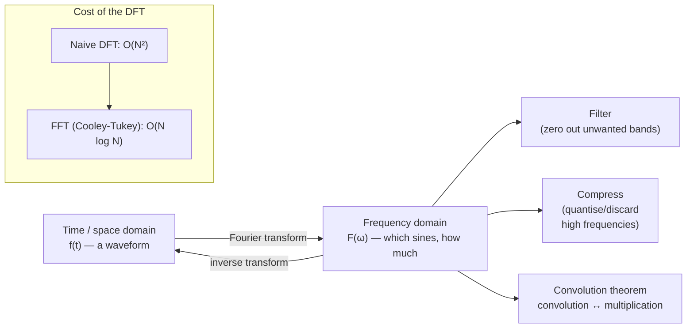

## In simple terms

Any repeating signal — a sound wave, a heartbeat, a daily temperature pattern — can be represented as a sum of sine waves of different frequencies. The Fourier transform is the tool that finds those frequencies: it tells you "this audio clip contains 440 Hz (concert A), 880 Hz (an octave up), and 1760 Hz (two octaves up)" and how much of each. This insight — that everything is a sum of sines — underlies MP3 compression, MRI scanners, JPEG images, signal filtering, and the wireless modulation in WiFi and 5G.

## The Visual Map



## More detail

**The continuous Fourier transform** maps `f(t)` in the time domain to `F(ω)` in the frequency domain:
`F(ω) = ∫ f(t) e^{-iωt} dt`. Since `e^{-iωt} = cos(ωt) - i·sin(ωt)` (Euler's formula), the integral computes the "overlap" of `f` with each frequency `ω`. The inverse transform recovers `f(t)` from `F(ω)`.

**Key properties:**
- **Linearity:** `F(af + bg) = aF(f) + bF(g)`.
- **Convolution theorem:** convolution in the time domain equals pointwise multiplication in the frequency domain — a massive computational saving.
- **Parseval's theorem:** total energy is preserved between domains.
- **Shift theorem:** a time shift becomes a phase shift in frequency.

**Discrete Fourier Transform (DFT):** for sampled signals, `X[k] = ∑ x[n] e^{-2πi nk/N}`. Computing all N outputs naively costs O(N²).

**Fast Fourier Transform (FFT):** the Cooley-Tukey algorithm (1965) reduces the DFT to O(N log N) by exploiting recursive structure when N is a power of 2. A one-million-point transform drops from ~10¹² operations to ~2×10⁷ — about 50,000× faster. The FFT is one of the most important algorithms in computing.

**Sampling and aliasing.** The Nyquist-Shannon theorem says that to represent a signal with maximum frequency `f_max`, you must sample at a rate of at least twice `f_max`. Sample too slowly and high frequencies fold back as false low-frequency artefacts (aliasing). CD audio samples at 44.1 kHz, comfortably above twice the ~20 kHz limit of human hearing.

**Windowing.** The DFT assumes the signal is periodic; a sharp truncation leaks energy across frequency bins. Window functions (Hann, Hamming, Blackman) taper the edges to reduce leakage, trading some frequency resolution.

The FFT is the computational engine behind MP3 and AAC (frequency-domain perceptual coding), JPEG (the related DCT on 8×8 blocks), video codecs, radar, MRI reconstruction, OFDM (the modulation in WiFi and 4G/5G), seismology, and LIGO's gravitational-wave detection. The convolution theorem also powers fast polynomial and large-integer multiplication and neural-network inference with large kernels.

## Under the Hood

A direct DFT is a simple double loop over complex exponentials — slow, but it shows exactly what the FFT computes faster. Feed it a sum of two sine waves and the spectrum spikes at precisely those frequencies:

```python
import cmath, math

def dft(x):
    N = len(x)
    return [sum(x[n] * cmath.exp(-2j * math.pi * k * n / N) for n in range(N))
            for k in range(N)]

N = 64
# signal = 4 Hz sine + half-amplitude 8 Hz sine, sampled over 1 second
sig = [math.sin(2*math.pi*4*n/N) + 0.5*math.sin(2*math.pi*8*n/N) for n in range(N)]
spec = dft(sig)

for k in range(N // 2):
    mag = abs(spec[k]) / N
    if mag > 0.05:                       # report only the strong bins
        print(f"{k:>2} Hz: magnitude {mag:.3f}  {'#' * int(mag * 40)}")
```

Real code calls an FFT (`numpy.fft`, FFTW, a GPU kernel) instead of this O(N²) loop, but the output — energy concentrated at the signal's true frequencies — is identical.

## Engineering Trade-offs

- **FFT vs direct DFT.** The FFT is O(N log N) versus O(N²) but is easiest when N is a power of 2; arbitrary N needs mixed-radix or Bluestein variants that are trickier and a little slower.
- **Frequency resolution vs time resolution.** A longer window gives finer frequency bins but blurs *when* things happened — the uncertainty principle of signal processing. Short-time FFTs (spectrograms) pick a compromise per application.
- **Leakage vs resolution.** Window functions suppress spectral leakage but widen the main lobe, reducing the ability to separate nearby frequencies.
- **Fast convolution break-even.** FFT-based convolution wins for large kernels but the transform overhead makes direct convolution faster for small ones — libraries switch strategies by size.

## Real-world examples

- MP3/AAC: frequency-domain perceptual coding is the basis of all lossy audio compression.
- JPEG: DCT-based image compression underlies most photo storage and web images.
- WiFi 802.11 and 4G/5G LTE: OFDM uses parallel frequency-domain sub-carriers — the whole wireless link is built on FFTs.
- LIGO: matched filtering via FFT detects black-hole-merger signals buried in noise.

## Common misconceptions

- **"The Fourier transform only works for periodic signals."** It applies to any square-integrable function; non-periodic functions simply have a continuous spectrum rather than discrete spectral lines.
- **"FFT and DFT are different transforms."** The FFT is an efficient *algorithm* for computing the DFT — same result, much faster.

## Try it yourself

Recover the hidden frequencies of a mixed signal — build a two-tone wave and watch the DFT spike at exactly 3 Hz and 7 Hz (`python3` only):

```bash
python3 - <<'EOF'
import cmath, math

def dft(x):
    N = len(x)
    return [sum(x[n]*cmath.exp(-2j*math.pi*k*n/N) for n in range(N)) for k in range(N)]

N = 64
sig = [math.sin(2*math.pi*3*n/N) + 0.4*math.sin(2*math.pi*7*n/N) for n in range(N)]
spec = dft(sig)
print("frequencies present (strong bins):")
for k in range(N//2):
    m = abs(spec[k]) / N
    if m > 0.05:
        print(f"  {k:>2} Hz  |{'#'*int(m*40)} {m:.3f}")
EOF
```

## Learn next

- [Calculus](/t/calculus-basics) — the integral that defines the transform and the notion of a function's spectrum
- [Linear algebra](/t/linear-algebra) — the Fourier transform is a change of basis: a linear operator on signal space
- [Numerical methods](/t/numerical-methods) — how the FFT is implemented stably and where sampling error enters
- [Information theory](/t/information-theory) — why frequency-domain representations enable compression in the first place
