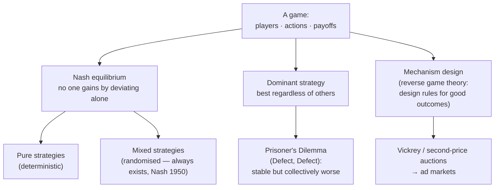

## In simple terms

In most optimization problems, you control all the variables. In a game, other rational agents also make decisions, and your best choice depends on what they choose — and their best choice depends on yours. Game theory formalises this: given a set of players, their actions, and payoffs for each combination, what is the rational outcome? The most famous concept — the **Nash equilibrium** — identifies action combinations where no player can improve by unilaterally changing strategy. Games underpin economics, traffic networks, auctions, protocol design, and increasingly AI.

## The Visual Map



## More detail

The ingredients are **players** (two or more decision-makers), **actions/strategies** available to each, and a **payoff function** giving each player's reward as a function of *everyone's* actions. A strategy can be *pure* (a fixed choice) or *mixed* (a probability distribution over choices).

**Nash equilibrium.** A strategy profile is a Nash equilibrium if no player can increase their payoff by unilaterally changing strategy, holding everyone else's fixed. Nash's 1950 theorem guarantees that *every finite game has at least one* (possibly in mixed strategies) — work that won the 1994 Nobel Prize in Economics.

**Classic games.** The **Prisoner's Dilemma** captures the tension between individual and collective rationality:

```
            Cooperate   Defect
Cooperate    (3, 3)     (0, 5)
Defect       (5, 0)     (1, 1)
```

Defect dominates for both players, so the equilibrium is (Defect, Defect) at payoff (1,1) — worse than mutual cooperation (3,3). It models arms races, price wars, and emissions agreements. A **coordination game** (drive on the left or right) explains why standards like USB or QWERTY stay stable once adopted. **Zero-sum games** (chess, simplified poker) have equilibria solvable by linear programming via the minimax theorem (von Neumann, 1928).

**Mechanism design** is "reverse game theory": instead of analysing a fixed game, design the rules so that self-interested play yields a desired outcome. The **Vickrey (second-price) auction** makes truthful bidding a dominant strategy and underlies Google's ad auctions; the **Gale-Shapley** deferred-acceptance algorithm produces stable matchings for medical residencies and school choice.

**Dynamics.** *Extensive-form* games model sequential moves as a tree, solved by backward induction (subgame-perfect equilibrium). *Repeated* games can sustain cooperation that single-shot play cannot — the "folk theorem", and the reason tit-for-tat wins repeated-Prisoner's-Dilemma tournaments.

In computer science, game theory explains Braess's paradox in network routing (adding a road can slow everyone), models GAN training as a two-player zero-sum game, designs the ad auctions behind a large share of internet revenue, and frames attacker-defender security and strategic BGP routing.

## Under the Hood

Strategic stability is computable. Here we find the equilibrium of the Prisoner's Dilemma by checking which cell no player wants to deviate from, then run a tiny repeated-game tournament where tit-for-tat beats always-defect:

```python
# Payoff[my move][their move] = (mine, theirs)
PD = {("C","C"): (3,3), ("C","D"): (0,5), ("D","C"): (5,0), ("D","D"): (1,1)}

def is_nash(a, b):
    mine, _ = PD[(a, b)]
    _, _   = PD[(a, b)]
    # would I prefer to switch, holding their move fixed?
    alt = "D" if a == "C" else "C"
    me_switch = PD[(alt, b)][0]
    return mine >= me_switch

for a in "CD":
    for b in "CD":
        print(f"({a},{b}) payoff {PD[(a,b)]}  no-regret for row player: {is_nash(a, b)}")

# Repeated game: tit-for-tat vs always-defect over 10 rounds
def play(stratA, stratB, rounds=10):
    histA, histB, sA, sB = [], [], 0, 0
    for _ in range(rounds):
        a, b = stratA(histB), stratB(histA)
        sA += PD[(a, b)][0]; sB += PD[(a, b)][1]
        histA.append(a); histB.append(b)
    return sA, sB

tit_for_tat   = lambda opp: "C" if not opp else opp[-1]   # copy opponent's last move
always_defect = lambda opp: "D"
print("TFT vs Always-Defect:", play(tit_for_tat, always_defect))
```

## Engineering Trade-offs

- **Equilibrium existence vs computation.** Nash proved an equilibrium always exists, but *finding* one is computationally hard (PPAD-complete) in general — existence is no guarantee of efficiency.
- **Stability vs optimality.** A Nash equilibrium is stable, not socially optimal (the Prisoner's Dilemma proves it). Mechanism design exists precisely to reshape incentives so the stable outcome is also the good one.
- **Rational model vs real agents.** Classical game theory assumes perfect rationality; behavioural game theory adds bounded rationality to match how humans actually play — more realistic, far less tractable.
- **Single-shot vs repeated.** Repetition unlocks cooperation but enlarges the strategy space enormously (any history-dependent rule), so analysis and learning get much harder.

## Real-world examples

- Google Ads / real-time bidding: a generalised second-price auction applies Vickrey-style mechanism design billions of times a day.
- Gale-Shapley matching: used for US medical-residency placement (NRMP) and school choice in New York and Boston.
- GAN training (Goodfellow, 2014): generator and discriminator play a minimax zero-sum game whose convergence is an equilibrium.
- AlphaGo / AlphaZero: Monte Carlo tree search with minimax — backward induction in an extensive-form game.

## Common misconceptions

- **"Nash equilibrium is the best outcome."** It is the *stable* outcome — no one wants to deviate alone — which can be collectively poor, as the Prisoner's Dilemma shows.
- **"Game theory assumes purely rational agents."** Classical theory does; behavioural game theory deliberately models the systematic ways real humans deviate.

## Try it yourself

Run a tiny strategy tournament and see why "always defect" loses to reciprocity in repeated play (`python3` only):

```bash
python3 - <<'EOF'
PD = {("C","C"):(3,3),("C","D"):(0,5),("D","C"):(5,0),("D","D"):(1,1)}

def play(A, B, rounds=20):
    hA, hB, sA, sB = [], [], 0, 0
    for _ in range(rounds):
        a, b = A(hB), B(hA)
        sA += PD[(a,b)][0]; sB += PD[(a,b)][1]
        hA.append(a); hB.append(b)
    return sA, sB

tft     = lambda opp: "C" if not opp else opp[-1]
defect  = lambda opp: "D"
coop    = lambda opp: "C"
for name, strat in [("Tit-for-Tat", tft), ("Always-Cooperate", coop)]:
    s, _ = play(strat, defect)
    print(f"{name:18} vs Always-Defect -> {s} points")
print("TFT vs TFT      ->", play(tft, tft)[0], "points (mutual cooperation)")
EOF
```

## Learn next

- [Optimization theory](/t/optimization-theory) — finding equilibria, especially the LP behind zero-sum minimax solutions
- [Probability and statistics](/t/probability-statistics) — mixed strategies are probability distributions over actions
- [Markov chains](/t/markov-chains) — model the dynamics of repeated games and learning agents
- [Machine learning](/t/machine-learning) — multi-agent RL and GANs apply game-theoretic equilibria in AI
