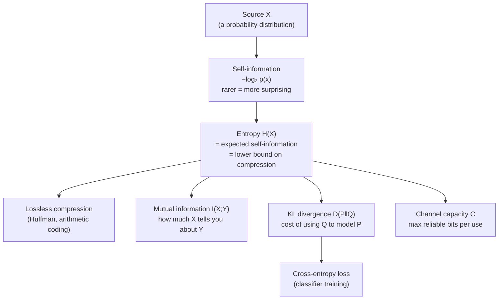

## In simple terms

Information theory asks: how surprised should you be by an event? A coin landing heads is mildly surprising; a fair die rolling exactly 6 is more surprising; the sun failing to rise is maximally surprising. Claude Shannon formalised this intuition in 1948 into a single number — **entropy** — that measures how much uncertainty lives in a source, and therefore how many bits are *needed* to communicate it faithfully.

## The Visual Map



## More detail

**Self-information** of an event with probability `p` is `−log₂(p)` bits. Rare events carry more information; certain events carry none. **Entropy** `H(X)` is the *expected* self-information over a distribution:

```
H(X) = −∑ p(x) log₂ p(x)
```

It measures average uncertainty: a fair coin has entropy 1 bit; a biased coin has less. A fair die has ~2.58 bits. Entropy is also the **lower bound on lossless compression** — you cannot represent messages from a source in fewer bits than its entropy on average.

Key derived quantities:

- **Joint and conditional entropy** — entropy of two variables together, and what remains after conditioning on one.
- **Mutual information** `I(X;Y)` — how much knowing X reduces uncertainty about Y; a symmetric measure of dependence. Used for feature selection and the information-bottleneck framework for model compression.
- **KL divergence** `D_KL(P‖Q)` — how much information is lost when you use distribution Q to approximate P. It appears everywhere in ML as a regulariser and loss term (variational autoencoders, RL policy gradients, Bayesian inference).
- **Cross-entropy** `H(P,Q) = H(P) + D_KL(P‖Q)` — used directly as a loss function in classification; minimising cross-entropy trains a model to match the true label distribution P.
- **Channel capacity** — Shannon's noisy-channel theorem: for any channel with noise, there exists an encoding that transmits up to `C = max I(X;Y)` bits per use reliably. This set the theoretical ceiling for all digital communications.

Information theory is the hidden engine behind compression (zip, JPEG, MP3), error-correcting codes (your SSD, 5G), and machine-learning loss functions. When you minimise **cross-entropy loss** in a classifier, you are doing information theory. When a language model scores a text with **perplexity**, it is measuring entropy. Feature selection, clustering, and the information bottleneck all reduce to mutual information. Even [Bayesian inference](/t/bayesian-inference) is phrased naturally in terms of KL divergence between prior and posterior.

## Under the Hood

Entropy is computable in a few lines, and it predicts exactly how well a lossless coder can compress a source. Here it is alongside Huffman-style intuition:

```python
from math import log2
from collections import Counter

def entropy_bits(data):
    n = len(data)
    counts = Counter(data)
    return -sum((c / n) * log2(c / n) for c in counts.values())

fair   = "ABCD" * 25                    # 4 symbols, uniform
skewed = "A" * 90 + "B" * 6 + "C" * 3 + "D" * 1

for name, s in [("uniform", fair), ("skewed", skewed)]:
    h = entropy_bits(s)
    print(f"{name:8}: H = {h:.3f} bits/symbol  ->  "
          f"{h * len(s):.0f} bits needed for {len(s)} symbols "
          f"(vs {2 * len(s)} at 2 bits each)")
```

The skewed source has far lower entropy, so an entropy coder (Huffman, arithmetic) packs it into far fewer bits — that gap is exactly what compression exploits.

## Engineering Trade-offs

- **Lossless vs lossy.** Lossless coding can never beat the entropy bound but reconstructs perfectly. Lossy codecs (JPEG, MP3) throw away information the human eye/ear ignores, beating the bound at the cost of fidelity.
- **Compression ratio vs CPU.** Higher-ratio coders (arithmetic coding, PPM, large dictionaries) cost more time and memory per byte than fast ones (LZ4) — a classic space/time trade.
- **Cross-entropy as a loss.** Minimising cross-entropy is well-behaved and information-theoretically principled, but it is sensitive to label noise and overconfident predictions — hence label smoothing and temperature scaling.
- **Channel capacity is a ceiling, not a recipe.** Shannon proves reliable codes *exist* up to capacity but says nothing about their complexity; practical codes (LDPC, turbo) approach it only with heavy decoding.

## Real-world examples

- Huffman coding assigns short bit strings to frequent symbols; it approaches the entropy bound for lossless compression.
- The cross-entropy loss in a neural-network classifier is literally the expected bits to encode labels using the model's predicted distribution.
- Shannon's channel-capacity theorem tells network engineers the maximum achievable throughput over a noisy link.
- Decision-tree algorithms (ID3, C4.5) split on the feature that maximises information gain — reduction in entropy.

## Common misconceptions

- **"Entropy is just a physics concept."** Shannon entropy is mathematically identical to thermodynamic entropy only in a specific limit; the two were deliberately analogous, not the same thing.
- **"Higher entropy means more information."** Higher entropy means *more uncertainty*, which means each message carries more information on average — but you need more bits to transmit it. It cuts both ways.

## Try it yourself

Measure the entropy of a real string and see how it bounds compression — `python3` only:

```bash
python3 - <<'EOF'
from math import log2
from collections import Counter

def entropy(s):
    n = len(s)
    return -sum((c/n) * log2(c/n) for c in Counter(s).values())

for s in ["aaaaaaaa", "abababab", "abcdefgh", "the quick brown fox"]:
    h = entropy(s)
    print(f"{s!r:24} H = {h:.3f} bits/char -> ~{h*len(s):.0f} bits total")
EOF
```

## Learn next

- [Bayesian inference](/t/bayesian-inference) — KL divergence measures exactly how far a posterior moves from its prior
- [Probability and statistics](/t/probability-statistics) — entropy is defined over distributions; this is its grounding
- [Machine learning](/t/machine-learning) — cross-entropy loss and perplexity are information theory applied to training
- [Linear algebra](/t/linear-algebra) — the other mathematical pillar under modern ML models
