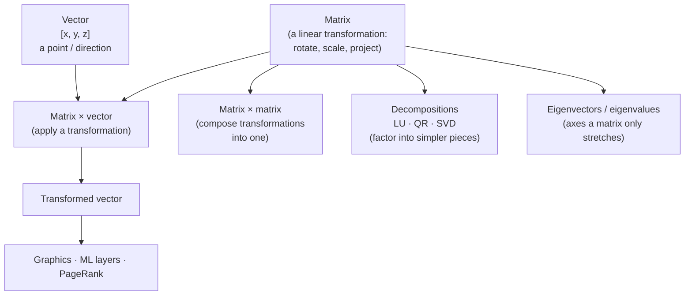

## In simple terms

Linear algebra is arithmetic done on whole lists of numbers at once. A **vector** is an ordered list — `[3, 1, 4]` — that you can picture as an arrow in space or as a row of data. A **matrix** is a grid of numbers that *transforms* vectors: rotating them, stretching them, projecting them onto a plane. Instead of nudging one number at a time, you operate on thousands together with a single multiplication.

## The Visual Map



## More detail

The two central objects are the **vector** (a point or direction in an *n*-dimensional space) and the **matrix** (a rectangular array that maps vectors to other vectors). The workhorse operation is the **matrix–vector product**, which applies a linear transformation, and the **matrix–matrix product**, which composes two transformations into one.

Key ideas that recur everywhere:

- **Dot product** — multiply two vectors element-wise and sum; measures how aligned they are. Cosine similarity between embeddings is a normalised dot product.
- **Linear independence and basis** — the smallest set of vectors whose combinations span a space; the dimension is how many you need.
- **Eigenvalues and eigenvectors** — directions a matrix only stretches (never rotates), and by how much. They reveal a transformation's "natural axes" and power techniques like PCA.
- **Matrix decompositions** (LU, QR, SVD) — factor a matrix into simpler pieces to solve systems, compress data, or find low-rank structure.

A transformation is **linear** when it preserves straight lines and the origin: scaling the input scales the output, and adding inputs adds outputs. That single constraint is what makes the whole theory clean — and what makes it map perfectly onto hardware that multiplies and adds in bulk.

Almost every data-heavy field reduces to linear algebra. A neural-network layer is a matrix multiply followed by a non-linearity. A 3D scene is a stream of vertices pushed through transformation matrices. A recommendation system factors a giant user–item matrix. Because these operations are uniform and parallel, the **GPU** was built to run them — the connection between linear algebra and hardware is why modern AI is feasible at all.

## Under the Hood

A matrix–vector product is the atom of a neural-network layer and a graphics transform alike. Written from scratch, it is just dot products of rows with the input vector:

```python
def matvec(M, v):
    # each output entry is the dot product of one matrix row with v
    return [sum(row[j] * v[j] for j in range(len(v))) for row in M]

# A 2D rotation by 90 degrees: (x, y) -> (-y, x)
R = [[0, -1],
     [1,  0]]
print(matvec(R, [1, 0]))   # -> [0, 1]
print(matvec(R, [0, 1]))   # -> [-1, 0]

# A neural layer: output = W @ x  (then a non-linearity would follow)
W = [[0.2, 0.8, -0.5],
     [-0.3, 0.1, 0.9]]
print(matvec(W, [1.0, 2.0, 3.0]))   # -> [0.3, 2.6]
```

On real hardware this loop is replaced by a BLAS `gemm` call or a GPU kernel that runs thousands of these dot products in parallel — the same math, vectorised across cores.

## Engineering Trade-offs

- **Dense vs sparse.** A dense matrix multiply is O(n³) and saturates the GPU; a sparse matrix (mostly zeros, like a web-link graph) stores only non-zeros and skips the rest, trading regular memory access for far less compute.
- **Precision vs throughput.** ML inference often drops from 32-bit to 16-bit or 8-bit matrices: 2–4× the throughput and half the memory, at the cost of numerical accuracy that the model is usually robust to.
- **Exact solve vs decomposition.** Solving `Ax = b` by inverting `A` is unstable and O(n³); LU/QR/SVD factorisations are more numerically stable and reusable across many right-hand sides — covered under [numerical methods](/t/numerical-methods).
- **Memory layout.** Row-major vs column-major storage changes cache behaviour dramatically; a transpose at the wrong moment can dominate runtime even though it changes no values.

## Real-world examples

- A graphics pipeline multiplies every vertex by model, view, and projection matrices to place it on screen.
- Word and image **embeddings** are vectors whose dot products encode similarity.
- Google's original PageRank is the dominant eigenvector of a web-link matrix.
- Image compression and noise reduction use the singular value decomposition to keep only the strongest components.

## Common misconceptions

- **"It's just solving systems of equations."** That's the entry point; the payoff is treating data as geometry — distances, angles, and projections in high-dimensional space.
- **"Matrices are only square grids of numbers."** A matrix is better understood as a *function* that transforms space; the numbers are just its coordinates in a chosen basis.

## Try it yourself

See a matrix as a transformation: rotate a square 90° and confirm a dot product measures alignment — `python3` only:

```bash
python3 - <<'EOF'
def matvec(M, v):
    return [sum(r[j] * v[j] for j in range(len(v))) for r in M]

def dot(a, b):
    return sum(x * y for x, y in zip(a, b))

R = [[0, -1], [1, 0]]                  # rotate 90 degrees
square = [[0,0], [1,0], [1,1], [0,1]]
print("rotated corners:", [matvec(R, c) for c in square])

# Dot product as alignment: parallel = high, perpendicular = 0
print("aligned   :", dot([1,0], [3,0]))   # 3
print("perpendic.:", dot([1,0], [0,5]))   # 0
EOF
```

## Learn next

- [Numerical methods](/t/numerical-methods) — how matrix factorisations and linear solves are computed stably on real hardware
- [Machine learning](/t/machine-learning) — every layer and loss is expressed as matrix operations over data
- [Neural network](/t/neural-network) — a stack of matrix multiplies interleaved with non-linearities
- [Fourier transform](/t/fourier-transform) — a change of basis: itself a linear operator on signals
- [GPU](/t/gpu) — the hardware built to run dense matrix math in parallel
