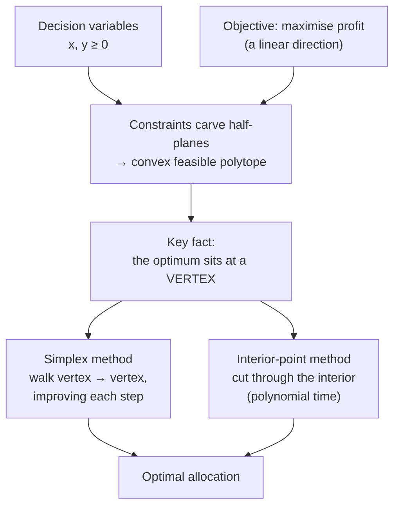

## In simple terms

Linear programming (LP) solves decisions of the form: "given limited resources and a set of rules about how they can be used, how do I get the most out of them?" The *linear* part means both the rules (constraints) and the goal (objective) are built from sums of weighted variables — no squaring, no multiplying variables together. This restriction sounds limiting but covers an enormous range of practical problems.

## The Visual Map



## More detail

A standard LP has three pieces:

1. **Decision variables** — the quantities you control (e.g. how many units of each product to make).
2. **Objective function** — a linear expression to maximise or minimise (e.g. total profit).
3. **Constraints** — linear inequalities the variables must satisfy (e.g. capacity limits, balance equations).

Geometrically, each constraint carves a half-space; their intersection is a convex **feasible region** (a polytope). The optimal solution, if it exists, always lies at a **vertex** of this polytope — the insight that makes LP solvable efficiently. The **simplex method** walks from vertex to vertex along edges, improving the objective at each step; for most practical problems it is extremely fast despite an exponential worst case. **Interior-point (barrier) methods** are polynomial in theory and competitive in practice for large problems.

LP is the core of **integer programming** (some variables must be whole numbers — NP-hard in general), **mixed-integer LP**, and **network flow** (shortest paths and max-flow are special LPs). **LP duality** is a structural theorem: every LP has a "dual" that provides a certificate of optimality and bounds.

LP underpins supply-chain management, airline crew and gate scheduling, network routing, ad-auction clearing, financial portfolio optimisation, and computational biology. It is also the relaxation of choice for approximation algorithms: solve the LP, round the fractional solution, prove the rounding doesn't lose too much. Any time you must "allocate limited resources to maximise value under hard constraints", LP is the first model to reach for.

## Under the Hood

For a small LP, the "optimum is at a vertex" theorem *is* the algorithm: enumerate the corners of the feasible region and pick the best feasible one. This solves a classic product-mix problem by hand:

```python
from itertools import combinations

# maximise profit 3x + 5y
# s.t.  x <= 4 ;  2y <= 12 ;  3x + 2y <= 18 ;  x, y >= 0
# Each constraint is a line a*x + b*y = c. Vertices = intersections of pairs.
lines = [(1, 0, 4), (0, 2, 12), (3, 2, 18), (1, 0, 0), (0, 1, 0)]

def intersect(l1, l2):
    (a1, b1, c1), (a2, b2, c2) = l1, l2
    det = a1 * b2 - a2 * b1
    if det == 0:
        return None
    return ((c1 * b2 - c2 * b1) / det, (a1 * c2 - a2 * c1) / det)

def feasible(p):
    x, y = p
    return (x >= -1e-9 and y >= -1e-9 and x <= 4 + 1e-9
            and 2*y <= 12 + 1e-9 and 3*x + 2*y <= 18 + 1e-9)

best = max((p for l1, l2 in combinations(lines, 2)
            if (p := intersect(l1, l2)) and feasible(p)),
           key=lambda p: 3 * p[0] + 5 * p[1])
print(f"optimal (x, y) = ({best[0]:.0f}, {best[1]:.0f})  profit = {3*best[0] + 5*best[1]:.0f}")
```

Real solvers (the simplex method, or interior-point libraries like HiGHS and Gurobi) never enumerate all vertices — there can be exponentially many — but the principle they exploit is exactly this one.

## Engineering Trade-offs

- **Simplex vs interior-point.** Simplex is fast and gives exact vertex solutions with great warm-starting, but has exponential worst-case behaviour; interior-point is polynomial and better for very large sparse problems but harder to warm-start.
- **LP vs integer programming.** Dropping the "must be integer" requirement turns an NP-hard problem into a polynomial one. The LP relaxation is the workhorse of approximation algorithms — but its fractional answer may need rounding.
- **Modelling fidelity vs solvability.** Forcing a real, slightly non-linear problem into linear form keeps it tractable but introduces approximation error; the engineering judgement is how much linearisation you can tolerate.
- **Duality as a tool.** Solving the dual can be cheaper and yields optimality certificates and sensitivity information — extra modelling effort that pays off in robustness analysis.

## Real-world examples

- Airlines solve LP/MIP problems nightly to assign crews and aircraft to flights within regulatory constraints.
- Google's ad auction runs an LP to allocate ad slots under budget and targeting constraints.
- Network-flow LPs assign bandwidth or freight across a graph to minimise cost or latency.
- Diet optimisation (the original 1940s LP application) finds the cheapest combination of foods that meets all nutritional requirements.

## Common misconceptions

- **"Linear programming means programming in the code sense."** The name predates software; "programming" here means *planning* or *scheduling*, as in military operations research.
- **"Real problems are never linear."** Many are approximated well by LP after reformulation, and LP relaxations of non-linear, discrete problems are a standard algorithmic tool even when the original problem is not LP-shaped.

## Try it yourself

Solve the product-mix LP by walking its vertices and confirm the optimum sits at a corner (`python3` only):

```bash
python3 - <<'EOF'
from itertools import combinations
lines = [(1,0,4),(0,2,12),(3,2,18),(1,0,0),(0,1,0)]
def x(l1,l2):
    (a,b,c),(d,e,f)=l1,l2; det=a*e-d*b
    return None if det==0 else ((c*e-f*b)/det,(a*f-d*c)/det)
def ok(p):
    X,Y=p
    return X>=-1e-9 and Y>=-1e-9 and X<=4.001 and 2*Y<=12.001 and 3*X+2*Y<=18.001
verts=[p for l1,l2 in combinations(lines,2) if (p:=x(l1,l2)) and ok(p)]
for X,Y in sorted(set((round(a,2),round(b,2)) for a,b in verts)):
    print(f"vertex ({X:>4}, {Y:>4})  profit 3x+5y = {3*X+5*Y:>5.1f}")
print("best:", max(verts, key=lambda p: 3*p[0]+5*p[1]))
EOF
```

## Learn next

- [Optimization theory](/t/optimization-theory) — LP is the most tractable corner of the broader optimisation landscape
- [Linear algebra](/t/linear-algebra) — the matrix view of constraints and the pivots simplex performs
- [Complexity theory](/t/complexity-theory) — why LP is polynomial while its integer cousin is NP-hard
- [Numerical methods](/t/numerical-methods) — how interior-point solvers handle large systems stably
