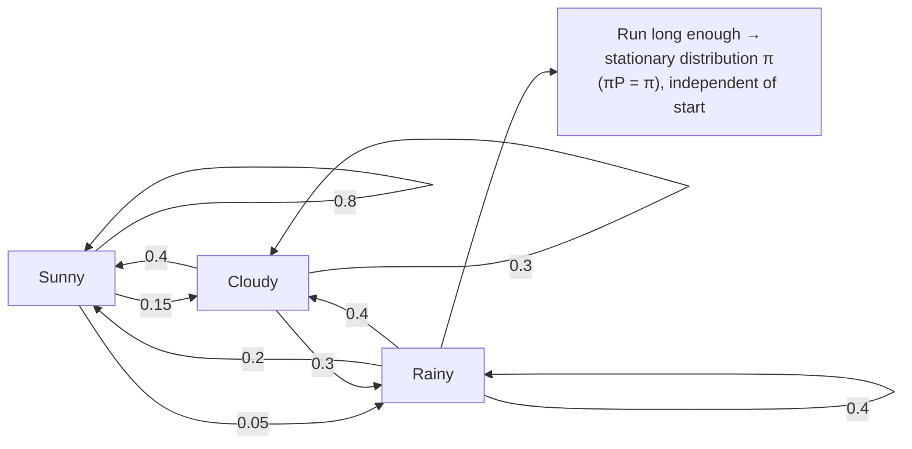

## In simple terms

A Markov chain is a system that hops between states at random, where the probability of the next state depends only on the current state — not on how you got there. This "Markovian" (memoryless) property makes the math tractable. A biased random walk, a board game (your next square depends only on the current square and the dice), and Google's PageRank (a random surfer clicking links) are all Markov chains. They are everywhere in probability, statistics, and machine learning.

## The Visual Map



## More detail

**Formal definition:** a sequence of random variables `X_0, X_1, X_2, ...` over a state space S with the Markov property
`P(X_{t+1} = j | X_t = i, ...) = P(X_{t+1} = j | X_t = i) = P_{ij}`.
The **transition matrix** `P` (where `P_{ij}` is the probability of moving from state i to j, rows summing to 1) encodes the entire chain.

**Key properties.** A chain is *irreducible* if every state can reach every other, and *aperiodic* if it doesn't cycle with a fixed period. A **stationary distribution** is a `π` with `πP = π`: step from it and you stay in it. An irreducible, aperiodic, finite chain always converges to its *unique* `π` regardless of the start — the **ergodic theorem**. The **mixing time** measures how fast `P^t` approaches `π`.

**Canonical instances:**
- **Random walk on a graph** — move to a uniformly random neighbour; `π` is proportional to node degree.
- **PageRank** — a surfer follows a random link with probability 0.85 and teleports to a random page with probability 0.15 (which guarantees irreducibility and aperiodicity). The PageRank vector is `π`, computed by power iteration `π ← πP`.
- **Queueing (M/M/1)** — states are queue lengths; the stationary distribution is geometric in the load `ρ = arrival / service`, and Little's Law falls out of the analysis.

**Continuous-time chains (CTMC)** replace discrete steps with a rate matrix Q (reliability, chemical kinetics, gene expression).

**MCMC (Markov Chain Monte Carlo)** flips the idea: *design* a chain whose stationary distribution is a target `π`, run it to mixing, and use the samples. **Metropolis-Hastings** proposes a move and accepts it with probability `min(1, π(new)/π(old))`; **Gibbs sampling** updates one variable at a time conditioned on the rest. MCMC is what makes [Bayesian inference](/t/bayesian-inference) feasible when the posterior has no closed form.

**Hidden Markov Models (HMMs)** add hidden states you never observe directly — only outputs they emit. The Forward-Backward and Viterbi algorithms do the inference; HMMs drove speech recognition, part-of-speech tagging, and protein analysis.

PageRank shaped web search for two decades, MCMC made Bayesian statistics practical, and Markov Decision Processes (MDPs) are the backbone of reinforcement learning. Modern language models can even be read as learned, high-order conditional distributions over the next token.

## Under the Hood

PageRank is just power iteration on a transition matrix: start with uniform mass and repeatedly multiply by `P` until the distribution stops changing — that fixed point is `π`:

```python
def page_rank(P, iters=50):
    n = len(P)
    pi = [1 / n] * n                       # start uniform
    for _ in range(iters):
        pi = [sum(pi[i] * P[i][j] for i in range(n)) for j in range(n)]
    return pi

# 3-page web: A->B, A->C, B->C, C->A  (row = out-link probabilities)
P = [[0.0, 0.5, 0.5],
     [0.0, 0.0, 1.0],
     [1.0, 0.0, 0.0]]

pi = page_rank(P)
for page, score in zip("ABC", pi):
    print(f"page {page}: PageRank {score:.3f}")
print("sums to 1:", round(sum(pi), 6))
```

The same `π ← πP` loop computes a weather forecast's long-run climate or an M/M/1 queue's steady state — only the matrix changes.

## Engineering Trade-offs

- **Memorylessness: tractable vs limited.** The Markov property makes the math closed-form and the matrix small, but a first-order chain cannot capture long-range dependencies — the reason attention-based models replaced HMMs for language.
- **Order vs state-space blow-up.** Conditioning on the last *k* states captures more history but multiplies the number of states by |S|ᵏ — accuracy bought with exponential memory.
- **MCMC: generality vs convergence.** MCMC samples from almost any distribution but the samples are correlated and need burn-in; diagnosing whether the chain has truly mixed (R-hat, effective sample size) is an art.
- **Exact vs power iteration.** The stationary distribution is an eigenvector problem solvable exactly, but for web-scale matrices power iteration's O(nnz) per step is the only practical route.

## Real-world examples

- Google PageRank: stationary distribution of a random walk on the web graph; powered Search for roughly 2004–2011.
- Speech recognition (the HMM era): CMU Sphinx and HTK used phone-level hidden states before deep learning.
- MCMC for Bayesian inference: Stan and PyMC sample posteriors with NUTS, a Hamiltonian-Monte-Carlo variant.
- Monopoly: the long-run probability of landing on each square is a Markov chain's stationary distribution (board plus jail mechanics).

## Common misconceptions

- **"Markov chains can't model long-range dependencies."** True for first-order chains; higher-order chains and HMMs extend the reach, and modern LLMs sidestep it entirely with attention.
- **"MCMC gives exact samples."** MCMC samples are correlated and only approximately distributed as `π` after burn-in; convergence diagnostics are mandatory.

## Try it yourself

Watch a weather chain forget where it started — two very different starting distributions converge to the same stationary climate (`python3` only):

```bash
python3 - <<'EOF'
P = [[0.8, 0.15, 0.05],   # Sunny  -> S, C, R
     [0.4, 0.30, 0.30],   # Cloudy
     [0.2, 0.40, 0.40]]   # Rainy

def step(pi):
    return [sum(pi[i] * P[i][j] for i in range(3)) for j in range(3)]

for name, pi in [("start Sunny", [1, 0, 0]), ("start Rainy", [0, 0, 1])]:
    for _ in range(30):
        pi = step(pi)
    print(f"{name:12} -> stationary  S={pi[0]:.3f} C={pi[1]:.3f} R={pi[2]:.3f}")
EOF
```

## Learn next

- [Hidden Markov models](/t/hidden-markov-model) — add unobserved states for sequence labelling and speech
- [Bayesian inference](/t/bayesian-inference) — uses MCMC, a Markov chain engineered to sample a posterior
- [Probability and statistics](/t/probability-statistics) — the distributions and expectations a chain evolves
- [Information theory](/t/information-theory) — entropy rate quantifies the uncertainty a Markov source produces
