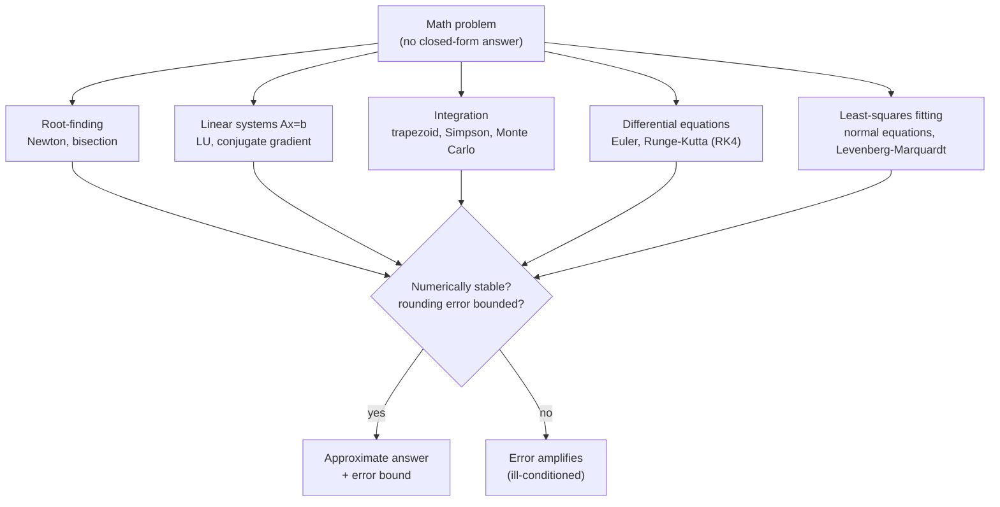

## In simple terms

Most equations that arise in science and engineering cannot be solved with an exact formula. Numerical methods compute an answer that is close enough, in a bounded number of steps. Instead of "the root is `√2`", they say "the root is `1.41421356...` to eight decimal places, and I can make it as accurate as you like by running longer." The trade-off is always speed vs. accuracy, and managing the errors that accumulate.

## The Visual Map



## More detail

The field is broad, but a handful of problems recur constantly:

**Root-finding.** Given `f(x) = 0`, find `x`. Newton's method iterates `x_{n+1} = x_n − f(x_n)/f'(x_n)` and converges quadratically near a root. The bisection method is slower but always works when the function changes sign.

**Linear systems.** Solving `Ax = b` exactly needs matrix factorisation (Gaussian elimination / LU decomposition); for huge sparse systems, iterative methods (conjugate gradient, GMRES) converge without factorising the whole matrix.

**Integration (quadrature).** Approximate ∫f(x)dx by evaluating `f` at strategically chosen points and forming a weighted sum — trapezoidal rule, Simpson's rule, Gaussian quadrature. For high-dimensional integrals: Monte Carlo integration (random sampling), which scales better than grid-based methods.

**Differential equations.** Euler's method takes small time steps to simulate how a system evolves; Runge-Kutta methods (especially RK4) take a weighted average of multiple slope estimates to stay accurate over large steps.

**Fitting / least squares.** Given noisy data, find the curve that minimises total squared error — solvable as a linear algebra problem (`AᵀAx = Aᵀb`) or, for nonlinear models, via iterative optimisation like Levenberg-Marquardt.

All of these share a concern with **numerical stability**: floating-point arithmetic introduces rounding errors at every step, and some algorithms amplify those errors catastrophically while others keep them bounded.

Scientific computing, simulation, graphics, and machine learning all rest on numerical methods. A physics engine integrates differential equations to move objects. A deep-learning framework uses numerical optimisation to fit millions of parameters. Signal processing, computer vision, computational finance, and weather forecasting are applied numerical analysis. Even the basic question "does this model's Jacobian have full rank?" is answered numerically.

## Under the Hood

Newton's method finds a root by repeatedly following the tangent line to where it crosses zero — quadratic convergence means the number of correct digits roughly doubles each step:

```python
def newton(f, df, x0, iters=8):
    x = x0
    for _ in range(iters):
        x = x - f(x) / df(x)
        yield x

# Compute sqrt(2) as the positive root of f(x) = x**2 - 2
f  = lambda x: x * x - 2
df = lambda x: 2 * x
for i, x in enumerate(newton(f, df, x0=1.0), 1):
    print(f"iter {i}: {x:.15f}   error = {abs(x - 2**0.5):.2e}")
```

Within ~5 iterations the error is at the limit of 64-bit floating point. The same `x_{n+1} = x_n − f/f'` step underlies SGD, root solvers in physics engines, and implicit ODE integrators.

## Engineering Trade-offs

- **Speed vs accuracy.** Every method has a knob — step size, iteration count, number of samples — that buys accuracy with compute. Halving the error often costs far more than 2× the work.
- **Direct vs iterative solvers.** LU factorisation solves `Ax = b` exactly in O(n³) and is reusable; iterative methods (conjugate gradient) cost O(nnz) per step and shine on huge sparse systems but may converge slowly when poorly conditioned.
- **Stability vs simplicity.** Euler's method is one line but accumulates error and can go unstable; RK4 is more code and four function evaluations per step but stays accurate over large steps.
- **Conditioning.** An ill-conditioned problem amplifies input error no matter how good the algorithm is. Knowing the condition number tells you how many digits you can possibly trust — see [floating point](/t/floating-point).

## Real-world examples

- Climate models integrate atmospheric differential equations forward in time using Runge-Kutta-style solvers.
- MRI reconstruction solves a large linear system to recover a 3D image from sensor measurements.
- Optimisation-based ML training (SGD, Adam) is a form of iterative root-finding applied to gradients.
- Finance uses Monte Carlo integration to price derivatives by averaging outcomes across thousands of simulated paths.

## Common misconceptions

- **"Floating-point arithmetic is accurate enough."** It usually is, but some algorithms are ill-conditioned: tiny perturbations in input cause huge changes in output. Stability analysis catches these before they matter.
- **"More iterations always mean more accuracy."** Accumulated rounding error eventually dominates; there is a sweet spot, and sometimes a coarser method is more stable over many steps.

## Try it yourself

Estimate π with Monte Carlo integration — throw random darts at a square and count how many land in the inscribed circle (`python3` only):

```bash
python3 - <<'EOF'
import random
random.seed(1)

for n in (1_000, 100_000, 5_000_000):
    inside = sum(1 for _ in range(n)
                 if (random.random()**2 + random.random()**2) <= 1.0)
    est = 4 * inside / n
    print(f"n = {n:>9}:  pi ~ {est:.5f}   error = {abs(est - 3.141592653589793):.5f}")
EOF
```

The error shrinks like 1/√n — a hallmark of Monte Carlo methods: easy to write, slow to make precise.

## Learn next

- [Calculus](/t/calculus-basics) — the derivatives and integrals these methods approximate on a machine
- [Linear algebra](/t/linear-algebra) — matrix factorisations are the backbone of linear-system and least-squares solvers
- [Floating point](/t/floating-point) — why rounding error accumulates and what numerical stability really protects against
- [Machine learning](/t/machine-learning) — training is large-scale numerical optimisation built on these primitives
- [Algorithms](/t/algorithms) — the complexity and convergence analysis that numerical methods extend to continuous problems
