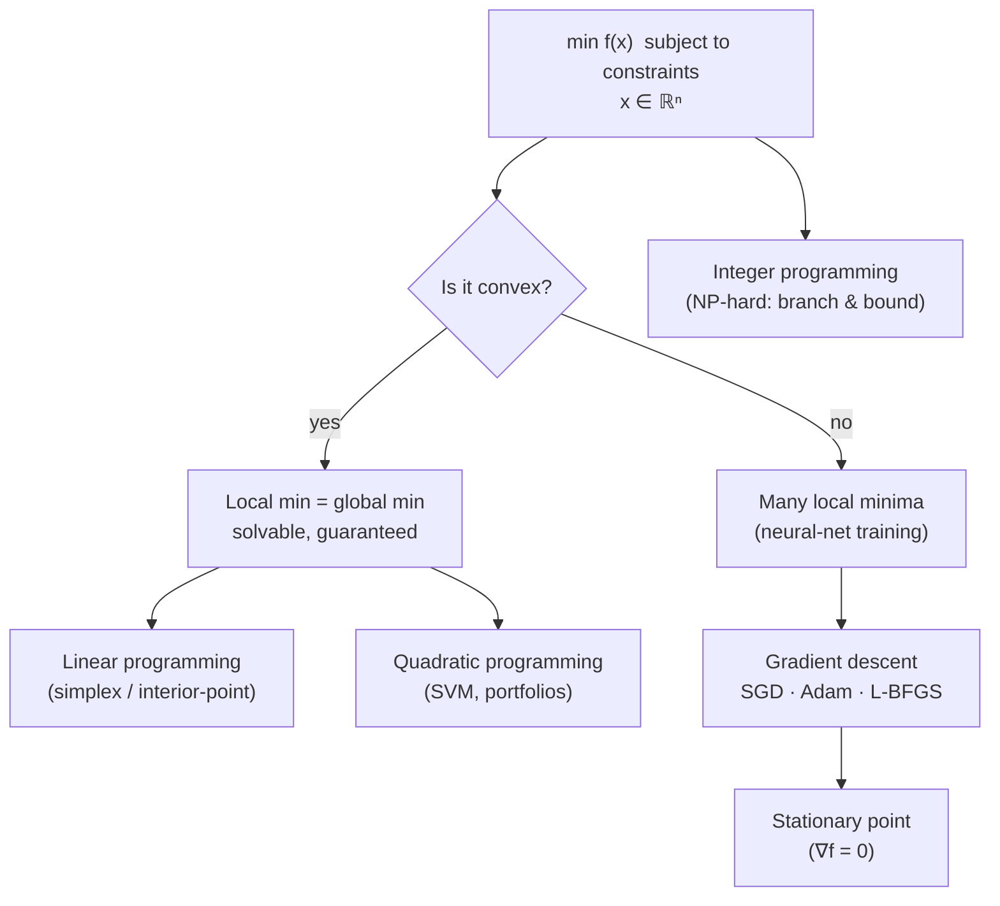

## In simple terms

Optimization is the science of finding the best answer. "Best" means minimising cost (the shortest route, the cheapest production schedule) or maximising reward (the highest profit, the most accurate model). Almost every quantitative decision in engineering, economics, and machine learning is an optimization problem. The challenge is finding the true optimum efficiently — especially when there are millions of variables and complex constraints.

## The Visual Map



## More detail

**General form:** minimise `f(x)` subject to `g_i(x) ≤ 0` and `h_j(x) = 0`, where `x ∈ ℝⁿ` is the decision variable, `f` is the objective, and `g_i`, `h_j` are constraints.

**Convex optimization** is the tractable heartland: when the objective and feasible set are convex, *any local minimum is a global minimum*, so every gradient step makes real progress. It includes linear, quadratic, second-order cone, and semidefinite programming.

- **Linear programming (LP):** linear objective and constraints, `min cᵀx` s.t. `Ax ≤ b`, `x ≥ 0`. Solved by simplex (exponential worst case, fast in practice) or interior-point methods (polynomial). See [linear programming](/t/linear-programming).
- **Quadratic programming (QP):** quadratic objective, linear constraints. SVMs and Markowitz portfolio optimisation are QPs.
- **Integer programming (IP/MIP):** variables must be whole numbers — scheduling, routing, the TSP. NP-hard; solved by branch-and-bound or cutting planes (Gurobi, CPLEX).
- **Nonlinear / non-convex (NLP):** neural-network training lives here; gradient methods find *local* optima only.
- **Stochastic optimization:** the objective is an expectation; SGD optimises it from mini-batch estimates.

**Key algorithms.** Gradient descent `x ← x − η∇f(x)` is the workhorse of ML (variants: SGD, Adam, RMSProp, AdaGrad). Newton's method `x ← x − H⁻¹∇f(x)` converges quadratically near the optimum but costs O(n³) per step; L-BFGS approximates the inverse Hessian cheaply. Interior-point (barrier) methods solve convex LP/QP/SDP in polynomial time.

**Structure theorems.** The **KKT conditions** generalise "gradient is zero" to constrained problems — necessary for any local optimum, and sufficient when the problem is convex. **Duality** pairs every problem with a dual that lower-bounds it; for convex problems strong duality holds (no gap), which enables decomposition and distributed solvers.

Optimization theory is the mathematical foundation of machine learning (training *is* optimization), operations research (supply chain, scheduling), financial engineering, and control systems. It explains why gradient descent works on networks, what convexity buys you, and why integer problems are hard.

## Under the Hood

Gradient descent on a convex quadratic converges to the unique global minimum; the same loop on a non-convex function can stall in a local dip. Both are three lines around `x ← x − η∇f`:

```python
def grad_descent(grad, x, lr=0.1, steps=100):
    for _ in range(steps):
        gx, gy = grad(x)
        x = (x[0] - lr * gx, x[1] - lr * gy)
    return x

# Convex bowl  f(x,y) = (x-2)**2 + (y+1)**2,  minimum at (2, -1)
grad_bowl = lambda p: (2 * (p[0] - 2), 2 * (p[1] + 1))
print("convex min ->", grad_descent(grad_bowl, (0.0, 0.0)))

# Two different starts on the bowl reach the SAME minimum — that is convexity
print("start A    ->", grad_descent(grad_bowl, (-9.0, 9.0)))
print("start B    ->", grad_descent(grad_bowl, (9.0, -9.0)))
```

PyTorch's `optimizer.step()` is this loop with the gradient supplied by automatic differentiation and `η` adapted per-parameter (Adam).

## Engineering Trade-offs

- **Convex vs non-convex.** Convex problems come with global-optimum guarantees but limited modelling power; non-convex models (deep nets) are expressive but offer no guarantee the solution found is best.
- **First-order vs second-order.** Gradient methods cost O(n) per step and scale to billions of parameters; Newton-type methods converge in far fewer steps but pay O(n³) and need the Hessian — practical only via approximations (L-BFGS).
- **Batch vs stochastic.** Full-batch gradients are accurate but slow per step; SGD's noisy mini-batch gradients are cheap, scale to huge datasets, and the noise can even help escape sharp minima — at the cost of needing a learning-rate schedule.
- **Exact solver vs relaxation.** Integer programs are NP-hard; relaxing integrality to an LP gives a fast, solvable bound that rounding turns into an approximate answer.

## Real-world examples

- Neural-network training: every `optimizer.step()` in PyTorch is gradient descent on the loss function.
- Google Maps routing: shortest path is a linear/dynamic-programming optimisation.
- Airline crew scheduling: mixed-integer programming solved by Gurobi over millions of variables.
- Financial portfolio optimisation: a quadratic program (mean-variance, Markowitz).

## Common misconceptions

- **"Gradient descent always finds the best solution."** For non-convex problems it finds a *local* minimum — often good enough, but not guaranteed global.
- **"Linear programming is just a special case."** LP's polynomial-time solvability makes it qualitatively different; many NP-hard problems use LP relaxations precisely because LP is easy.

## Try it yourself

Watch convexity guarantee a single answer: run gradient descent from several random starts on a convex bowl and on a wavy non-convex function (`python3` only):

```bash
python3 - <<'EOF'
import random, math
random.seed(0)

def descend(grad, x, lr=0.05, steps=500):
    for _ in range(steps):
        x -= lr * grad(x)
    return x

convex   = lambda x: 2 * (x - 3)          # f = (x-3)**2, min at 3
wavy     = lambda x: 2*(x-3) + 3*math.cos(x)   # several local minima

print("convex bowl (should all land near 3):")
print("  ", [round(descend(convex, random.uniform(-10, 10)), 2) for _ in range(5)])
print("non-convex (lands in different dips):")
print("  ", [round(descend(wavy,   random.uniform(-10, 10)), 2) for _ in range(5)])
EOF
```

## Learn next

- [Gradient descent](/t/gradient-descent) — the single most important optimization algorithm in machine learning
- [Linear programming](/t/linear-programming) — the most tractable subclass, solvable to a guaranteed global optimum
- [Calculus](/t/calculus-basics) — derivatives, gradients, and the Hessian that drive every method here
- [Linear algebra](/t/linear-algebra) — the matrix machinery behind Newton's method and interior-point solvers
- [Game theory](/t/game-theory) — optimization extended to multiple agents whose optima interact
