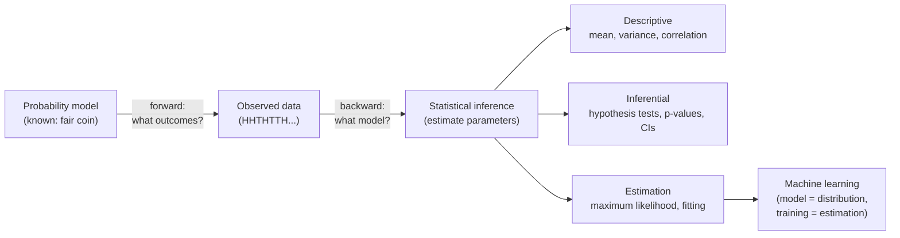

## In simple terms

**Probability** runs the world forwards: given a fair coin, how often do we expect heads? **Statistics** runs it backwards: given a pile of coin flips, was the coin fair? One reasons from a known model to likely outcomes; the other reasons from observed outcomes back to a plausible model. Computers lean on both whenever they must act without certainty.

## The Visual Map



## More detail

Probability starts with a **sample space** (all possible outcomes), assigns each event a number between 0 and 1, and combines them with a few rules. The essential tools:

- **Random variables and distributions** — a variable whose value is uncertain, described by a distribution (uniform, Bernoulli, binomial, normal, Poisson). The **normal/Gaussian** distribution shows up constantly because of the *central limit theorem*: sums of many small independent effects tend toward it.
- **Expectation and variance** — the long-run average of a random variable and how spread out it is.
- **Conditional probability and Bayes' rule** — how a probability should update once you learn new evidence. `P(A|B) = P(B|A)·P(A) / P(B)` is the hinge of all statistical inference.
- **Independence** — when knowing one outcome tells you nothing about another.

Statistics then asks: given data, what can we conclude? It splits into **descriptive** (summaries like mean, median, correlation), **inferential** (confidence intervals, hypothesis tests, *p*-values), and **estimation** (fitting a model's parameters, e.g. via maximum likelihood). The recurring danger is confusing correlation with causation, or reading signal into noise.

This is why probability and statistics underpin so much of computing: machine learning is applied probability and statistics, where a model is a probability distribution over outputs and training is statistical estimation of its parameters. Beyond ML, A/B tests decide product changes, anomaly detection flags fraud and outages, and randomised algorithms trade certainty for speed. Any system that must act on incomplete information is doing statistics, explicitly or not.

## Under the Hood

The central limit theorem is the workhorse that makes the normal distribution appear everywhere. Sum many independent uniform draws and the totals pile up into a bell curve — no Gaussian assumed anywhere in the code:

```python
import random

def sample_mean(n):
    return sum(random.random() for _ in range(n)) / n   # mean of n Uniform(0,1)

trials = [sample_mean(30) for _ in range(100_000)]
mu = sum(trials) / len(trials)
var = sum((x - mu) ** 2 for x in trials) / len(trials)

print(f"mean  ~ {mu:.4f}   (expected 0.5)")
print(f"var   ~ {var:.5f}   (expected 1/(12*30) = {1/(12*30):.5f})")
# A simple ASCII histogram shows the bell shape emerging
buckets = [0] * 20
for x in trials:
    buckets[min(int(x * 20), 19)] += 1
for b in buckets:
    print("#" * (b // 400))
```

## Engineering Trade-offs

- **Bias vs variance.** A simple estimator (small model) has low variance but may be biased; a flexible one fits the data but swings wildly on new samples. Every model choice trades these off — the core tension behind overfitting.
- **Frequentist vs Bayesian.** Frequentist tests are cheap and need no prior, but *p*-values are easy to misread. [Bayesian inference](/t/bayesian-inference) gives directly interpretable probabilities at the cost of choosing a prior and heavier computation.
- **Sample size vs cost.** More data shrinks confidence intervals like 1/√n — diminishing returns. Quadrupling the sample only halves the error bar, so collecting more data has a real cost/precision trade-off.
- **Exact vs approximate.** Closed-form statistics are instant but assume a clean model; Monte Carlo estimates handle arbitrary models but cost compute and carry their own sampling error.

## Real-world examples

- A spam filter scores each email with the probability it is junk, updated Bayesian-style as it sees more mail.
- An A/B test uses a hypothesis test to decide whether a new button genuinely lifted conversions or just got lucky.
- Recommendation and ranking systems model the probability you'll click, then sort by it.
- Monitoring dashboards flag a metric as anomalous when it falls many standard deviations from its baseline.

## Common misconceptions

- **"A low *p*-value proves the effect is real."** It only bounds how surprising the data would be under the null hypothesis; it is not the probability the hypothesis is true.
- **"Past independent outcomes change future ones."** The gambler's fallacy — a fair coin has no memory; previous flips don't make heads "due".
- **"More data always means more truth."** Biased data scales the bias too; a bigger flawed sample can be more confidently wrong.

## Try it yourself

Run an A/B test the way a stats engine does — simulate two variants and test whether the lift is real or noise (pure `python3`):

```bash
python3 - <<'EOF'
import random
random.seed(7)

# Variant A converts at 10%, variant B at 12% — can we detect it in 2000 users each?
def trial(p, n): return sum(1 for _ in range(n) if random.random() < p)

n = 2000
a, b = trial(0.10, n), trial(0.12, n)
pa, pb = a / n, b / n

# Two-proportion z-test (normal approximation)
pooled = (a + b) / (2 * n)
se = (pooled * (1 - pooled) * (2 / n)) ** 0.5
z = (pb - pa) / se
print(f"A: {pa:.3%}   B: {pb:.3%}   z = {z:.2f}")
print("Significant at 95%?", abs(z) > 1.96)
EOF
```

## Learn next

- [Bayesian inference](/t/bayesian-inference) — turns Bayes' rule into a full method for updating beliefs as data arrives
- [Supervised learning](/t/supervised-learning) — recasts statistical estimation as learning a function from labelled examples
- [Discrete mathematics](/t/discrete-mathematics) — the counting and combinatorics behind probability of finite events
- [Machine learning](/t/machine-learning) — where models *are* probability distributions and training *is* estimation
- [Gradient descent](/t/gradient-descent) — the algorithm that fits those statistical models in practice
