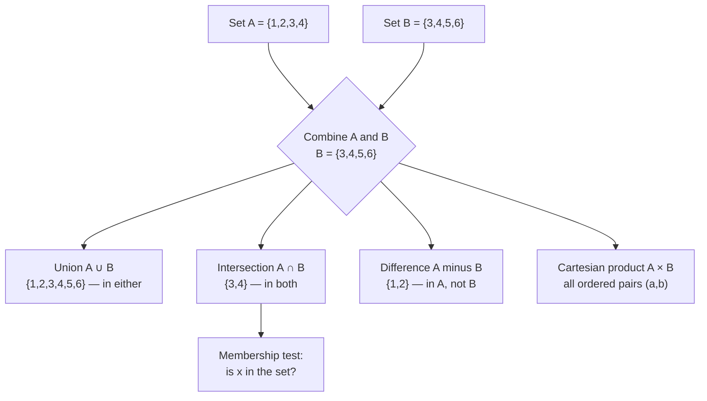

## In simple terms

A **set** is just a collection of distinct things, with no particular order and no duplicates: `{1, 2, 3}`, the set of all users, the set of valid email addresses. The only question a set really answers is *"is this thing in here or not?"* — that's **membership**. From that one idea, an astonishing amount of mathematics and computing is built.

## The Visual Map



## More detail

A set is defined by its **elements**, and the same element never appears twice. We write `x ∈ A` ("x is in A") or `x ∉ A`. Sets can be finite (`{red, green, blue}`) or infinite (the natural numbers). The core operations:

- **Union** `A ∪ B` — everything in either set.
- **Intersection** `A ∩ B` — only what's in both.
- **Difference** `A \ B` — what's in A but not B.
- **Complement** — everything *not* in A, relative to some universe.
- **Subset** `A ⊆ B` — every element of A is also in B.
- **Cartesian product** `A × B` — all ordered pairs `(a, b)`; the basis of relations and tables.

A few deeper ideas matter for computing: the **power set** (the set of all subsets, of size 2ⁿ for an *n*-element set), **cardinality** (a set's size, and the surprising result that some infinities are larger than others), and **relations and functions**, which are themselves just sets of ordered pairs. Modern foundations layer axioms (ZFC) on top to avoid paradoxes like "the set of all sets that don't contain themselves."

Set theory is the connective tissue of mathematics and the conceptual root of much of computing. The **relational model** behind SQL databases is set theory made practical — tables are relations, and `JOIN`, `UNION`, and `INTERSECT` are set operations. **Boolean logic** is set algebra in disguise (AND ↔ intersection, OR ↔ union). Type systems treat types as sets of values; `Optional<T>` is a union. Even hash sets and `IN`-clauses are membership tests. Speaking the language of sets makes all of these look like one idea.

## Under the Hood

In code, a set is a data structure optimised for the membership question. A hash set stores elements in buckets so `x in A` is O(1) on average; the operations below mirror the mathematical ones exactly:

```python
A = {1, 2, 3, 4}
B = {3, 4, 5, 6}

print(A | B)   # union        -> {1, 2, 3, 4, 5, 6}
print(A & B)   # intersection -> {3, 4}
print(A - B)   # difference   -> {1, 2}
print(A ^ B)   # symmetric diff-> {1, 2, 5, 6}
print(A <= B)  # subset?      -> False
print(3 in A)  # membership   -> True  (O(1) average)

# Power set: all 2**n subsets of A
from itertools import combinations
elems = list(A)
power = [set(c) for r in range(len(elems) + 1) for c in combinations(elems, r)]
print(len(power))   # 2**4 = 16
```

The same algebra drives a SQL engine: `SELECT ... INTERSECT SELECT ...` is `A & B` over rows, and the query planner reasons about it with set identities (commutativity, distributivity) before ever touching disk.

## Engineering Trade-offs

- **Hash set vs sorted/tree set.** A hash set gives O(1) membership but no order and worst-case O(n) on adversarial collisions. A balanced-tree set (e.g. C++ `std::set`) gives O(log n) membership but keeps elements sorted, enabling range queries. Pick by whether you need ordering.
- **Membership vs sequence.** Sets discard order and duplicates. If those carry meaning (a log, a queue, a ranked list) a set is the wrong tool — you want a list or multiset.
- **Power set blow-up.** The power set has 2ⁿ elements; any algorithm that enumerates "all subsets" is exponential. Set theory makes the operation easy to *write* and easy to make accidentally intractable.
- **Memory vs speed.** Hash sets trade memory (load factor below 1, so buckets sit empty) for constant-time lookup; sorted arrays are compact but pay O(log n) per probe.

## Real-world examples

- A SQL `INNER JOIN` is an intersection of rows that match a condition; `UNION` merges result sets.
- A programming language's `Set` collection enforces uniqueness and offers O(1) membership tests.
- Access control asks set questions: is this user in the set of admins?
- A type like `string | number` is a union of two sets of possible values.

## Common misconceptions

- **"Sets are ordered like lists."** They aren't — `{1, 2}` and `{2, 1}` are the same set, and there are no duplicates. Order and repetition belong to sequences/lists.
- **"All infinities are the same size."** Cantor showed otherwise: the real numbers are strictly more numerous than the integers, even though both are infinite.

## Try it yourself

Watch the algebra hold on real collections — De Morgan's law and the power-set size, with no installs beyond `python3`:

```bash
python3 - <<'EOF'
U = set(range(10))            # universe 0..9
A = {1, 2, 3, 4, 5}
B = {4, 5, 6, 7}

# De Morgan: complement of (A ∪ B) == (comp A) ∩ (comp B)
lhs = U - (A | B)
rhs = (U - A) & (U - B)
print("De Morgan holds:", lhs == rhs, lhs)

# |power set| == 2 ** |A|
from itertools import combinations
subsets = sum(1 for r in range(len(A) + 1) for _ in combinations(A, r))
print(f"|A| = {len(A)},  |power set| = {subsets},  2**|A| = {2 ** len(A)}")
EOF
```

## Learn next

- [Discrete mathematics](/t/discrete-mathematics) — sets are its starting vocabulary; relations, functions, and graphs are all built from them
- [Boolean logic](/t/boolean-logic) — set algebra in disguise: AND is intersection, OR is union, NOT is complement
- [Relational model](/t/relational-model) — set theory made practical, where tables are relations and `JOIN`/`UNION` are set operations
- [Linear algebra](/t/linear-algebra) — the next mathematical layer, where sets of vectors gain structure
- [Probability and statistics](/t/probability-statistics) — events are sets, and probability is a measure over them
