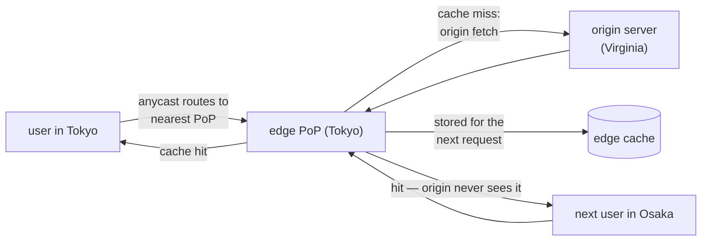

## In simple terms

A **CDN** (Content Delivery Network) is a globally distributed network of servers that caches your content close to your users. When someone in Tokyo asks for a video stored in your Virginia data centre, the CDN serves it from a server in Tokyo (or close by), not from Virginia. The result: lower latency, less load on your origin, and resilience to traffic spikes.

## The Visual Map



## More detail

A CDN's job is conceptually simple but operationally enormous:

1. **PoPs** (Points of Presence) — physical servers in hundreds of cities.
2. **Anycast routing** — multiple PoPs advertise the same IP address; BGP routes the user to the closest one.
3. **Cache** — recently requested files live on the PoP's local disk / SSD.
4. **Origin fetch** — on a cache miss, the PoP pulls the file from your origin server, serves it to the user, and stores it for future requests.

Caching is governed by HTTP headers (`Cache-Control`, `ETag`, `Last-Modified`, `Vary`). The CDN respects these and adds its own rules (purge APIs, cache tags, geo-targeting).

Beyond static content, modern CDNs increasingly run **compute at the edge**:

- **Edge Workers / Functions** — Cloudflare Workers, Vercel Edge Functions, Fastly Compute@Edge — small JavaScript / Wasm / Rust code that runs at every PoP, handling auth, A/B tests, redirects, even SSR.
- **Image optimisation** — resize, recompress, convert format on the fly per device.
- **Bot protection / DDoS mitigation** — absorb attack traffic before it reaches your origin.
- **TLS termination** — handle handshakes globally; backend traffic to origin is often a single long-lived connection.

Major operators in 2026: **Cloudflare**, **Fastly**, **Akamai**, **Amazon CloudFront**, **Google Cloud CDN**, **Bunny**, **Vercel** (a layer on top of Cloudflare and others).

A CDN is often the single biggest performance lever for a public web site or app: putting one in front of static assets can take page-load time from 3 seconds to under 1, especially for users far from the origin, while absorbing DDoS attacks, smoothing traffic spikes, and cutting origin bandwidth bills.

## Under the Hood

The contract between your origin and every CDN is a handful of HTTP headers:

```text
# origin response — these headers ARE the caching policy
HTTP/1.1 200 OK
Cache-Control: public, max-age=86400, stale-while-revalidate=3600
ETag: "v42-a1b2c3"
Vary: Accept-Encoding

# what the edge adds when serving from cache
Age: 5117                 # seconds this copy has sat in the edge cache
X-Cache: HIT              # (name varies: cf-cache-status, x-served-by, ...)

# revalidation: edge asks the origin "still fresh?"
GET /app.js HTTP/1.1
If-None-Match: "v42-a1b2c3"

HTTP/1.1 304 Not Modified  # origin sends 4 bytes of headers, not 400 KB of body
```

`max-age` decides how long the edge may serve without asking; `ETag` + `304` make the asking nearly free; `stale-while-revalidate` lets the edge serve the old copy *while* it refreshes — the trick behind "always fast, eventually fresh".

## Engineering Trade-offs

- **Cache duration vs freshness.** Long `max-age` means most requests never touch your origin — and that a bad deploy lives at the edge until it expires. The standard escape is immutable, content-hashed asset names (`app.4f3a2b.js`) cached forever, with only the small HTML entry point kept fresh.
- **Centralisation risk.** Fronting your site with a CDN means inheriting its outages — when a major CDN stumbles, thousands of "independent" sites go down together. You trade your own reliability problem for a shared, usually-smaller one.
- **Edge compute: latency vs capability.** Edge functions run within milliseconds of every user but in constrained runtimes with no nearby database; data-heavy logic still belongs at the origin or needs edge-replicated storage.
- **TLS termination at the edge.** Letting the CDN terminate TLS enables caching and DDoS filtering — and means the CDN sees your plaintext traffic. For some threat models that's an unacceptable trust grant.

## Real-world examples

- **Netflix Open Connect** is a custom CDN that ships physical servers (Open Connect Appliances) to ISPs around the world, so a stream usually comes from a box inside the user's ISP's network.
- The **June 2021 Fastly outage** took down the BBC, Amazon, the Guardian, Reddit, and many more for under an hour — a vivid demonstration of how much of the modern web sits behind a few CDNs.
- **Cloudflare** advertises that it handles ~20% of internet traffic; the dashboard's RPM (requests-per-minute) graphs are public reports of how much DDoS its WAF absorbs daily.

## Common misconceptions

- **"A CDN only helps static assets."** Modern CDNs accelerate dynamic content too (via micro-caching, route optimisation, edge compute, and intelligent connection pooling to the origin).
- **"A CDN is just a cache."** It's a cache, a DDoS absorber, a TLS terminator, an image optimiser, a routing optimiser, and increasingly a runtime.

## Try it yourself

Fetch a CDN-served page and read the cache verdict straight from the response headers:

```bash
# requires: network
python3 -c "
import urllib.request
req = urllib.request.Request('https://www.wikipedia.org', method='HEAD',
                             headers={'User-Agent': 'curiosity/1.0'})
with urllib.request.urlopen(req, timeout=5) as r:
    for h in ('server', 'cache-control', 'age', 'x-cache', 'cf-cache-status', 'etag'):
        if r.headers.get(h):
            print(f'{h}: {r.headers[h]}')
"
```

An `Age` header counts seconds since the edge cached this copy; run it twice and watch it climb — your second request never reached the origin.

## Learn next

- [HTTP](/t/http) — the protocol whose caching headers CDNs obey.
- [DNS](/t/dns) — the naming layer that steers users toward PoPs.
- [Anycast](/t/anycast) — how one IP address answers from hundreds of cities.
- [HTTPS](/t/https) — the encryption CDNs terminate at the edge.
