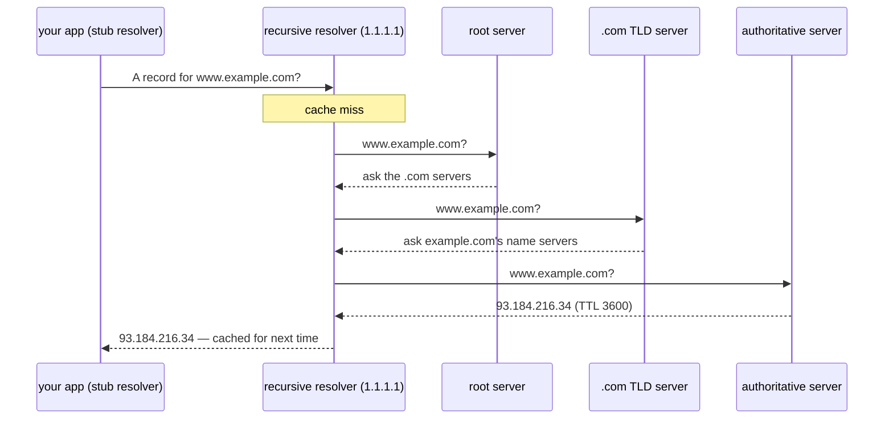

## In simple terms

DNS (Domain Name System) is what turns a name you can remember, like `wikipedia.org`, into a number a computer can use to find the right server, like `208.80.154.224`. Without DNS, you would have to memorise IP addresses for every site you visit.

## The Visual Map



## More detail

DNS is a globally distributed, hierarchical database. The hierarchy is read **right to left** in a domain name:

```
www . example . com .
 │     │        │   │
 │     │        │   └── root
 │     │        └────── top-level domain (TLD): com
 │     └─────────────── second-level domain:    example
 └───────────────────── subdomain:              www
```

A lookup typically involves four kinds of server:

1. **Stub resolver** — built into your operating system; asks the next server up.
2. **Recursive resolver** — usually your ISP, your router, or a public resolver like `1.1.1.1` or `8.8.8.8`. Does the actual hunting and caches results.
3. **Root servers** — point the resolver toward the right TLD server.
4. **Authoritative servers** — know the real answer for a specific domain.

Records come in types: **A** (IPv4), **AAAA** (IPv6), **MX** (mail), **CNAME** (alias), **TXT** (free-form, often used for verification), **NS** (delegation).

Modern DNS adds **DNSSEC** for cryptographic integrity and **DNS-over-HTTPS / DNS-over-TLS** for privacy.

DNS is invisible until it breaks — and when it does, "the internet is down" for users even though the underlying network is fine. It is the single most-relied-upon name service on the planet.

## Under the Hood

A DNS query is a tiny binary packet, usually one UDP datagram each way. This builds one by hand:

```python
import socket, struct

def query(name, server="1.1.1.1"):
    # header: id, flags (RD=recursion desired), 1 question
    pkt = struct.pack(">HHHHHH", 0x1234, 0x0100, 1, 0, 0, 0)
    for label in name.split("."):          # QNAME: length-prefixed labels
        pkt += bytes([len(label)]) + label.encode()
    pkt += b"\x00" + struct.pack(">HH", 1, 1)   # QTYPE=A, QCLASS=IN
    s = socket.socket(socket.AF_INET, socket.SOCK_DGRAM)
    s.settimeout(3)
    s.sendto(pkt, (server, 53))
    resp, _ = s.recvfrom(512)
    return resp[-4:]                       # last 4 bytes of a simple answer: the IPv4

print(".".join(map(str, query("example.com"))))
```

The whole protocol fits in ~512 bytes per message — which is why a single UDP round-trip is enough for most lookups.

## Engineering Trade-offs

- **TTL: agility vs load.** A long TTL means resolvers everywhere serve your record from cache — cheap and fast, but a DNS change takes hours to propagate. A short TTL makes failover quick but multiplies query load on your authoritative servers.
- **UDP speed vs TCP robustness.** One UDP datagram each way is the fast path; responses too large for it (DNSSEC signatures, many records) force a retry over TCP, adding round-trips.
- **Encrypted DNS: privacy vs visibility.** DoH/DoT hide queries from on-path observers — and from the enterprise security tooling and parental controls that relied on seeing them.
- **Caching layers vs freshness.** Browser, OS, router, and resolver each cache independently. The layers make the system resilient and fast, but "have you flushed your DNS cache?" exists because four caches can disagree.

## Real-world examples

- Typing `https://github.com` triggers DNS lookups for `github.com` before any HTTP request can be made.
- A misconfigured `MX` record routes email to the wrong server.
- A long DNS cache (high TTL) makes changes slow to roll out; a short one increases query load.
- CDNs answer DNS queries with different IPs depending on where you ask from — DNS doubles as a global load balancer.

## Common misconceptions

- **"DNS uses HTTP."** Classic DNS uses its own protocol on UDP/TCP port 53. DoH adds an HTTPS transport for privacy, but the underlying queries are still DNS.
- **"DNS is centralised."** It is hierarchical and operated by many organisations, but it is deeply distributed and cached at every level.

## Try it yourself

Resolve a name through your system's full resolver path and see every address it returns:

```bash
# requires: network
python3 -c "
import socket
for fam, _, _, _, addr in socket.getaddrinfo('example.com', 443, proto=socket.IPPROTO_TCP):
    print('IPv6' if fam == socket.AF_INET6 else 'IPv4', addr[0])
"
```

On Linux, `resolvectl query example.com` (systemd) or `getent hosts example.com` shows what your OS stub resolver actually returns, cache and all.

## Learn next

- [IP address](/t/ip-address) — the numbers DNS resolves names into.
- [UDP](/t/udp) — the transport that carries most DNS queries.
- [Anycast](/t/anycast) — how `1.1.1.1` can be one address answered by hundreds of sites worldwide.
- [HTTP](/t/http) — what happens right after the name is resolved.
