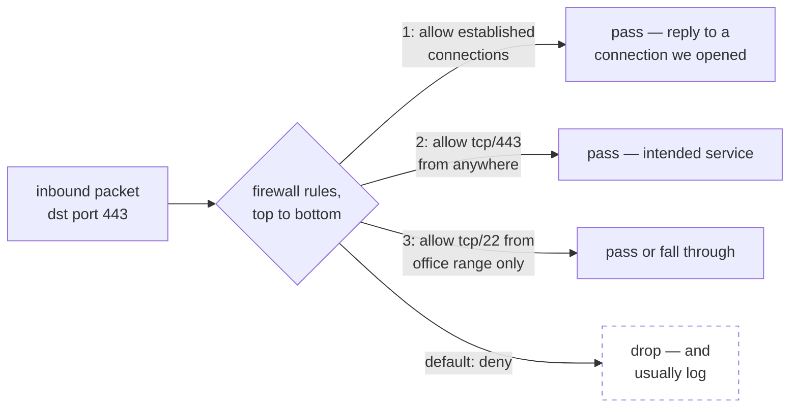

## In simple terms

A **firewall** is a filter that decides which network traffic is allowed through and which gets dropped. It sits at a boundary — between your computer and the network, or between a private network and the internet — and checks every [packet](/t/packet) against a list of rules. "Allow web traffic on port 443, block everything else inbound" is a firewall rule. It's the most basic and universal network defense.

## The Visual Map



## More detail

Firewalls have grown in sophistication over the decades:

- **Packet filtering** — the original form. Each packet is judged in isolation by its source/destination IP, port, and protocol. Fast, stateless, but blind to context.
- **Stateful inspection** — the firewall tracks *connections*. It remembers that you opened a connection to a web server, so it knows the reply packets are expected and lets them back in, while blocking unsolicited inbound traffic. This is the modern baseline.
- **Application-layer / next-generation firewalls (NGFW)** — inspect the actual content (HTTP, DNS), can identify applications regardless of port, and integrate intrusion detection.
- **Web Application Firewalls (WAF)** — specialized for HTTP, filtering for attacks like SQL injection and XSS.

A typical default policy is **default-deny**: block everything, then explicitly allow what's needed. Firewalls run in many places — on your laptop (host firewall), in your home [router](/t/router), as a dedicated appliance at a company's edge, and as software rules in the cloud (AWS Security Groups). They commonly sit right alongside [NAT](/t/nat) on the same device.

A firewall is the first and most universal line of network defense: it shrinks a system's **attack surface** by ensuring only intended services are reachable. A database that should never be exposed to the internet, an admin port that should only accept connections from inside the office — the firewall is what enforces those boundaries. Misconfigured firewall rules (or an accidentally-open port) are behind a large share of breaches.

## Under the Hood

A real default-deny ruleset in nftables (Linux's current firewall), readable top to bottom:

```text
table inet filter {
  chain input {
    type filter hook input priority 0; policy drop;   # default-deny

    ct state established,related accept   # replies to connections we opened
    ct state invalid drop                 # nonsense packets

    iif "lo" accept                       # localhost talks to itself freely
    tcp dport 443 accept                  # the web service we mean to expose
    tcp dport 22 ip saddr 203.0.113.0/24 accept   # SSH from the office only

    log prefix "fw-drop: " counter        # everything else: log it, drop it
  }
}
```

The `ct state established` line is what makes it *stateful*: the kernel's connection tracker remembers outbound connections, so replies are allowed without opening any inbound port.

## Engineering Trade-offs

- **Default-deny vs operational friction.** Blocking everything by default is the secure posture, but every new legitimate service now requires a rule change — and overly painful processes push teams toward dangerously broad "allow all from internal" rules.
- **Inspection depth vs throughput.** Checking IP+port is nearly free at line rate; parsing HTTP bodies for SQL injection costs orders of magnitude more CPU per packet. NGFW/WAF features are why firewall appliances are sized by inspected bandwidth.
- **Stateful tracking has limits.** Connection tables are finite memory — SYN floods aim to fill them. Defenses (SYN cookies, aggressive timeouts) trade strict correctness for survivability under attack.
- **Encrypted traffic: inspect or trust.** TLS hides payloads from application-layer filtering. Decrypting at the firewall (TLS interception) restores visibility but breaks end-to-end encryption and adds a high-value point of failure.

## Real-world examples

- A cloud **security group** that allows inbound port 443 from anywhere but restricts SSH (port 22) to the company's office IP range.
- `ufw` or `iptables`/`nftables` on a Linux server defining which ports accept connections.
- A WAF in front of a web app blocking requests that look like SQL injection before they reach the application.

## Common misconceptions

- **"A firewall makes me safe."** It controls *network reachability* — it does nothing about a vulnerability in a service you *do* expose, a phishing email, or malware already inside.
- **"Firewalls only block incoming traffic."** They can filter outbound traffic too — useful for stopping malware from "phoning home" or exfiltrating data.

## Try it yourself

See your machine's actual attack surface — the listening sockets a firewall would need rules for:

```bash
ss -tlnp 2>/dev/null | head -15    # listening TCP sockets: address, port, process
```

Every line is a doorway: `127.0.0.1:...` entries are reachable only locally, but anything on `0.0.0.0` or `[::]` accepts connections from any network the host is on — exactly the list you'd write allow rules for. (`sudo ufw status` or `sudo nft list ruleset` shows the rules currently guarding them.)

## Learn next

- [Packet](/t/packet) — the unit every firewall rule judges.
- [NAT](/t/nat) — the address translation that shares the firewall's box.
- [Router](/t/router) — the device at the boundary where both usually live.
