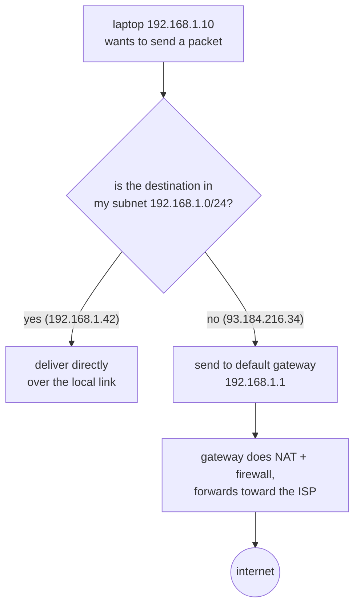

## In simple terms

A **gateway** is the doorway between two networks. When a device on your home or office network wants to reach anything *outside* that network — a website, an app's servers — it sends the traffic to its **default gateway**, the router that knows how to forward it onward. Your laptop doesn't know how to reach the whole internet; it just knows "send anything that isn't local to the gateway, and let it figure out the next hop."

## The Visual Map



## More detail

Every device configured for a network gets a **default gateway** address (often something like `192.168.1.1`). The rule a device follows is simple: if the destination IP is on my local subnet, deliver it directly; otherwise, hand it to the gateway. The gateway — usually a [router](/t/router) — then forwards the packet toward its destination, hop by hop.

The word "gateway" is used at different levels:

- **Default gateway** — the router connecting a local network (LAN) to the wider internet. This is the everyday meaning.
- **Protocol gateway** — a node that translates between *different* protocols or data formats, not just different networks (e.g., an email gateway, a VoIP-to-PSTN gateway).
- **API gateway** — in software architecture, a single entry point that routes client requests to backend services (a different but related "doorway" idea).

A home router typically bundles several roles into one box: it's the default gateway, it does [NAT](/t/nat) so all your devices share one public IP, it runs a [firewall](/t/firewall), and it hands out addresses via DHCP.

The gateway is the concept that makes "the local network" and "the internet" connect. Almost every networking problem — "I can reach local devices but not the internet," or vice versa — comes down to gateway and routing configuration. Understanding it is the difference between networking feeling like magic and feeling like plumbing you can reason about.

## Under the Hood

The local-or-gateway decision is one subnet test, made for every single packet your machine sends:

```python
import ipaddress

my_subnet = ipaddress.ip_network("192.168.1.0/24")
default_gateway = "192.168.1.1"

def next_stop(dst):
    if ipaddress.ip_address(dst) in my_subnet:
        return f"{dst} directly (ARP for its MAC, send on the local link)"
    return f"{default_gateway} (the gateway worries about the rest)"

print(next_stop("192.168.1.42"))    # a local printer — direct
print(next_stop("93.184.216.34"))   # a web server — via gateway
print(next_stop("8.8.8.8"))         # DNS — via gateway
```

This is exactly the kernel's routing decision: one specific route for the local subnet, and `default via 192.168.1.1` for everything else.

## Engineering Trade-offs

- **Single exit point: control vs bottleneck.** Routing everything through one gateway gives you one place to apply NAT, firewalling, logging, and monitoring — and one device whose failure or saturation takes the whole network offline. Serious networks run redundant gateways (VRRP/HSRP) for exactly this reason.
- **Inspection at the gateway vs end-to-end trust.** A corporate security gateway can filter and log all outbound traffic, but with TLS everywhere it sees mostly encrypted bytes — deeper visibility requires intercepting encryption, with all its costs.
- **One hop of indirection.** Devices stay simple ("everything non-local goes one way") at the price of an extra hop even for traffic to a neighbouring network — hence multi-subnet sites place routers, not hosts, at the topology joints.
- **Protocol gateways trade fidelity for reach.** Translating between protocols (email gateways, VoIP-PSTN) connects worlds that couldn't otherwise talk, but translation always loses or approximates features that don't map cleanly.

## Real-world examples

- `ip route` (Linux) or `route print` (Windows) shows your default gateway — the address everything non-local is sent to.
- "Can ping the router but not Google" is a classic symptom: the local link works, but the gateway can't reach the outside (or DNS is broken).
- A corporate network may route all internet-bound traffic through a single security gateway that inspects and logs it.

## Common misconceptions

- **"Gateway and router mean the same thing."** A router is a device; "gateway" is a *role* — the router your traffic exits through. A router can be a gateway, but the gateway concept is about the boundary it sits on.
- **"The gateway assigns my IP address."** That's usually DHCP (often running on the same box), not the gateway function itself.

## Try it yourself

Find your gateway and confirm it's the first hop for everything non-local:

```bash
ip route show default          # "default via 192.168.1.1 dev wlan0" — your doorway
ip route get 1.1.1.1           # non-local: routed via that gateway
ip neigh show                  # the gateway's MAC, learned via ARP
```

Every destination outside your subnet resolves to the same `via` — one doorway, regardless of where the packet is ultimately headed.

## Learn next

- [Router](/t/router) — the device that usually plays the gateway role.
- [NAT](/t/nat) — the address rewriting done on the way out.
- [Firewall](/t/firewall) — the filtering that guards the same boundary.
