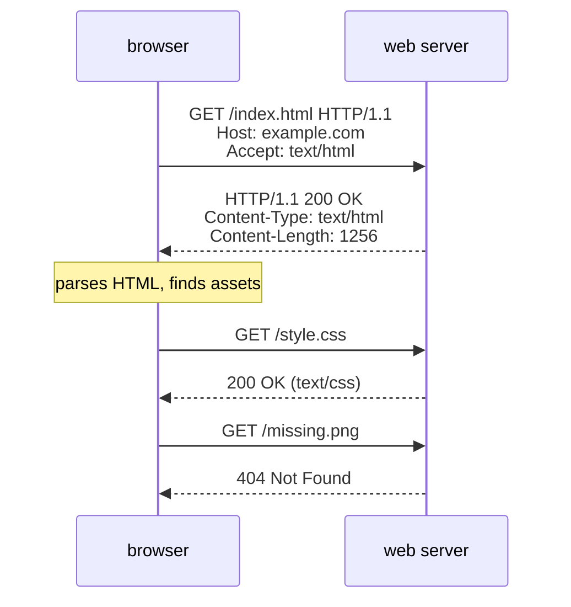

## In simple terms

HTTP is the language web browsers and web servers use to talk. The browser sends a **request** ("give me this page"), the server sends back a **response** ("here you go, and here's the status").

## The Visual Map



## More detail

An HTTP request has:

- A **method** (`GET`, `POST`, `PUT`, `DELETE`, `PATCH`, ...).
- A **URL** that identifies the resource.
- **Headers** with metadata (content type, cookies, caching directives, auth, ...).
- An optional **body** (for `POST`, `PUT`, ...).

An HTTP response has:

- A **status code** — `200 OK`, `301 Moved Permanently`, `404 Not Found`, `500 Internal Server Error`, ...
- **Headers**.
- A **body**, often HTML, JSON, or an image.

Versions matter:

- **HTTP/1.1** — text-based, one request at a time per connection (mostly).
- **HTTP/2** — binary, multiplexed over a single connection.
- **HTTP/3** — built on QUIC over UDP, faster on lossy networks.

**HTTPS** is HTTP over TLS — the same protocol with end-to-end encryption and server identity verification.

HTTP is the universal API of the modern internet. Web sites, mobile apps, microservices, webhooks — they almost all speak it.

## Under the Hood

HTTP/1.1 is plain text on a TCP socket. This is a complete, valid exchange:

```text
GET /index.html HTTP/1.1
Host: example.com
User-Agent: curl/8.5
Accept: */*

HTTP/1.1 200 OK
Content-Type: text/html; charset=UTF-8
Content-Length: 48
Cache-Control: max-age=604800

<html><body><h1>Hello, world.</h1></body></html>
```

Request line, headers, blank line, optional body — that's the entire grammar. HTTP/2 and HTTP/3 carry the same semantics (methods, headers, status codes) in binary frames, which is why your application code rarely cares which version is underneath.

## Engineering Trade-offs

- **Statelessness vs convenience.** Each request stands alone, which makes servers trivially scalable behind load balancers — but every stateful feature (logins, carts) needs cookies, tokens, or sessions bolted on top.
- **Text vs binary framing.** HTTP/1.1's readable text made it debuggable with `telnet` and ubiquitous; HTTP/2 traded that readability for multiplexing and header compression because parsing text at scale was the bottleneck.
- **One connection, many streams.** HTTP/2 multiplexing removes connection overhead but inherits TCP head-of-line blocking: one lost packet stalls *all* streams. HTTP/3 moved to QUIC precisely to give each stream independent delivery.
- **Caching vs freshness.** HTTP's cache headers (`Cache-Control`, `ETag`) let CDNs absorb most of the world's traffic, at the price of an entire discipline of cache-invalidation bugs.

## Real-world examples

- Loading `https://wikipedia.org` is one HTTP `GET` request (followed by many more for assets).
- A REST API responds to `GET /api/users/42` with a JSON body.
- A webhook is just an HTTP `POST` from one service to another.
- A single browser tab opening Gmail can fire off hundreds of HTTP requests in the first second — a mix of HTML, JS modules, fonts, images, and API calls.

## Common misconceptions

- **"HTTPS encrypts who I'm talking to."** It encrypts the payload, but the destination IP and (often) hostname are still visible.
- **"`POST` is for new data, `PUT` is for updates."** Closer to: `POST` is "do something with this", `PUT` is "make this resource look exactly like this". Conventions vary by API.

## Try it yourself

Run a real HTTP exchange entirely on your machine — server, raw-socket client, and the actual bytes on the wire:

```bash
python3 -c "
import socket, threading, http.server, functools

srv = http.server.ThreadingHTTPServer(('127.0.0.1', 0), http.server.SimpleHTTPRequestHandler)
threading.Thread(target=srv.serve_forever, daemon=True).start()

s = socket.create_connection(('127.0.0.1', srv.server_address[1]))
s.sendall(b'GET / HTTP/1.1\r\nHost: localhost\r\nConnection: close\r\n\r\n')
resp = b''
while chunk := s.recv(4096):
    resp += chunk
print(resp.decode(errors='replace')[:400])
srv.shutdown()
"
```

The response starts with the status line and headers — the same text your browser parses on every page load.

## Learn next

- [HTTPS](/t/https) — the same protocol wrapped in encryption; the web's default.
- [REST API](/t/rest-api) — the dominant convention for building APIs on HTTP.
- [QUIC](/t/quic) — the transport HTTP/3 runs on, replacing TCP.
- [Web browser](/t/web-browser) — the client that turns these responses into pages.
