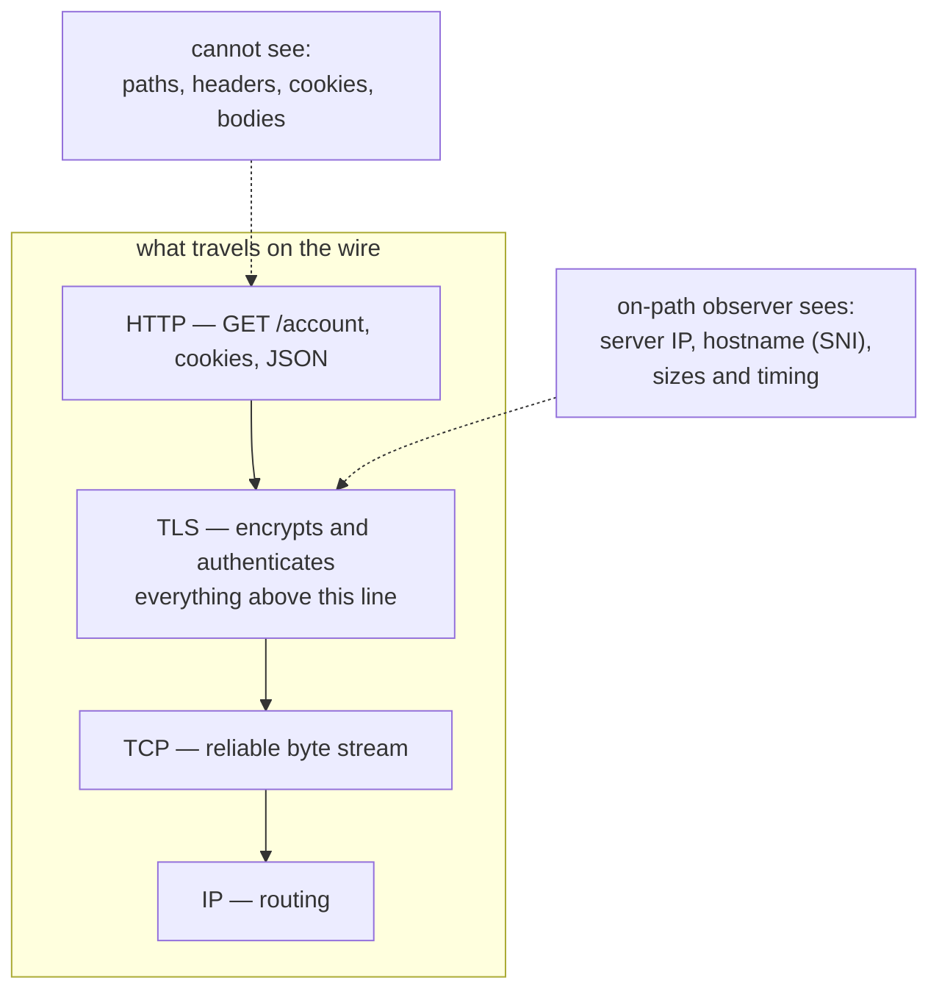

## In simple terms

**HTTPS** is just HTTP carried over TLS. It uses the same request / response model, the same status codes, the same headers — but everything between the client and server is encrypted, and the server has proven its identity via a certificate. In 2026 it's the default for the entire public web; modern browsers warn or refuse to load anything on plain HTTP.

## The Visual Map



## More detail

What HTTPS adds on top of HTTP:

- **Confidentiality** — an attacker on the network sees encrypted bytes, not the URL paths, headers, cookies, or response bodies.
- **Integrity** — the attacker can't modify the traffic without breaking the authenticated cipher.
- **Server authentication** — the certificate the server presents proves it owns the domain (verified against the browser's trust store of CAs).

The handshake is just TLS over a TCP (or QUIC, for HTTP/3) connection, followed by HTTP messages flowing through the encrypted tunnel.

The transition story over the last decade:

- **2010**: HTTPS was mostly for banks and shopping carts; the rest of the web was HTTP.
- **2014**: Google announced HTTPS as a ranking signal; **Let's Encrypt** launched and made certificates free and automated.
- **2018**: Chrome started showing "Not Secure" on HTTP pages.
- **2020+**: HTTPS-only mode is the default in major browsers; HTTP exists mostly for localhost and internal networks.

Things HTTPS does **not** hide:

- The IP address of the server.
- The hostname (visible in the TLS SNI extension, unless **Encrypted Client Hello** is in use — increasingly common in 2026).
- The approximate sizes and timings of requests (traffic analysis).

Without HTTPS, every Wi-Fi network is an eavesdropper, every ISP is a man-in-the-middle, and every login over coffee-shop Wi-Fi is a credential leak. The push by browsers, Let's Encrypt, and the broader web community to move the whole internet to HTTPS over the 2010s is one of the most consequential security wins in computing history.

## Under the Hood

Serving HTTPS is configuration, not application code. A minimal nginx site with the standard hardening:

```text
server {
    listen 80;
    server_name example.com;
    return 301 https://$host$request_uri;     # plain HTTP exists only to redirect
}

server {
    listen 443 ssl http2;
    server_name example.com;

    ssl_certificate     /etc/letsencrypt/live/example.com/fullchain.pem;
    ssl_certificate_key /etc/letsencrypt/live/example.com/privkey.pem;
    ssl_protocols       TLSv1.2 TLSv1.3;      # nothing older negotiable

    # HSTS: browsers must use HTTPS for this domain for the next year
    add_header Strict-Transport-Security "max-age=31536000; includeSubDomains" always;

    location / { proxy_pass http://127.0.0.1:3000; }
}
```

The application behind `proxy_pass` speaks plain HTTP on localhost — TLS termination at the front means the app never touches a certificate.

## Engineering Trade-offs

- **Performance: a solved tax.** The handshake once cost extra round-trips and real CPU; TLS 1.3 (one RTT, 0-RTT resumption) and AES hardware acceleration cut the overhead to single-digit percent. The era of "we can't afford HTTPS" is over — but connection reuse still matters at scale.
- **HSTS: downgrade protection vs lock-in.** Telling browsers "HTTPS only, for a year" defeats SSL-stripping attacks, but a botched TLS setup now locks users out until it's fixed — there is deliberately no "click through anyway".
- **Certificates: free issuance, real operations.** Let's Encrypt removed the cost barrier; what remains is renewal automation. Expired certificates are still among the most common self-inflicted outages.
- **Where to terminate.** Ending TLS at a CDN or load balancer enables caching and inspection but means the infrastructure between terminator and app carries plaintext — many compliance regimes require re-encrypting that internal leg.

## Real-world examples

- **Let's Encrypt** issues hundreds of millions of free certificates and now covers a large share of the public web.
- **HSTS** (HTTP Strict Transport Security) lets a site tell browsers "always use HTTPS for this domain for the next year" — locking out downgrade attacks.
- **HTTPS Everywhere** browser extension once forced HTTPS where available; it was retired in 2022 because browsers do this themselves now.
- A **TLS misconfiguration** (expired certificate, weak cipher, missing chain) is one of the most common causes of "the site is down" outages.

## Common misconceptions

- **"HTTPS means the site is safe."** It means the *connection* to the site is encrypted and authenticated. The site itself can still be a phishing page or a fraud — HTTPS only proves "you're talking to who you think you're talking to".
- **"HTTPS adds significant overhead."** With TLS 1.3 and modern ciphers it's essentially free; Cloudflare reported single-digit-percent CPU overhead at scale years ago.

## Try it yourself

Check a real site's HTTPS posture — protocol version and HSTS policy — in one request:

```bash
# requires: network
python3 -c "
import urllib.request
req = urllib.request.Request('https://github.com', method='HEAD')
with urllib.request.urlopen(req, timeout=5) as r:
    print('status:', r.status)
    print('HSTS  :', r.headers.get('strict-transport-security', '(none)'))
"
```

A `max-age=31536000` HSTS header means your browser will refuse plain HTTP to this domain for a year — try the same check on sites you use daily.

## Learn next

- [TLS](/t/tls) — the encryption layer underneath.
- [HTTP](/t/http) — the application protocol on top.
- [Public-key cryptography](/t/public-key-cryptography) — the math at the heart of the handshake.
