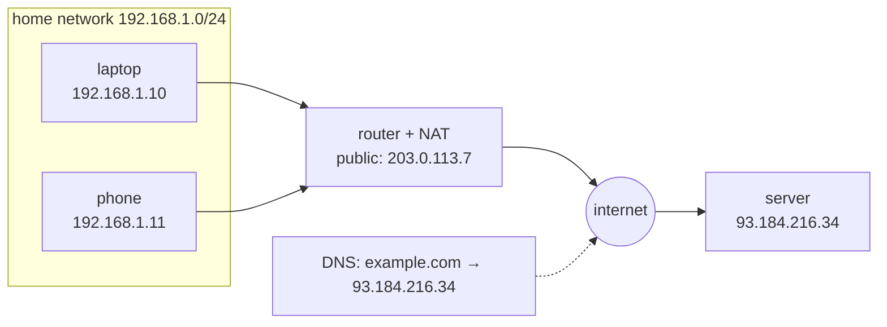

## In simple terms

An IP address is the number a computer is reachable at on a network. The internet uses two flavours: IPv4 (looks like `192.168.1.1`) and IPv6 (looks like `2001:0db8::1`).

## The Visual Map



## More detail

- **IPv4** is 32 bits, written as four decimal numbers separated by dots. Total address space: about 4.3 billion — long since exhausted.
- **IPv6** is 128 bits, written in hexadecimal blocks. The address space is essentially unlimited for practical purposes.

A modern computer often has both, plus a **private** address inside your network (handed out by your router) and a **public** address that the rest of the world sees (your ISP's gateway). Translating between them is **NAT** (network address translation).

IP addresses route by **prefix**: routers look at the leading bits and forward packets toward the destination network, hop by hop. A network is written in CIDR notation — `192.168.1.0/24` means "the 256 addresses sharing the first 24 bits".

Everything on the internet is named by IP underneath. Names like `wikipedia.org` only exist because we don't want to memorise numbers.

## Under the Hood

An IPv4 address is just a 32-bit integer; prefixes are bit masks over it:

```python
import ipaddress

net = ipaddress.ip_network("192.168.1.0/24")
addr = ipaddress.ip_address("192.168.1.10")

print(int(addr))                 # 3232235786 — the address as one integer
print(addr in net)               # True — first 24 bits match
print(net.netmask)               # 255.255.255.0
print(net.num_addresses)         # 256

# the same machinery at internet scale
print(ipaddress.ip_address("8.8.8.8") in ipaddress.ip_network("8.8.8.0/24"))  # True
```

"Longest prefix match" — the heart of every routing decision — is comparing leading bits of exactly these integers.

## Engineering Trade-offs

- **IPv4 scarcity vs IPv6 migration cost.** IPv4 ran out, so addresses are bought, leased, and stretched with NAT. IPv6 fixes scarcity permanently, but both stacks must run side by side for decades — every middlebox, firewall rule, and log pipeline doubled.
- **NAT: address sharing vs end-to-end reachability.** NAT lets a whole household live behind one public IPv4 address, but breaks the original "any host can reach any host" model — peer-to-peer apps need hole-punching and relay servers to cope.
- **Static vs dynamic assignment.** Static addresses are predictable (servers, DNS targets) but must be managed; DHCP-assigned dynamic addresses are zero-touch but can change, which is why home-hosted services need dynamic-DNS workarounds.
- **Aggregation vs precision in routing.** Big prefixes keep the global routing table small; carving them into small announcements gives fine-grained traffic control but bloats every router's memory on the planet.

## Real-world examples

- `127.0.0.1` (and `::1`) — your own machine.
- `8.8.8.8` — one of Google's public DNS servers.
- `192.168.x.x`, `10.x.x.x` — typical home-router private ranges.
- A single phone on cellular often has *three* IPs at once: a private IPv4 from the carrier's NAT, an IPv6 from the cellular network, and a private IPv4 on its local Wi-Fi.

## Common misconceptions

- **"My IP address never changes."** Many ISPs assign dynamic addresses that change on reconnect. Even "static" cloud IPs can be reassigned if you release them.
- **"An IP address identifies a person."** It identifies a network endpoint, often shared via NAT. Tying it to a person needs more evidence.

## Try it yourself

See every address your machine holds right now, then do some prefix math:

```bash
ip -brief addr show   # Linux/WSL: interface, state, IPv4 + IPv6 addresses

python3 -c "
import ipaddress
net = ipaddress.ip_network('10.0.0.0/8')
print(f'{net} holds {net.num_addresses:,} addresses')
for sub in list(net.subnets(new_prefix=10))[:4]:
    print('  subnet:', sub)
"
```

Spot the `192.168.x.x` or `10.x.x.x` private address — that's the one NAT hides from the internet.

## Learn next

- [DNS](/t/dns) — names are easier than numbers.
- [NAT](/t/nat) — how many devices share one public address.
- [Router](/t/router) — the machines that act on these prefixes.
