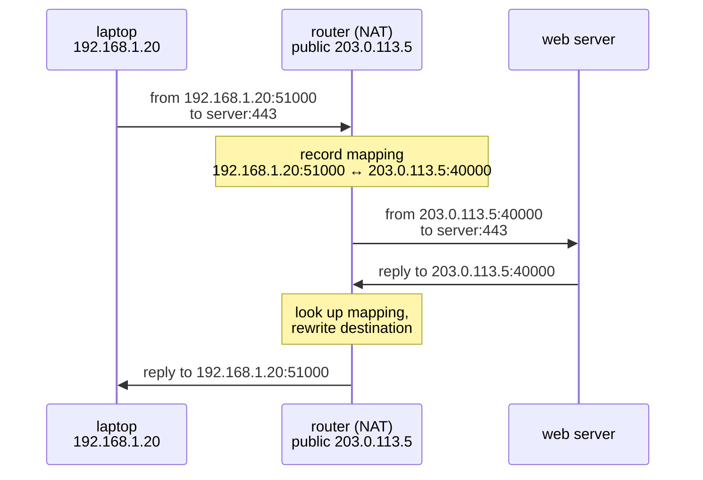

## In simple terms

**NAT** (Network Address Translation) is the trick that lets every device in your home — laptop, phone, TV, smart bulb — share a single public internet address. Your devices each have a *private* address that only works inside your network. When they reach out to the internet, the [router](/t/router) rewrites the traffic so it all appears to come from one *public* address, and remembers who asked for what so the replies get back to the right device. It's why you can have twenty gadgets online with only one address from your ISP.

## The Visual Map



## More detail

The world ran low on IPv4 addresses (there are only ~4.3 billion, far fewer than there are devices). NAT was the pragmatic fix. The common form, **PAT** (Port Address Translation, also called "NAT overload" or masquerading), works like this:

1. A device at `192.168.1.20` opens a connection to a web server. Its packet says *from 192.168.1.20:51000*.
2. The router rewrites the source to its own public address and a chosen port: *from 203.0.113.5:40000*, and records the mapping `192.168.1.20:51000 ↔ 203.0.113.5:40000`.
3. The server replies to `203.0.113.5:40000`. The router looks up the mapping and rewrites the destination back to `192.168.1.20:51000`.

Consequences that fall out of this design:

- **Inbound connections don't work by default** — an outside machine can't initiate a connection to a device behind NAT, because there's no mapping yet. This is why you set up **port forwarding** to host a game server or reach a home device remotely.
- **Private address ranges** (`10.x`, `172.16–31.x`, `192.168.x`) are reserved for use behind NAT and never routed on the public internet.
- NAT incidentally acts as a crude firewall, since unsolicited inbound traffic is dropped.

**IPv6**, with its astronomically larger address space, was designed to make NAT unnecessary by giving every device a real public address — though NAT persists for IPv4 compatibility and habit.

NAT is one of the most widely deployed pieces of internet plumbing — and the source of a whole category of networking headaches: peer-to-peer connections, VoIP, online gaming, and hosting services from home all have to work *around* it (via techniques like STUN, TURN, and UPnP). Understanding NAT explains why "it works on my network but I can't connect from outside."

## Under the Hood

The entire mechanism is a lookup table plus packet rewriting. In miniature:

```python
nat_table = {}            # (private ip, private port) <-> public port
next_port = 40000
PUBLIC_IP = "203.0.113.5"

def outbound(src_ip, src_port, dst):
    global next_port
    key = (src_ip, src_port)
    if key not in nat_table:
        nat_table[key] = next_port; next_port += 1
    return f"rewritten: from {PUBLIC_IP}:{nat_table[key]} to {dst}"

def inbound(public_port):
    for (ip, port), pub in nat_table.items():
        if pub == public_port:
            return f"rewritten: deliver to {ip}:{port}"
    return "no mapping -> DROP (this is why inbound fails by default)"

print(outbound("192.168.1.20", 51000, "server:443"))
print(inbound(40000))      # reply finds its way back
print(inbound(40999))      # unsolicited inbound: dropped
```

A real router keeps this table in the kernel's connection tracker, expires idle entries after minutes, and handles thousands of concurrent mappings.

## Engineering Trade-offs

- **Address conservation vs end-to-end reachability.** NAT stretched IPv4 by decades, but broke the internet's original "any host can reach any host" model — an entire industry of workarounds (STUN, TURN, UPnP, relay servers) exists to reconstruct what NAT removed.
- **Statefulness is fragility.** Every connection through NAT lives in a finite table with idle timeouts. Long-quiet connections die silently (hence TCP keep-alives), and the table itself is a resource an attacker or a busy network can exhaust.
- **Carrier-grade NAT compounds everything.** ISPs short on IPv4 put whole neighbourhoods behind one address: port forwarding becomes impossible, abuse-blocking one address punishes hundreds of households, and logging requirements explode.
- **The "free firewall" illusion.** Dropping unsolicited inbound traffic is a side effect, not a policy: UPnP can silently open ports, and outbound traffic is entirely unfiltered. Treat NAT as addressing, and run a real [firewall](/t/firewall) for security.

## Real-world examples

- Your home router doing PAT so all your devices share the one public IP your ISP assigned.
- **Port forwarding** a router so an outside friend can connect to a game server running on your desktop.
- Video calls using **STUN/TURN** servers to punch through both participants' NATs and establish a direct connection.

## Common misconceptions

- **"NAT is a security feature."** It blocks unsolicited inbound traffic as a side effect, but it's an addressing hack, not a security control — don't rely on it instead of a real [firewall](/t/firewall).
- **"Every device needs its own public IP."** NAT exists precisely because they don't — thousands of devices can share one public address.

## Try it yourself

See both sides of your own NAT — the private address your machine holds vs the public address the world sees:

```bash
hostname -I                      # your private address(es): 192.168.x.x / 10.x.x.x

# requires: network
python3 -c "
import urllib.request
print('public:', urllib.request.urlopen('https://api.ipify.org', timeout=5).read().decode())
"
```

Every device in your home prints a different private address but the *same* public one — that shared address is NAT at work.

## Learn next

- [Router](/t/router) — the box that performs the translation.
- [Gateway](/t/gateway) — the role that router plays for your network.
- [Firewall](/t/firewall) — the real security control NAT is mistaken for.
