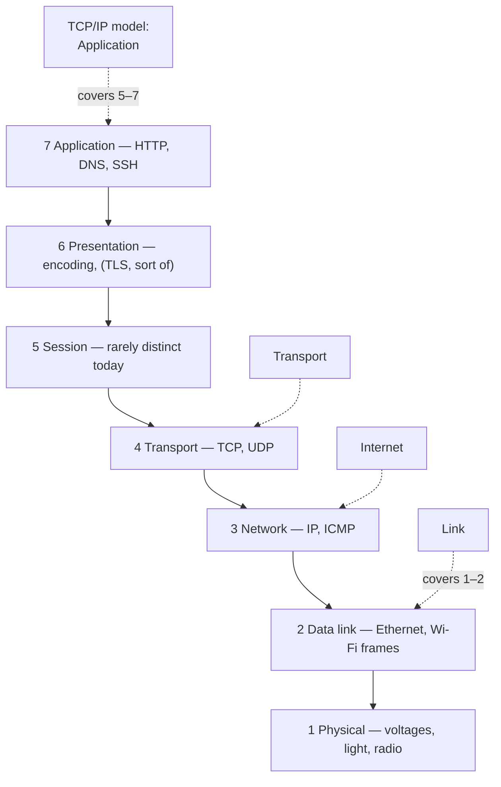

## In simple terms

The **OSI model** is a way of dividing networking into seven layers, each handling one job, with each layer relying on the layers below. The bottom is physical wires; the top is the application. It's a teaching tool, not a strict prescription — the real internet doesn't quite match it — but the vocabulary is universal in networking conversations.

## The Visual Map



## More detail

The seven layers, bottom-up:

| # | Layer | What it does | Example |
|---|---|---|---|
| 1 | Physical | Voltages, light pulses, radio waves | Ethernet cable, Wi-Fi radio |
| 2 | Data link | Framing between adjacent nodes | Ethernet frame, Wi-Fi 802.11 |
| 3 | Network | Routing across networks | IP, ICMP |
| 4 | Transport | End-to-end reliability and flow | TCP, UDP |
| 5 | Session | Sessions, dialogues | (rarely used distinctly today) |
| 6 | Presentation | Encoding, compression, encryption | TLS (kind of) |
| 7 | Application | The actual protocol the user cares about | HTTP, SMTP, DNS, SSH |

The internet's actual stack is closer to the four-layer **TCP/IP model**: Link, Internet, Transport, Application. The OSI model's session and presentation layers don't map cleanly to anything in real use.

The most useful thing OSI gives you is the vocabulary: when an engineer says "this is a layer 7 problem" they mean it's at the application protocol level; "layer 4 load balancer" means it operates at the TCP / UDP level (doesn't inspect HTTP); "layer 2 switch" forwards Ethernet frames, doesn't route IP.

That layered mental model is how you reason about almost any networking issue: where in the stack is the bug? where is the bottleneck? where is the encryption applied? Knowing the layers also helps you read tools (Wireshark, `tcpdump`, `traceroute`) and product docs (load balancers, firewalls, CDNs) without getting lost.

## Under the Hood

The layers aren't abstract — they're where each piece of a real program's network code lives:

```python
import socket, ssl

# L3/L4 — the socket API: IP addressing (AF_INET) + transport (SOCK_STREAM = TCP)
raw = socket.create_connection(("example.com", 443))

# L6-ish — TLS wraps the transport, encrypting everything above it
tls = ssl.create_default_context().wrap_socket(raw, server_hostname="example.com")

# L7 — the application protocol: HTTP, written as bytes into the pipe
tls.sendall(b"HEAD / HTTP/1.1\r\nHost: example.com\r\nConnection: close\r\n\r\n")
print(tls.recv(200).decode(errors="replace"))

# L1/L2 (cables, Wi-Fi frames) and L3 routing happened invisibly,
# inside the kernel and the network — your code never touches them.
```

One short script touches four layers; the kernel and the network handle the rest. That separation — each layer usable without understanding the ones below — is the model's actual engineering content.

## Engineering Trade-offs

- **Clean layering vs performance.** Strict layer separation means each layer re-parses and copies; high-performance stacks deliberately violate it (TCP checksum offload into the NIC, kernel-bypass networking, QUIC merging transport and crypto handshakes) to skip the overhead.
- **Vocabulary vs reality.** OSI's seven layers beat TCP/IP's four as a *taxonomy* ("layer 4 load balancer" is precise), but layers 5 and 6 describe almost nothing real — a model optimised for classification, not for describing the actual internet.
- **Abstraction hides failure detail.** Layering lets an HTTP developer ignore routing — until a path-MTU bug or a flaky link surfaces as a mysterious application timeout. Debugging networks is largely the skill of deciding *which layer* to look at.
- **Where a function lives changes its cost.** Encryption at L2 (Wi-Fi WPA) protects one link; at L6/7 (TLS) it protects end to end but blinds every middlebox. Same function, different layer, completely different system behavior.

## Real-world examples

- A **layer 7 load balancer** (HAProxy, Envoy, Cloudflare) routes based on the HTTP request — host header, path, cookies.
- A **layer 4 load balancer** (AWS NLB, kube-proxy) routes by IP + port only — much faster, no app awareness.
- A **layer 2 attack** like ARP spoofing only works on the local network; routing across the internet would hide it.
- TLS sits awkwardly across layers 5-7 in the OSI model — which is one reason the model is mostly a vocabulary tool, not a hard architecture.

## Common misconceptions

- **"The OSI model is the real architecture of the internet."** It is not — the internet uses the TCP/IP model. OSI is the teaching reference.
- **"Every protocol lives in exactly one layer."** TLS, HTTP/3 over QUIC, and DNS-over-HTTPS all cut across layers. The model is a guideline.

## Try it yourself

Walk the stack on your own machine — one command per layer:

```bash
ip -brief link show          # L2: your interfaces and their MAC addresses
ip -brief addr show          # L3: the IP addresses bound to them
ss -tln | head -5            # L4: TCP ports currently listening
getent hosts example.com     # L7: an application protocol (DNS) resolving a name
```

Each command only makes sense in terms of its layer's nouns — MACs, then IPs, then ports, then names. That progression *is* the model.

## Learn next

- [Packet](/t/packet) — the unit that gets wrapped by each layer in turn.
- [TCP](/t/tcp) — the transport layer's reliable workhorse.
- [HTTP](/t/http) — the application layer's most-used protocol.
