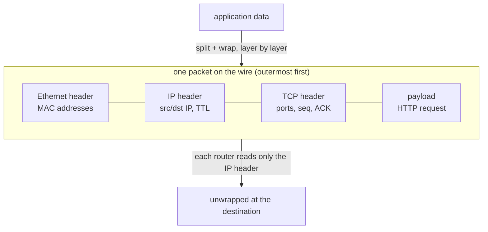

## In simple terms

A **packet** is a small envelope of data — typically a few hundred to a few thousand bytes — addressed to a destination and dropped onto the network. Big things like a video stream or a web page get broken into many packets, sent independently, and reassembled at the other end.

## The Visual Map



## More detail

A packet typically has:

- **Headers** — addressing and bookkeeping (source/destination, length, checksums, protocol numbers).
- **Payload** — the actual data being carried.

Headers are layered: an Ethernet frame wraps an IP packet, which wraps a TCP/UDP segment, which wraps your HTTP message. Each layer's header is added when the packet enters that layer and stripped at the other end.

Properties of packet-switched networks (vs. the old telephone-style circuit-switched ones):

- Each packet is **routed independently**; it can take a different path than the next.
- Packets can be **dropped**, **delayed**, **reordered**, or **duplicated**.
- Higher-level protocols (TCP) restore order and retransmit losses; lower-level ones (UDP) leave that to you.

Common sizes:

- **MTU** (Maximum Transmission Unit) is typically 1500 bytes on Ethernet. Bigger packets get fragmented.
- A modern fibre link carries billions of packets per second.

Packetisation is what makes the internet work as one shared, resilient network. Because each packet finds its own way, the network survives broken links, congested routes, and constant change.

## Under the Hood

An IPv4 header is 20 bytes of tightly packed fields. Build one and read it back:

```python
import struct, socket

# version+IHL, TOS, total length, id, flags+frag, TTL, proto, checksum, src, dst
header = struct.pack(">BBHHHBBH4s4s",
    0x45, 0, 20 + 13, 0x1234, 0, 64, 17, 0,        # proto 17 = UDP, TTL 64
    socket.inet_aton("192.168.1.10"),
    socket.inet_aton("93.184.216.34"))

v_ihl, _, length, pkt_id, _, ttl, proto, _, src, dst = struct.unpack(">BBHHHBBH4s4s", header)
print(f"IPv{v_ihl >> 4}, header {(v_ihl & 0xF) * 4} bytes, total {length} bytes")
print(f"TTL {ttl}, protocol {proto} (UDP)")
print(f"{socket.inet_ntoa(src)} -> {socket.inet_ntoa(dst)}")
```

Every router on the path parses exactly these bytes, decrements the TTL, and forwards — billions of times per second.

## Engineering Trade-offs

- **Packet switching vs circuit switching.** Sharing links packet-by-packet uses capacity far more efficiently than reserving a circuit per conversation — at the cost of variable delay, loss, and reordering that endpoints must handle.
- **Small vs large packets.** Small packets waste a larger fraction on headers and burn router CPU per byte; large packets amortise overhead but risk fragmentation when they exceed some link's MTU. Path MTU discovery exists to thread this needle.
- **Per-packet independence vs flow state.** Routers that treat each packet independently are simple and fast; anything needing flow awareness (NAT, firewalls, load balancers) must hold per-connection state, which costs memory and creates failure modes.
- **Header richness vs processing speed.** Every optional header field is flexibility for endpoints and work for forwarding hardware — core routers process packets in nanoseconds, so the IP header has barely changed in 40 years.

## Real-world examples

- `ping` sends ICMP packets and measures round-trip time.
- `tcpdump` and Wireshark show you the actual packets crossing a network interface.
- A "packet loss" reading on a video call means some packets didn't arrive — the codec hides the gaps as best it can.
- A 4K video call sends ~600 packets per second per direction. Most are 1 KB or smaller — bandwidth isn't the bottleneck, packet rate often is.

## Common misconceptions

- **"Packets are sent in order."** They are sent in order; they are not necessarily *received* in order. TCP fixes this for you; UDP does not.
- **"Each packet is its own connection."** No — a TCP connection is a stream that happens to be carried by many independent packets.

## Try it yourself

Send one real packet to yourself and inspect what arrives:

```bash
python3 -c "
import socket
rx = socket.socket(socket.AF_INET, socket.SOCK_DGRAM)
rx.bind(('127.0.0.1', 0))
tx = socket.socket(socket.AF_INET, socket.SOCK_DGRAM)
tx.sendto(b'hello, one datagram', rx.getsockname())
data, addr = rx.recvfrom(2048)
print(f'{len(data)} payload bytes from {addr}: {data!r}')
print('(the kernel added ~28 bytes of IP+UDP headers on the wire)')
"
```

On Linux, `ping -c 3 127.0.0.1` shows per-packet round-trip times, and `ip -s link` shows how many packets each interface has ever carried.

## Learn next

- [IP address](/t/ip-address) — how packets are addressed.
- [Router](/t/router) — the machines that steer them hop by hop.
- [OSI model](/t/osi-model) — the layer cake the headers come from.
