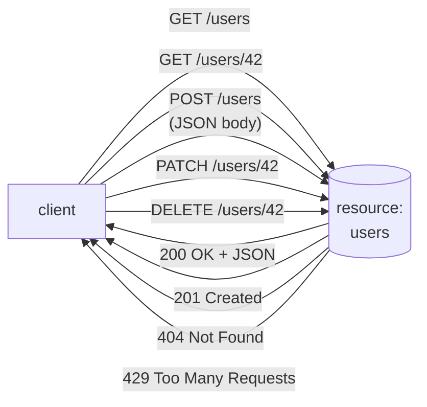

## In simple terms

A **REST API** is a way of designing HTTP-based APIs around **resources** (a user, an order, a comment) and the standard HTTP verbs (`GET`, `POST`, `PUT`, `PATCH`, `DELETE`). To list users you `GET /users`; to fetch one you `GET /users/42`; to create one you `POST /users`; to delete one you `DELETE /users/42`. It's not a strict standard — it's a set of conventions — but it dominates how the web's APIs work.

## The Visual Map



## More detail

The term comes from Roy Fielding's 2000 dissertation defining **REST** (REpresentational State Transfer). The strictly-defined version is a six-constraint architectural style; the everyday meaning is much looser:

- **Resource-based URLs** — `/users/42/orders/7`, not `/getUserOrder?u=42&o=7`.
- **Standard HTTP verbs** — `GET` (safe, idempotent), `POST` (create), `PUT` (replace, idempotent), `PATCH` (partial update), `DELETE` (idempotent).
- **HTTP status codes** — `200`, `201 Created`, `204 No Content`, `400 Bad Request`, `404 Not Found`, `409 Conflict`, `429 Too Many Requests`, `500 Internal Server Error`.
- **JSON payloads** — overwhelmingly. (Some APIs use XML, Protocol Buffers, or HTML.)
- **Statelessness** — each request carries everything needed; no server-side session memory.

What gets called "REST" in practice often isn't fully restful (it's missing HATEOAS, the "hypermedia" constraint that says the response should tell you what you can do next). Pragmatic teams call this **REST-ish** or **HTTP API**.

Common challenges:

- **Versioning** — `/v1/users` vs. `/v2/users`, or header-based versioning. No consensus.
- **Pagination** — offsets, cursors, link headers, opaque tokens. Standards vary.
- **Filtering and sorting** — query parameters, ad-hoc per API.
- **Bulk operations** — REST is awkward at "update 100 users in one call".
- **N+1 problem** — fetching a list and then per-item details often needs many requests, motivating GraphQL.

The vast majority of public APIs in 2026 are REST-ish over HTTPS. Knowing the conventions — and the trade-offs against GraphQL and gRPC — is core knowledge for any backend or frontend developer working with services.

## Under the Hood

One REST exchange, down to the bytes — the conventions are all visible on the wire:

```text
POST /v1/users HTTP/1.1
Host: api.example.com
Authorization: Bearer sk_live_...
Content-Type: application/json
Idempotency-Key: 8f3c-41d7            # retry-safety for a non-idempotent verb

{"name": "Ada Lovelace", "email": "ada@example.com"}

HTTP/1.1 201 Created
Location: /v1/users/42                # where the new resource now lives
Content-Type: application/json

{"id": 42, "name": "Ada Lovelace", "email": "ada@example.com"}
```

Verb carries the action, URL names the resource, status code reports the outcome, `Location` points at what was created. A client that understands HTTP already understands half this API — that reuse is REST's whole bet.

## Engineering Trade-offs

- **Convention vs contract.** REST's loose conventions make APIs guessable and learnable without tooling — but nothing machine-enforces them, so OpenAPI schemas, linters, and review discipline fill the gap that gRPC's compiler enforces for free.
- **Statelessness scales, sessions don't.** Any server can answer any request, which makes horizontal scaling trivial — and pushes all conversational state into tokens, cookies, or the database.
- **Fixed resource shapes vs query flexibility.** Each endpoint returns a fixed shape: simple to cache and reason about, but clients over-fetch fields they don't need and under-fetch relations they do (the N+1 problem GraphQL exists to solve).
- **Request/response only.** REST has no server push — anything real-time (notifications, live updates) needs [WebSockets](/t/websocket), Server-Sent Events, or polling bolted alongside.

## Real-world examples

- **The Stripe API** is the canonical "elegant REST API" reference: well-named resources, consistent pagination, helpful error responses.
- **The GitHub API** is a useful contrast: started REST, added GraphQL, now both coexist.
- **The Twilio, Slack, Discord, and Spotify APIs** are all REST-ish HTTPS APIs with JSON payloads.
- **OpenAPI** (formerly Swagger) is a standard for describing REST APIs; the same definition generates docs, clients, and server scaffolding.

## Common misconceptions

- **"REST is a standard."** It's an architectural style. There's no spec to comply with; conventions vary widely across APIs.
- **"REST APIs must be stateless from the client's perspective."** They're stateless server-side; the client typically holds an auth token across requests.

## Try it yourself

Run a tiny REST API and exercise two verbs against it — server and client in one script:

```bash
python3 -c "
import json, threading, urllib.request
from http.server import BaseHTTPRequestHandler, ThreadingHTTPServer

users = {'42': {'id': 42, 'name': 'Ada'}}

class API(BaseHTTPRequestHandler):
    def _send(self, code, body):
        data = json.dumps(body).encode()
        self.send_response(code)
        self.send_header('Content-Type', 'application/json')
        self.end_headers(); self.wfile.write(data)
    def do_GET(self):
        uid = self.path.rsplit('/', 1)[-1]
        self._send(200, users[uid]) if uid in users else self._send(404, {'error': 'not found'})
    def log_message(self, *a): pass

srv = ThreadingHTTPServer(('127.0.0.1', 0), API)
threading.Thread(target=srv.serve_forever, daemon=True).start()
base = f'http://127.0.0.1:{srv.server_address[1]}'

print('GET /users/42 ->', urllib.request.urlopen(f'{base}/users/42').read().decode())
try:
    urllib.request.urlopen(f'{base}/users/99')
except urllib.error.HTTPError as e:
    print('GET /users/99 ->', e.code, e.read().decode())
srv.shutdown()
"
```

Resource URL, status code, JSON body — the whole convention in thirty lines.

## Learn next

- [HTTP](/t/http) — the protocol REST's conventions are built from.
- [HTTPS](/t/https) — the transport every production API runs over.
- [WebSocket](/t/websocket) — the push channel REST APIs pair with for real-time.
