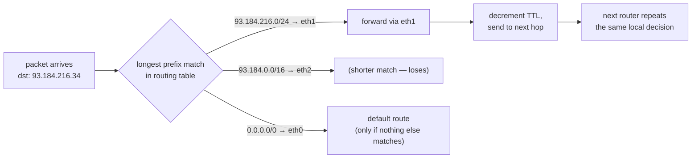

## In simple terms

A **router** is a device that connects two or more networks and decides where to send each packet next. The home router on your shelf bridges your house to your ISP; backbone routers at internet exchanges move millions of packets a second between continents.

## The Visual Map



## More detail

A router has a **routing table**: rules that map "destination network" to "next hop". When a packet arrives:

1. Look at its **destination IP address**.
2. Find the **longest matching prefix** in the routing table.
3. Decrement the packet's **TTL** (so loops eventually die).
4. Send the packet out the corresponding interface to the next router.

Routing tables come from:

- **Static routes** — hand-configured by humans.
- **Interior routing protocols** — OSPF, IS-IS — share routes within one organisation.
- **Border Gateway Protocol (BGP)** — exchanges routes between Autonomous Systems (ISPs and big networks). BGP is what makes "the internet" a single graph.

Home routers usually combine many functions in one box: routing, DHCP (handing out private IPs), NAT (sharing one public IP), DNS forwarding, Wi-Fi, and firewalling.

Switches are sometimes confused with routers but operate at a lower layer: a switch forwards Ethernet frames inside one local network using MAC addresses; a router forwards IP packets between networks.

Without routers, every network would be an island. They are how a packet sent from a laptop in Lisbon finds its way to a server in Sydney via dozens of hops, in milliseconds.

## Under the Hood

Longest-prefix match — the algorithm at the heart of every forwarding decision — in a dozen lines:

```python
import ipaddress

routing_table = {
    ipaddress.ip_network("0.0.0.0/0"):        "eth0 (default, to ISP)",
    ipaddress.ip_network("93.184.0.0/16"):    "eth2",
    ipaddress.ip_network("93.184.216.0/24"):  "eth1",
    ipaddress.ip_network("192.168.1.0/24"):   "lan0 (local)",
}

def next_hop(dst):
    addr = ipaddress.ip_address(dst)
    matches = [net for net in routing_table if addr in net]
    best = max(matches, key=lambda n: n.prefixlen)   # longest prefix wins
    return routing_table[best]

print(next_hop("93.184.216.34"))   # eth1 — /24 beats /16 beats /0
print(next_hop("8.8.8.8"))         # eth0 — only the default matches
```

Real routers do this in hardware (TCAM or trie lookups) at hundreds of millions of packets per second, but the rule is the same: most specific prefix wins.

## Engineering Trade-offs

- **Local decisions vs global knowledge.** Each router only knows its next hop, which makes the internet survive failures with no central coordinator — but it also means no single device can guarantee or even see the full path.
- **Hardware forwarding vs flexibility.** Line-rate forwarding lives in fixed-function ASICs; anything clever (deep inspection, per-flow logic) drops to the CPU and runs orders of magnitude slower. Router design is the art of keeping packets on the fast path.
- **Route aggregation vs table size.** Every router in the internet core carries ~1 million BGP prefixes in expensive fast memory. Aggregating routes keeps tables small; de-aggregating gives operators traffic control — and bloats everyone else's hardware.
- **Convergence speed vs stability.** When a link dies, routing protocols must spread the news fast — but react too eagerly and a flapping link sends update storms through the whole network. Timers and dampening trade outage seconds against churn.

## Real-world examples

- The plastic box from your ISP is a router.
- `traceroute` (or `mtr`) shows the chain of routers a packet passes through.
- BGP misconfigurations have taken down major chunks of the internet several times in the last decade, including the 2021 Facebook outage where its routers withdrew themselves.

## Common misconceptions

- **"My router gives me Wi-Fi."** Wi-Fi is one feature of the all-in-one box; routing is a separate job.
- **"Routers know the full path."** They know only the *next hop*. Each router along the way makes a local decision.

## Try it yourself

Inspect your own machine's routing table — it makes the same longest-prefix decision as a backbone router:

```bash
ip route show                 # your routing table: default route + local networks
ip route get 1.1.1.1          # which interface and gateway would carry this packet
ip route get 127.0.0.1        # same question, very different answer
```

The `default via ...` line is the route your traffic takes whenever nothing more specific matches — for a home machine, that's almost everything.

## Learn next

- [BGP](/t/bgp) — how routers across organisations agree on routes.
- [Gateway](/t/gateway) — the router role your machine's default route points at.
- [NAT](/t/nat) — the address translation your home router performs on every packet.
