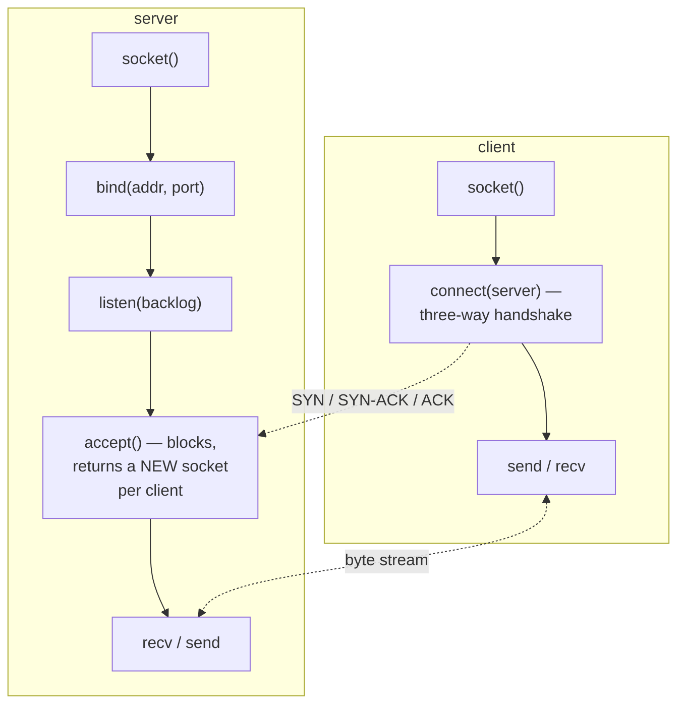

## In simple terms

When your program wants to talk to another program over the network, it calls into the operating system via the **socket API** — the same four calls (create, bind, connect/listen, send/receive) whether you're writing a web server, a game client, or a database driver. A socket is the OS's file-like handle for a network endpoint: open it, write bytes in, get bytes out, close it when done.

## The Visual Map



## More detail

A socket is identified by five values — the **5-tuple**: `(protocol, local IP, local port, remote IP, remote port)`. This uniquely identifies every active connection in the system. The OS uses it to demultiplex incoming packets to the right application.

The BSD socket API (standardised in POSIX, available on every OS):

1. **`socket(domain, type, protocol)`** — create a socket. `AF_INET`/`AF_INET6` for IP; `SOCK_STREAM` for TCP; `SOCK_DGRAM` for UDP.
2. **`bind(fd, addr)`** — claim a local address/port (mandatory for servers; optional for clients, who get an ephemeral port).
3. **`listen(fd, backlog)`** — (TCP servers only) mark the socket as passive; `backlog` is how many pending connections the kernel will queue.
4. **`accept(fd)`** — (TCP servers) block until a client connects; returns a *new* socket for that connection, leaving the listening socket ready for the next.
5. **`connect(fd, addr)`** — (TCP clients) initiate the three-way handshake to a server address.
6. **`send` / `recv`** (or `write` / `read`) — exchange data. **TCP is a stream**: `send(1000 bytes)` may result in `recv` returning 200 bytes, then 800 bytes — the application must loop until it has all it expects.
7. **`close(fd)`** — tear down the connection (sends TCP FIN).

**Unix domain sockets** (`AF_UNIX`) use the same API but communicate through the kernel without touching the network stack — they're faster for same-machine IPC (databases, docker, systemd all use them).

Non-blocking sockets and **I/O multiplexing** (`select`, `poll`, `epoll`, `kqueue`) let a single thread handle thousands of concurrent connections by registering sockets and getting callbacks when data arrives — the model behind every high-performance server (Nginx, Node.js's event loop).

**TLS** is layered on top of a TCP socket: the application opens a normal socket, hands it to a TLS library (OpenSSL, BoringSSL), which handles the handshake and then wraps `send`/`recv` to encrypt/decrypt transparently.

Every network library, every HTTP client, every database driver, and every web server ultimately calls this API. Understanding it explains why HTTP keep-alive matters (amortising the cost of connect), why a server needs `SO_REUSEADDR` after a crash, why `TCP_NODELAY` helps latency-sensitive protocols, and why "connection refused" vs "connection timed out" point to different failure modes.

## Under the Hood

The canonical server and client, with every BSD call visible:

```python
import socket

# --- server ---
srv = socket.socket(socket.AF_INET, socket.SOCK_STREAM)   # 1. socket()
srv.setsockopt(socket.SOL_SOCKET, socket.SO_REUSEADDR, 1) # rebindable after crash
srv.bind(("127.0.0.1", 0))                                # 2. bind()
srv.listen(8)                                             # 3. listen()

# --- client ---
cli = socket.socket(socket.AF_INET, socket.SOCK_STREAM)
cli.connect(srv.getsockname())                            # 5. connect() = handshake

conn, peer = srv.accept()                                 # 4. accept() -> NEW socket
print("server sees client at", peer)                      #    (the 5-tuple's far end)

cli.sendall(b"ping")                                      # 6. send / recv
print("server got:", conn.recv(64))
conn.sendall(b"pong")
print("client got:", cli.recv(64))

cli.close(); conn.close(); srv.close()                    # 7. close() -> FIN
```

Note `accept()` returning a *second* socket: the listening socket is a factory; each connection gets its own file descriptor with its own buffers.

## Engineering Trade-offs

- **Blocking simplicity vs concurrency.** One blocking socket per thread is easy to reason about but caps out at thousands of threads; event-driven non-blocking I/O (`epoll`, `kqueue`, `io_uring`) handles hundreds of thousands of connections in one thread at the cost of inverted, callback-shaped code — the tension async/await syntax exists to soften.
- **Stream abstraction vs message framing.** The byte-stream model is universal and simple, but every application must invent framing on top. The recurring "it worked locally, breaks in production" socket bug is assuming one `send` equals one `recv`.
- **Buffer sizes: memory vs throughput.** Each socket holds kernel send/receive buffers. Bigger buffers keep fast links full (bandwidth-delay product), but a server with 100k connections pays that memory 100k times.
- **Portability vs the fast path.** BSD sockets run everywhere; the high-performance interfaces (`io_uring`, `kqueue`, IOCP) are per-OS. Networking runtimes ship one backend per platform because the portable API leaves performance on the table.

## Real-world examples

- A browser opens a TCP socket to port 443 of a web server, hands it to a TLS library, then speaks HTTP over it.
- `curl` and every HTTP client library create a socket, connect, send the HTTP request as bytes, and read the response.
- Redis, PostgreSQL, and MySQL all listen on a TCP socket; clients connect using the same BSD API.
- Node.js's `net` module is a thin wrapper over non-blocking sockets with `epoll`/`kqueue` for event notification.

## Common misconceptions

- **"Sockets are a network concept."** Unix domain sockets work entirely within the kernel — same API, zero network. Many local services (Docker daemon, systemd, database) use them.
- **"If I send 1000 bytes, the other side receives 1000 bytes in one call."** TCP is a stream, not a message protocol. The receiver can get any fragmentation; higher-level protocols define where messages end.

## Try it yourself

The same API with zero network: a Unix domain socket, the IPC channel Docker and PostgreSQL use locally:

```bash
python3 -c "
import socket, os, tempfile
path = os.path.join(tempfile.mkdtemp(), 'demo.sock')

srv = socket.socket(socket.AF_UNIX, socket.SOCK_STREAM)   # same API...
srv.bind(path)                                            # ...but bound to a FILE
srv.listen(1)

cli = socket.socket(socket.AF_UNIX, socket.SOCK_STREAM)
cli.connect(path)
conn, _ = srv.accept()

cli.sendall(b'hello through the kernel, no network stack involved')
print(conn.recv(128).decode())
print('socket lives at:', path)
"
```

`ss -x | head` lists the Unix sockets active on your system right now — you'll likely spot systemd, D-Bus, and Docker.

## Learn next

- [TCP](/t/tcp) — the protocol the stream socket abstracts.
- [HTTP](/t/http) — an application protocol that defines message boundaries over it.
- [TLS](/t/tls) — encryption wrapped around a plain socket.
