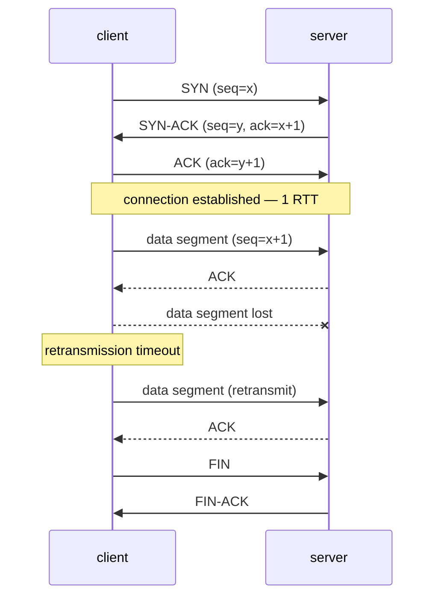

## In simple terms

**TCP** (Transmission Control Protocol) is the layer that turns the unreliable, packet-by-packet world of IP into a reliable, ordered byte stream between two computers. You hand it a stream of bytes; it slices them into segments, sends them, retransmits any that get lost, reassembles them on the other end in the right order, and hides every hiccup from your application. Almost every protocol you've heard of — HTTP, SSH, email, databases — rides on top of TCP.

## The Visual Map



## More detail

TCP gives applications four guarantees IP alone doesn't:

1. **Reliability** — lost segments are detected (via acknowledgements and timeouts) and retransmitted.
2. **Order** — segments that arrive out of order are reassembled before delivery.
3. **Flow control** — the receiver advertises a window; the sender never overwhelms it.
4. **Congestion control** — algorithms (CUBIC, BBR, …) react to packet loss and round-trip time so a single connection doesn't crush the network.

A connection is established with the **three-way handshake** (SYN → SYN-ACK → ACK, shown above). After that, both sides can send. Connections close with FIN exchanges (or with RST on errors).

Important characteristics:

- Stream, not message. TCP doesn't preserve message boundaries; the application has to frame.
- Setup cost. Three-way handshake means at least one round-trip before any data flows. TLS adds another. QUIC (UDP-based) was designed partly to collapse these.
- "Head-of-line blocking": a single lost segment stalls every byte behind it on that connection.
- TCP versions evolve (TCP Fast Open, ECN, modern congestion controllers) but the on-wire format is essentially unchanged in decades.

TCP is the contract every reliable internet application depends on. Even now that HTTP/3 has shifted to QUIC/UDP, TCP still carries the vast majority of internet traffic: web, email, SSH, databases, file transfer, RPCs. Tuning TCP (buffer sizes, congestion control choice, keep-alives) is one of the few low-level levers that shifts real performance.

## Under the Hood

The stream abstraction in four socket calls — and the framing trap hiding inside it:

```python
import socket

srv = socket.socket(socket.AF_INET, socket.SOCK_STREAM)
srv.bind(("127.0.0.1", 0)); srv.listen()

cli = socket.create_connection(srv.getsockname())
conn, _ = srv.accept()

# three separate "messages" from the sender's point of view
for msg in (b"one", b"two", b"three"):
    cli.sendall(msg)
cli.close()

# ...arrive as one undifferentiated byte stream
print(conn.recv(4096))   # b'onetwothree'
```

Three `sendall` calls, one `recv` — the boundaries are gone. This is why every protocol on TCP (HTTP, Redis, PostgreSQL's wire format) defines its own framing: length prefixes, delimiters, or typed records.

## Engineering Trade-offs

- **Reliability vs latency.** Every guarantee costs time: the handshake burns one RTT before data, a lost segment stalls the whole stream (head-of-line blocking), and retransmission timeouts are conservative. Real-time media usually picks UDP and tolerates loss instead.
- **Kernel maturity vs ossification.** Decades of kernel tuning make TCP fast and free for applications — but middleboxes that inspect TCP headers froze the wire format. QUIC moved the transport into user space over UDP largely to regain the ability to evolve.
- **Fairness vs throughput.** Congestion control deliberately backs off under loss so flows share links fairly. Loss-based algorithms (CUBIC) misread random wireless loss as congestion; model-based ones (BBR) probe bandwidth instead but can crowd out CUBIC flows.
- **Connection state costs memory.** Each connection holds buffers and timers in the kernel; servers handling hundreds of thousands of connections tune buffer sizes and use SYN cookies to survive floods.

## Real-world examples

- An HTTP/1.1 or HTTP/2 page load is a single TCP connection (or a handful) carrying many HTTP requests.
- An `ssh` session is one persistent TCP connection.
- A PostgreSQL or Redis connection is a TCP stream framing the database protocol on top.
- A Netflix stream over HTTP/2 is TCP underneath; the same stream over HTTP/3 swaps TCP for QUIC.

## Common misconceptions

- **"TCP guarantees delivery to the user."** TCP guarantees delivery to the *receiving OS's TCP buffer*. If the application crashes before reading, the bytes are lost as far as the user is concerned.
- **"TCP preserves messages."** It does not — `send(...)` calls may be coalesced or split arbitrarily. Application protocols frame their own messages (length prefix, delimiter, or framed protocols like HTTP).
- **"TCP and UDP are interchangeable."** They sit at the same layer but answer opposite questions. TCP is the right default; UDP is what you reach for when TCP's costs hurt more than its guarantees help (real-time media, DNS, QUIC).

## Try it yourself

Watch message boundaries dissolve into a byte stream over a real localhost connection:

```bash
python3 -c "
import socket
srv = socket.socket(); srv.bind(('127.0.0.1', 0)); srv.listen()
cli = socket.create_connection(srv.getsockname())
conn, _ = srv.accept()
for msg in (b'GET ', b'/index.html ', b'HTTP/1.1'):
    cli.sendall(msg)          # three separate sends
cli.close()
data = b''
while chunk := conn.recv(4096):
    data += chunk
print('received as one stream:', data)
"
```

On Linux, `ss -t` lists your machine's live TCP connections with their state and buffer occupancy.

## Learn next

- [TLS](/t/tls) — the encrypted overlay almost always added on top.
- [UDP](/t/udp) — the faster, unreliable sibling.
- [HTTP](/t/http) — the application protocol that defined the modern web.
