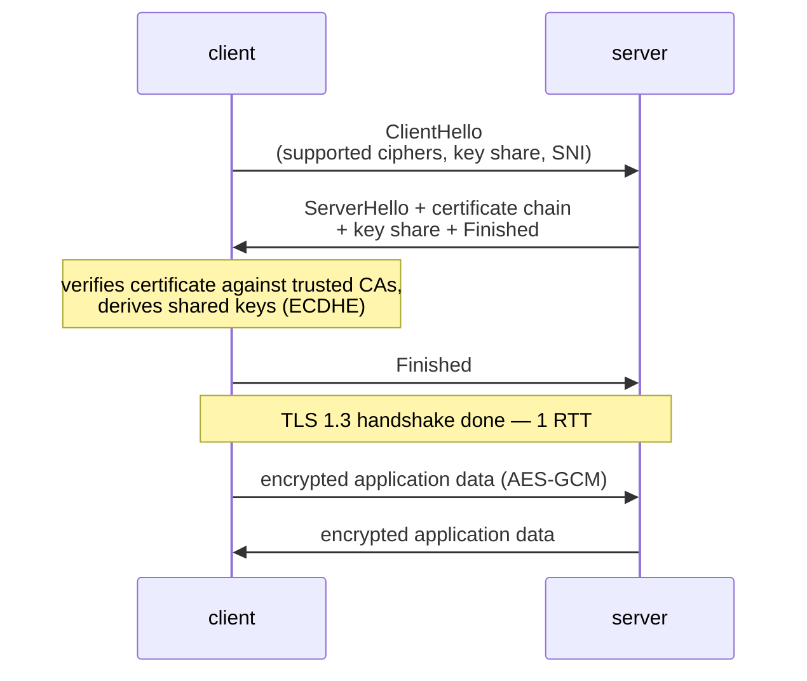

## In simple terms

**TLS** (Transport Layer Security) is the layer that turns any TCP connection into a private, tamper-resistant pipe. When you visit `https://`, the browser and the server first agree on a shared secret using public-key cryptography, then encrypt every byte that follows with a fast symmetric cipher.

## The Visual Map



## More detail

A modern TLS 1.3 handshake takes one round-trip and does three things at once:

1. **Authentication** — the server presents a certificate chain signed by a trusted CA, proving it owns the hostname.
2. **Key agreement** — both sides use ECDHE (an elliptic-curve Diffie–Hellman exchange) to derive a fresh symmetric key. Even if the server's private key leaks later, that session's traffic stays private ("forward secrecy").
3. **Negotiation** — agree on cipher suite, ALPN protocol (`h2`, `http/1.1`, `h3`), and resumption tickets.

After the handshake, both sides encrypt records using an AEAD cipher like AES-GCM or ChaCha20-Poly1305: each record carries its own authenticated tag, so the receiver detects any tampering.

TLS 1.3 (RFC 8446) is the current version. Older versions (SSL 2.0/3.0, TLS 1.0/1.1) are deprecated; modern stacks should not negotiate them. TLS 1.2 is still widely supported but TLS 1.3 is faster and simpler.

Mutual TLS (**mTLS**) is the same protocol with both sides presenting certificates — common for service-to-service traffic inside a private network.

TLS is the bedrock of internet trust. Browsers refuse to load HTTP pages without it, mobile apps require it to talk to their backends, and CAs and certificate transparency logs make MITM attacks at scale very difficult.

## Under the Hood

Wrapping a plain TCP socket in TLS is a few lines — the library does the entire handshake on `wrap_socket`:

```python
import socket, ssl

ctx = ssl.create_default_context()          # trusted CAs, TLS 1.2+ only,
                                            # hostname checking on
with socket.create_connection(("example.com", 443)) as raw:
    with ctx.wrap_socket(raw, server_hostname="example.com") as tls:
        print(tls.version())                # e.g. TLSv1.3
        print(tls.cipher())                 # e.g. ('TLS_AES_256_GCM_SHA384', ...)
        cert = tls.getpeercert()
        print(cert["subject"], "expires", cert["notAfter"])
```

`server_hostname` does double duty: it is sent as SNI so the server knows which certificate to present, and it is the name the certificate is checked against. Most real-world TLS bugs are applications disabling that check.

## Engineering Trade-offs

- **Security vs handshake latency.** TLS 1.3 cut the handshake to one RTT, and 0-RTT resumption removes even that for returning clients — at the cost of a narrow replay-attack window, which is why 0-RTT is restricted to idempotent requests.
- **Forward secrecy vs passive inspection.** Ephemeral keys mean recorded traffic can never be decrypted later — a win for users, but it broke the passive monitoring that enterprises used; they now must terminate TLS at a proxy to inspect anything.
- **CPU cost: mostly solved, not zero.** AES-NI hardware made bulk encryption nearly free; the asymmetric handshake still costs real CPU at connection-heavy servers, which is why session resumption and connection reuse matter.
- **Certificate trust vs operational burden.** The CA system gives strangers a basis for trust, but certificates expire — automated renewal (ACME/Let's Encrypt) turned a notorious outage source into a solved problem for those who adopt it.

## Real-world examples

- Every `https://` page in your browser.
- A `git push` to GitHub uses HTTPS over TLS or SSH (a different protocol with similar guarantees).
- Let's Encrypt issues 90-day TLS certificates for free, automated via ACME.
- TLS 1.3's 0-RTT mode lets a returning client send application data with the very first packet, saving an entire round-trip.

## Common misconceptions

- **"TLS hides who I'm talking to."** It encrypts the payload but the destination IP and (without ECH) the hostname are still visible.
- **"TLS is for browsers only."** Almost any TCP-based protocol can be wrapped in TLS — IMAP, SMTP, AMQP, MQTT, gRPC, PostgreSQL.

## Try it yourself

Open a real TLS connection and inspect what was negotiated and who signed the certificate:

```bash
# requires: network
python3 -c "
import socket, ssl
ctx = ssl.create_default_context()
with socket.create_connection(('example.com', 443), timeout=5) as raw:
    with ctx.wrap_socket(raw, server_hostname='example.com') as s:
        print('version :', s.version())
        print('cipher  :', s.cipher()[0])
        cert = s.getpeercert()
        print('subject :', dict(x[0] for x in cert['subject'])['commonName'])
        print('issuer  :', dict(x[0] for x in cert['issuer'])['organizationName'])
        print('expires :', cert['notAfter'])
"
```

Swap in any hostname you like — the issuer line shows which CA the site's trust chain hangs from.

## Learn next

- [HTTPS](/t/https) — TLS's most visible deployment, securing the web.
- [HTTP](/t/http) — the application layer that usually rides on TLS.
- [Public-key cryptography](/t/public-key-cryptography) — the math that makes the handshake work.
