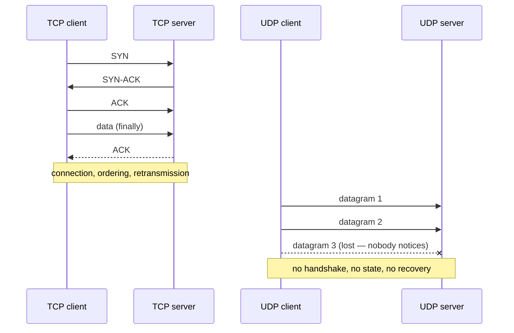

## In simple terms

**UDP** is the simpler sibling of TCP. You put data in a packet, address it, send it — and the network may deliver it, drop it, duplicate it, or deliver it out of order. UDP doesn't try to fix any of that for you. In exchange, it's fast, has tiny overhead, and is great for things that don't mind a missing frame here and there.

## The Visual Map



## More detail

A UDP packet is just an 8-byte header on top of an IP packet:

| Field             | Bytes |
|-------------------|-------|
| Source port       | 2     |
| Destination port  | 2     |
| Length            | 2     |
| Checksum          | 2     |
| Payload           | …     |

That's it. No handshake, no acknowledgements, no congestion control, no ordering. If you need any of those, you build them in the application — which is exactly what real-time protocols do.

UDP is the right choice when:

- **Low latency** beats reliability — voice, video, gaming, live telemetry.
- **One-shot requests** make connection setup overkill — DNS, NTP.
- **Broadcast or multicast** — TCP can't do this; UDP can.
- **You build your own reliability** — QUIC (used by HTTP/3) is a stack of features layered on top of UDP, because TCP couldn't be evolved fast enough.

For each TCP-only feature you forgo, you can add a tailored version: ACK only what matters, retransmit only fresh data, congestion control tuned to your traffic.

A surprising amount of the modern internet — video calls, online games, DNS, almost all real-time media, HTTP/3 — runs over UDP. It is the foundation for any protocol that needs to escape TCP's assumptions.

## Under the Hood

The full UDP API is two calls — no connect, no accept, no teardown:

```python
import socket

rx = socket.socket(socket.AF_INET, socket.SOCK_DGRAM)
rx.bind(("127.0.0.1", 0))

tx = socket.socket(socket.AF_INET, socket.SOCK_DGRAM)
tx.sendto(b"datagram one", rx.getsockname())     # fire...
tx.sendto(b"datagram two", rx.getsockname())     # ...and forget

for _ in range(2):
    data, addr = rx.recvfrom(2048)
    print(f"from {addr}: {data!r}")               # boundaries preserved
```

Note the contrast with TCP: each `sendto` is one datagram and arrives (if it arrives) as exactly one `recvfrom` — UDP keeps message boundaries that TCP's byte stream erases.

## Engineering Trade-offs

- **Speed vs guarantees.** Zero setup round-trips and an 8-byte header make UDP the floor for latency — but every reliability property you need (ordering, retransmission, congestion control) becomes your application's code, your bugs, your testing burden.
- **Statelessness vs spoofing.** No handshake means a server can answer queries with no per-client state — and also that source addresses are trivially forged, which is why UDP services (DNS, NTP) get abused for reflection/amplification attacks.
- **Message boundaries vs message size.** UDP preserves datagram boundaries, but a datagram larger than the path MTU gets fragmented at the IP layer — and one lost fragment silently kills the whole datagram. Most protocols keep payloads under ~1,400 bytes.
- **Middlebox hostility.** NATs and firewalls track TCP connections naturally; UDP "flows" are guesses with timeouts. Long-lived UDP applications need keep-alives, and some networks throttle or block UDP outright — QUIC carries a TCP fallback for exactly this reason.

## Real-world examples

- **DNS** queries are usually a single UDP packet each direction.
- **WebRTC** video and audio use UDP (via SRTP) so a momentary loss doesn't stall the call.
- **QUIC** / HTTP/3 are UDP-based replacements for TCP / HTTP/2.
- Apple's iCloud Private Relay relays user traffic over QUIC (UDP-based) instead of TCP to make connections faster and harder to fingerprint per-network.

## Common misconceptions

- **"UDP is unreliable, so I shouldn't use it."** UDP is unreliable in the sense that the protocol itself makes no guarantees; well-built UDP applications can be extremely reliable.
- **"UDP is faster than TCP."** Per packet, yes. End-to-end throughput depends on what your application does on top.

## Try it yourself

Prove there's no connection: send to a port nobody is listening on — the send "succeeds" anyway:

```bash
python3 -c "
import socket
s = socket.socket(socket.AF_INET, socket.SOCK_DGRAM)
sent = s.sendto(b'anyone there?', ('127.0.0.1', 49999))   # no listener
print(f'sendto returned {sent} — no error, no handshake, no idea if it arrived')
s.settimeout(1)
try:
    s.recvfrom(2048)
except socket.timeout:
    print('and no reply ever comes. fire and forget.')
"
```

A TCP `connect()` to the same closed port would fail immediately — that's the handshake difference in one experiment.

## Learn next

- [TCP](/t/tcp) — the reliable, ordered transport on the other side of the trade.
- [QUIC](/t/quic) — a modern reliable transport built *on top of* UDP.
- [DNS](/t/dns) — the most famous single-datagram protocol.
