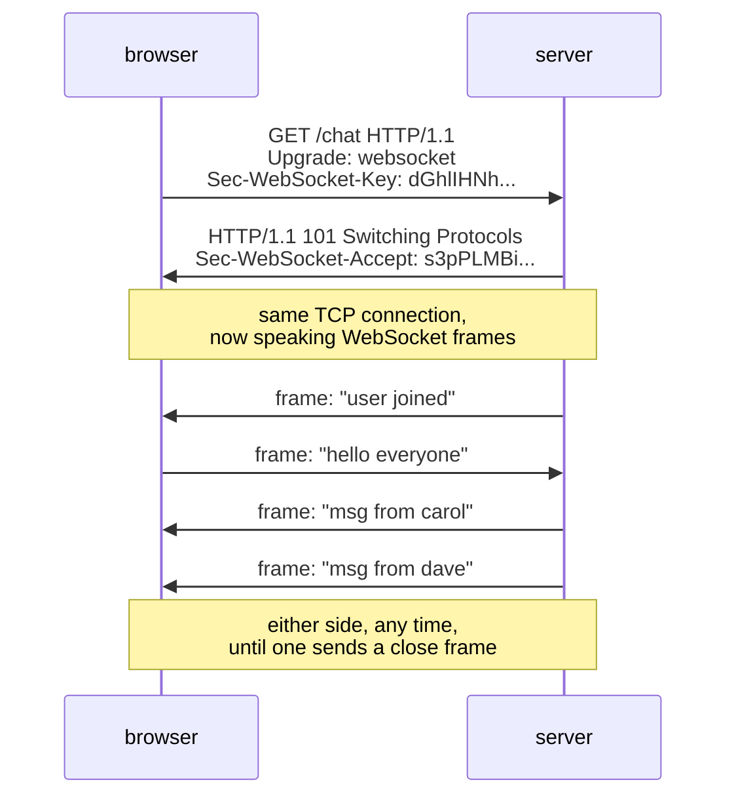

## In simple terms

A **WebSocket** is an upgrade from an ordinary HTTP request into a persistent, two-way channel between a browser (or any client) and a server. After the upgrade, either side can send messages whenever it wants, with low latency, without the request-response overhead of HTTP. It's the standard way to do real-time push in the browser: chat, live updates, multiplayer games, collaborative editing.

## The Visual Map



## More detail

The handshake:

1. Client sends an HTTP `GET` request with `Upgrade: websocket` and a random `Sec-WebSocket-Key`.
2. Server responds with HTTP `101 Switching Protocols` and a derived `Sec-WebSocket-Accept`.
3. The TCP connection (now established as `ws://`) is repurposed: both ends start sending WebSocket frames instead of HTTP messages.

After that:

- Either side can send a message at any time (full-duplex).
- Messages are framed as text or binary.
- The connection stays open until either side closes it (or the network drops it).
- Optional sub-protocols (negotiated in the handshake) define what the messages mean — STOMP, MQTT-over-WS, GraphQL Subscriptions, custom JSON.

`wss://` is WebSockets over TLS — the production default, equivalent to HTTPS-ing the upgrade.

WebSockets are bidirectional but **don't recover from connection drops on their own**. Production code needs reconnect logic, ideally with exponential backoff and message resumption. Libraries like Socket.IO, SignalR, and PartyKit add this on top.

Anything in a browser that needs "the server tells me about new things without me asking" usually uses WebSockets. The pattern is so common that the major frameworks (React + Convex / Liveblocks / PartyKit, Phoenix LiveView, Rails Hotwire) have first-class support for it.

## Under the Hood

The handshake's only cryptography is a fixed magic string and a SHA-1 — just enough to prove the server actually speaks WebSocket:

```python
import base64, hashlib

# client sends a random key in Sec-WebSocket-Key
client_key = "dGhlIHNhbXBsZSBub25jZQ=="          # example from RFC 6455

# server must concatenate the protocol's magic GUID and hash
MAGIC = "258EAFA5-E914-47DA-95CA-C5AB0DC85B11"
accept = base64.b64encode(
    hashlib.sha1((client_key + MAGIC).encode()).digest()
).decode()

print("Sec-WebSocket-Accept:", accept)
# -> s3pPLMBiTxaQ9kYGzzhZRbK+xOo=  (any RFC-compliant server answers exactly this)
```

The point isn't secrecy — it's proving the responder is a WebSocket server and not an oblivious HTTP cache replaying a stale response. After `101`, data flows in lightweight frames: a few header bytes carrying opcode (text/binary/ping/close), length, and a client-to-server masking key.

## Engineering Trade-offs

- **Persistent connections vs server resources.** No per-message HTTP overhead, true push — but every connected client holds a socket, buffers, and heartbeat state on your server. A million idle WebSockets is a real memory and load-balancing bill that request/response never pays.
- **Bidirectional power vs SSE simplicity.** If data only flows server→client (feeds, notifications), Server-Sent Events ride plain HTTP, auto-reconnect natively, and traverse proxies better. WebSockets earn their complexity only when the client talks back frequently.
- **Stateful connections break stateless scaling.** Load balancers must pin a connection to one backend, deploys sever every active connection, and horizontal scaling needs a pub/sub layer (Redis, NATS) so any node can reach any client. The "just add servers" story of stateless HTTP doesn't apply.
- **Infrastructure hostility.** Corporate proxies, some mobile networks, and aggressive idle timeouts drop long-lived connections — production systems keep ping/pong heartbeats and a long-polling fallback.

## Real-world examples

- **Slack, Discord, WhatsApp Web** — chat over WebSockets.
- **Google Docs, Figma, Linear, Notion** — real-time collaborative editing over WebSockets (often with a custom CRDT or operational transform layer on top).
- **Trading platforms** — live price feeds over WebSockets (or proprietary protocols).
- **Multiplayer browser games** (slither.io, agar.io, krunker) — game state over WebSockets, sometimes with WebRTC for peer-to-peer.

## Common misconceptions

- **"WebSockets replace HTTP."** They complement it — the initial handshake is HTTP, and most apps use both: HTTP for fetches, WebSockets for push.
- **"WebSockets are always the right answer for real-time."** Sometimes Server-Sent Events or HTTP/2 push or even long polling is simpler and good enough.
- **"WebSockets work everywhere."** Some corporate proxies and old infrastructure block them; production apps usually keep a long-polling fallback.

## Try it yourself

Reproduce the RFC 6455 handshake math and verify it against the spec's own test vector:

```bash
python3 -c "
import base64, hashlib, os

MAGIC = '258EAFA5-E914-47DA-95CA-C5AB0DC85B11'
def accept(key):
    return base64.b64encode(hashlib.sha1((key + MAGIC).encode()).digest()).decode()

# the example straight from RFC 6455 section 1.3
rfc_key = 'dGhlIHNhbXBsZSBub25jZQ=='
print('RFC vector ok:', accept(rfc_key) == 's3pPLMBiTxaQ9kYGzzhZRbK+xOo=')

# and a fresh handshake like a browser would start
key = base64.b64encode(os.urandom(16)).decode()
print('Sec-WebSocket-Key:   ', key)
print('Sec-WebSocket-Accept:', accept(key))
"
```

That's the entire upgrade proof — every WebSocket connection ever opened starts with this exchange.

## Learn next

- [HTTP](/t/http) — the protocol the handshake starts as.
- [TCP](/t/tcp) — the ordered transport every frame relies on.
- [HTTPS](/t/https) — the encrypted variant behind `wss://`.
