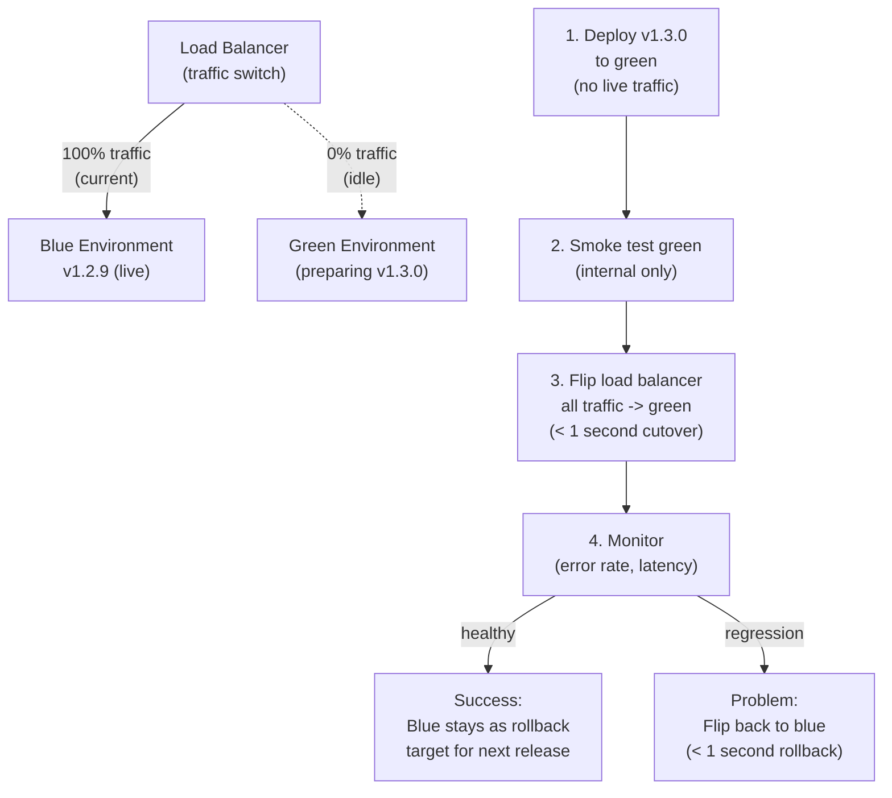

## In simple terms

**Blue-green deployment** is a way to release new software with a near-instant undo button. You keep **two identical production environments**: "blue" (the current live version) and "green" (idle). To deploy, you install the new version on green, test it while it's still receiving no real traffic, then flip a switch so *all* users go to green at once. Blue sits there untouched. If anything goes wrong, you flip back to blue instantly — no rebuild, no scramble. The two environments swap roles with each release.

## The Visual Map



## More detail

The mechanics centre on a **traffic switch** — usually a load balancer or router — that points at whichever environment is "live."

1. Blue is live and serving everyone.
2. Deploy the new version to green; run smoke tests and health checks against it privately.
3. Flip the router so all traffic now hits green.
4. Keep blue intact for a while as an instant rollback target. Next release, blue becomes the staging environment.

The big advantages are **instant rollback** (just flip back) and **zero-downtime cutover**. But it has real costs and caveats:

- **Double the infrastructure** — you run two full production environments (mitigated in the cloud, where you can spin green up only during a release).
- **Database migrations are the hard part** — both versions may share one database, so schema changes must be backward-compatible (the expand/contract pattern), since a rollback can't easily un-migrate data.
- **All-at-once exposure** — unlike a [canary](/t/canary-deployment), every user hits the new version simultaneously, so a bug that passed tests reaches everyone before you notice.

## Under the Hood

A simple blue-green deployment controller with health-check validation and rollback:

```python
import random, time

class BlueGreenController:
    def __init__(self):
        self.live      = "blue"
        self.standby   = "green"
        self.versions  = {"blue": "v1.2.9", "green": None}
        self.traffic   = {"blue": 100, "green": 0}

    def deploy_to_standby(self, version: str):
        print(f"Deploying {version} to {self.standby} environment...")
        self.versions[self.standby] = version
        print(f"  {self.standby}: {version} deployed (receiving 0% traffic)")

    def health_check(self, env: str) -> bool:
        """Simulate a health check against the idle environment."""
        return random.random() > 0.15   # 85% pass rate

    def flip(self) -> bool:
        print(f"\nFlipping traffic: {self.live} -> {self.standby}...")
        if not self.health_check(self.standby):
            print(f"  Health check FAILED on {self.standby} — keeping {self.live} live")
            return False
        # Atomic traffic flip
        self.traffic[self.live]    = 0
        self.traffic[self.standby] = 100
        self.live, self.standby    = self.standby, self.live
        print(f"  Switched. {self.live} ({self.versions[self.live]}) now at 100% traffic")
        print(f"  {self.standby} ({self.versions[self.standby]}) kept as rollback target")
        return True

    def rollback(self):
        print(f"\nROLLBACK: flipping back to {self.standby}...")
        self.traffic[self.live]    = 0
        self.traffic[self.standby] = 100
        self.live, self.standby    = self.standby, self.live
        print(f"  Restored {self.live} ({self.versions[self.live]}) to 100% traffic")

random.seed(42)
ctrl = BlueGreenController()
print(f"Current state: {ctrl.live} ({ctrl.versions[ctrl.live]}) at 100%")

ctrl.deploy_to_standby("v1.3.0")
success = ctrl.flip()

if success:
    print("\nSimulating a regression post-flip...")
    if random.random() < 0.4:
        print("Regression detected! Error rate > 2%")
        ctrl.rollback()
    else:
        print("Healthy for 10 minutes. Deployment complete.")
```

## Engineering Trade-offs

**Infrastructure cost:** blue-green requires two production-sized environments. In the cloud this can be mitigated by spinning up green only for the release window (auto-scaling from 0), but for large deployments the simultaneous capacity is real cost. Some teams keep green at reduced capacity between deploys.

**All-at-once exposure vs. canary:** blue-green exposes every user to the new version at once. If a bug slipped through testing, it affects 100% of users. [Canary deployment](/t/canary-deployment) exposes only a small fraction first; blue-green offers faster rollback when a bug is discovered. Choose based on your ability to detect problems quickly.

**Database migration complexity:** if blue and green share a database (common), schema changes must be backward-compatible with both versions simultaneously. The expand/contract pattern: first add the new column (expand), deploy green that reads both old and new columns, verify stability, then remove the old column (contract) in a follow-up. Never run a destructive migration during the flip.

**Warm caches:** green starts cold — its caches are empty, JVM just compiled, connection pools newly opened. The first minutes of traffic may see higher latency ("cold start") than steady-state blue. Monitor carefully and consider warming caches before flipping.

## Real-world examples

- A team cuts over to a new app version by repointing the load balancer, then flips back the instant error rates spike — recovering in seconds.
- A cloud setup that spins up the "green" environment only for the duration of a release to avoid paying for two environments full-time.
- Pairing blue-green with [feature flags](/t/feature-flag-rollout) so individual features can still be toggled after the environment switch.

## Common misconceptions

- **"Blue-green and canary are the same thing."** Blue-green switches *all* traffic at once with instant rollback; a [canary](/t/canary-deployment) shifts traffic *gradually* to limit who's exposed to a bad release.
- **"Rollback is always trivial."** Flipping traffic back is instant, but if the new version already changed the shared database, rolling back code without corrupting data takes careful, backward-compatible migrations.

## Try it yourself

Simulate a blue-green flip with randomised health check outcomes:

```bash
python3 - <<'EOF'
import random

random.seed(42)

def simulate_blue_green(n_deploys: int, health_check_pass_rate: float = 0.85):
    state = {"live": "blue", "standby": "green"}
    successful = 0
    rolled_back = 0

    for i in range(n_deploys):
        # Deploy to standby
        # Health check
        if random.random() < health_check_pass_rate:
            # Flip
            state["live"], state["standby"] = state["standby"], state["live"]
            # Monitor post-flip (10% chance of regression after flip)
            if random.random() < 0.10:
                state["live"], state["standby"] = state["standby"], state["live"]
                rolled_back += 1
            else:
                successful += 1
        else:
            rolled_back += 1   # health check failed, no flip

    return successful, rolled_back

n = 50
succ, rb = simulate_blue_green(n)
print(f"{n} blue-green deployments:")
print(f"  Successful: {succ} ({succ/n*100:.0f}%)")
print(f"  Rolled back: {rb} ({rb/n*100:.0f}%)")
print(f"  (rollback is instant — <1s traffic flip, no rebuild required)")
EOF
```

## Learn next

- [Canary deployment](/t/canary-deployment) — the gradual alternative: route a small fraction of traffic to the new version and ramp up only if metrics remain healthy; lower blast radius than blue-green's all-at-once switch
- [Monitoring](/t/monitoring) — monitoring is the feedback loop after the flip; without it, you can't detect a regression and trigger the rollback
- [Feature flag rollout](/t/feature-flag-rollout) — decouples deployment from release at the feature level; pairs with blue-green to provide both environment-level and feature-level control
